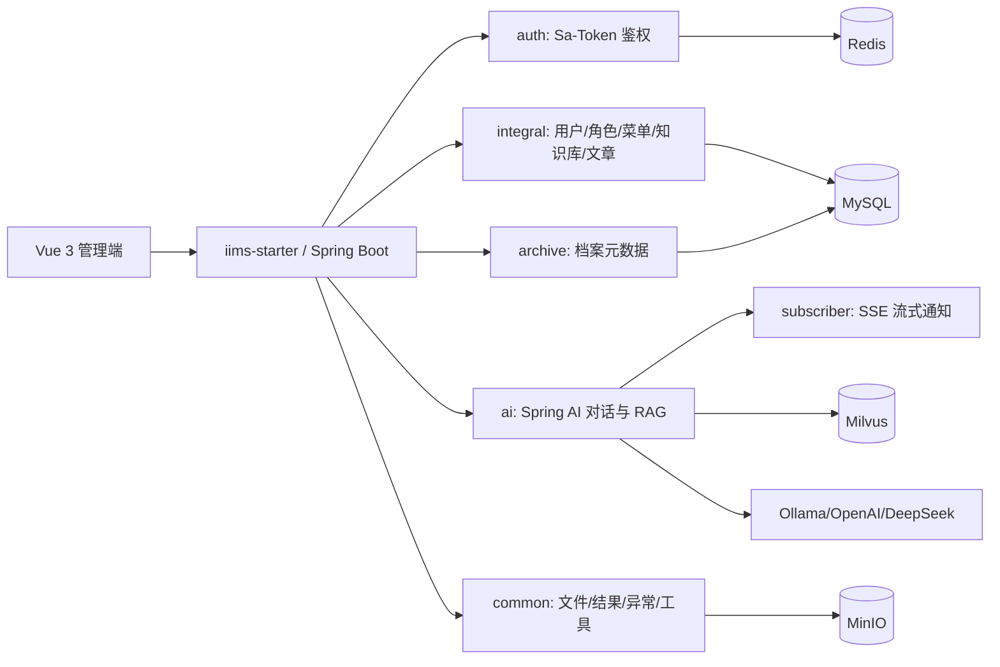

# IIMS 项目转型方案：面向 Java 后端求职的可简历化项目

## 1. 转型结论

当前 IIMS 的 README 将项目描述为“AI-Powered Intelligent Information Management Platform”，并同时规划了教务系统 EAS、档案系统 DMS、AI 对话、知识库问答、文件预览等大量能力。结合代码、依赖、接口、SQL 和前端页面后，建议不要继续包装成“大而全综合平台”，而是转型为：

> **基于 Spring Boot 3 + MyBatis-Plus + Redis + MySQL + Spring AI 的企业知识与档案智能管理系统**

这个定位更适合 Java 后端简历：

- 后端主线清楚：用户权限、菜单角色、组织机构、字典、文件上传、知识库、文章、档案元数据、AI 对话。
- 技术栈贴合目标岗位：Spring Boot、MyBatis-Plus、Redis、MySQL、Spring AI、MinIO、SSE、事件异步、Docker Compose。
- 可以裁掉未完成教务系统，避免面试时被追问没有后端支撑的“空页面”。
- AI 能力应保留已完成部分：对话问答、文件问答、内部知识库问答、Ollama/OpenAI 模型接入、对话删除/复制；未完成的置顶、分享、生成历史、再生成等能力从简历叙事中裁剪。

## 2. 当前项目真实状态

### 2.1 仓库结构

```text
IIMS
├── README.md
├── iims-server                 # Java 后端，多模块 Maven
│   ├── iims-starter            # Spring Boot 启动模块
│   ├── iims-module-common      # 通用实体、结果封装、文件服务、工具类
│   ├── iims-module-auth        # 鉴权拦截器、Sa-Token、MVC 配置
│   ├── iims-module-integral    # 权限、用户、角色、菜单、组织、文章、知识库等核心业务
│   ├── iims-module-ai          # Spring AI 对话、模型管理、RAG、Agent 雏形
│   ├── iims-module-archive     # 档案目录和档案元数据管理
│   ├── iims-module-subscriber  # SSE 通知
│   └── iims-module-search      # 空模块，当前无 Java 源码
├── iims-client                 # Vue 3 + Vite + Element Plus 前端
├── resources/sql/init-data.sql # MySQL 初始化脚本
├── deploy-bundle/docker-compose.yml
└── jiaoxue                     # 教学文档，不属于项目交付主线
```

### 2.2 后端模块成熟度

| 模块 | 当前状态 | 建议 |
| --- | --- | --- |
| `iims-starter` | 可编译，统一启动入口 | 保留 |
| `iims-module-common` | 结果封装、异常、文件、MinIO、Markdown、基础实体较完整 | 保留并整理 |
| `iims-module-auth` | Sa-Token + 自定义拦截器 + ThreadLocal 用户上下文 | 保留，需修正文档和鉴权边界 |
| `iims-module-integral` | 用户、角色、菜单、组织、字典、日志、文章、知识库接口完整度较高 | 作为核心业务模块保留 |
| `iims-module-ai` | 对话、模型配置、SSE 流式输出、RAG、Milvus、文件问答、模型接入 | 保留已完成 AI 能力，裁剪未完成 Agent/会话扩展叙事 |
| `iims-module-archive` | 档案目录、档案元数据 CRUD 可形成闭环 | 保留为 DMS 业务亮点 |
| `iims-module-subscriber` | SSE 通知服务，用于异步任务完成提醒 | 保留为工程亮点 |
| `iims-module-search` | 空模块 | 删除或从启动依赖中移除 |

### 2.3 前端模块成熟度

前端采用 Vue 3、Vite、TypeScript、Pinia/Vuex、Element Plus、Axios、Markdown 编辑器、Mermaid、ECharts。当前页面很多，但成熟度不均：

| 前端区域 | 状态 | 建议 |
| --- | --- | --- |
| 登录、布局、动态菜单、权限页面 | 与后端权限模块匹配 | 保留 |
| 知识库、文章、AI 对话、文件问答 | 与后端接口匹配 | 保留已完成闭环 |
| 档案采集/档案元数据页面 | 与后端 archive 模块匹配 | 保留 |
| 教务系统学生、教师、课程、班级、排课、财务、考试 | 前端页面存在，但后端领域模块缺失 | 从菜单、README、演示路径中裁剪 |
| 文件云库 | 后端有文件上传/下载和 MinIO 服务 | 保留基础能力 |
| 监控、任务、部分设置页 | 功能边界不清晰 | 只保留日志和模型配置，其他弱化 |

## 3. 技术栈审计

### 3.1 后端技术栈

| 技术 | 项目中用途 | 简历表达 |
| --- | --- | --- |
| Java 17 | 后端运行环境 | 使用 Java 17 构建多模块后端服务 |
| Spring Boot 3.5.0 | 应用启动、Web、配置、事务、缓存 | 基于 Spring Boot 3 搭建企业级后端服务 |
| MyBatis-Plus | Mapper、实体映射、基础 CRUD | 使用 MyBatis-Plus 完成业务数据访问层封装 |
| MySQL 8 | 主业务数据库 | 设计用户、角色、菜单、知识库、文章、档案元数据等表结构 |
| Redis | Sa-Token 会话、缓存、业务辅助 | 使用 Redis 管理登录态和缓存数据 |
| Sa-Token | 登录、Token、权限注解 | 实现基于角色和权限标识的后台访问控制 |
| Spring AI | LLM 对话、Embedding、向量检索接口 | 集成 Spring AI 实现知识库增强问答 |
| Milvus | 向量库 | 用于知识库文档向量存储与相似度检索 |
| MinIO | 文件对象存储 | 实现文件上传、下载和业务文件管理 |
| SSE | AI 流式响应、异步通知 | 通过 SSE 实现 AI 答案流式推送和任务通知 |
| Apache POI | 用户导入导出 | 支持 Excel 模板导入导出 |
| MapStruct | VO/DTO 转换 | 用于对象转换，降低手写映射代码 |
| Docker Compose | MySQL、Redis、MinIO 部署 | 编排本地开发和演示依赖 |

### 3.2 前端技术栈

| 技术 | 项目中用途 | 简历中是否强调 |
| --- | --- | --- |
| Vue 3 + Vite | 后台管理前端 | 简单提及即可 |
| TypeScript | 类型约束 | 简单提及即可 |
| Element Plus | UI 组件 | 简单提及即可 |
| Axios | HTTP 请求封装 | 简单提及即可 |
| Markdown/Vditor/Mermaid | 文档编辑和渲染 | 可作为知识库特色 |
| ECharts | 首页统计图 | 可作为展示能力，不作为后端重点 |

## 4. 推荐裁剪范围

### 4.1 必须裁掉的内容

这些内容不适合作为简历项目主线：

| 内容 | 裁剪原因 | 处理方式 |
| --- | --- | --- |
| EAS 教务系统 | README 规划很大，但后端缺少学生、教师、课程、班级、考试、财务等领域模型和接口 | 从 README、菜单、演示路径中移除；保留代码可暂不物理删除 |
| `iims-module-search` | 当前为空模块 | 从父 POM 和 starter 依赖中移除，或标记为后续扩展 |
| 内部系统问答、MCP/工具集成 | README 标注未完成 | 从主线裁剪，只保留为后续规划 |
| 权限集成到 AI 工具调用 | README 标注未完成 | 不作为已实现亮点 |
| 主题置顶、主题重命名、分享对话、生成历史、再生成 | README 标注未完成 | 从 README 功能表和演示路径中删除 |
| 聊天收藏 | README 标注部分完成 | 可保留为“基础收藏/反馈”，不要写成完整收藏系统 |
| 用户上传文档知识库问答 | README 标注未完成 | 不写入核心功能，只保留内部知识库问答和文件问答 |
| 文章问答 | README 标注未完成 | 裁剪，文章只作为内容管理能力 |
| 多格式文件在线预览 | README 未列为完成能力 | 降级为“文件上传、下载、文件问答和元数据管理” |
| 复杂教务报表/排课算法 | 没有对应后端实现 | 不出现在简历和项目说明中 |

### 4.2 应该保留的项目主线

建议最终项目只保留 4 条业务线：

1. **权限与组织管理**
   - 用户登录、Token 鉴权、角色权限、菜单权限、组织树、字典管理。
   - 对应模块：`auth`、`integral`、`common`。

2. **知识内容管理**
   - 文章发布、知识库目录、Markdown 内容、评论、标签、阅读详情。
   - 对应模块：`integral`、`common`。

3. **档案元数据管理**
   - 档案库树状结构、档案分类体系、多级档案目录、档案元数据分页、详情、新增、编辑、删除。
   - 档案表格构造：按档案类型维护标准化录入表单，实现档案元数据结构化管理。
   - 对应模块：`archive`。

4. **AI 对话与知识库问答**
   - 对话问答、对话删除、对话复制、基础收藏/反馈、会话主题和历史消息。
   - 文件问答：基于上传文件内容构造上下文并回答。
   - 内部知识库问答：基于知识库文档向量检索增强回答。
   - 模型支持：Ollama 本地模型、OpenAI/vLLM 兼容接口。
   - 流式输出：通过 SSE 返回模型生成过程。
   - 对应模块：`ai`、`subscriber`、`common`。

## 5. 目标架构



## 6. 转型实施路线

### 第一阶段：工程可运行和文档可信

目标：让项目可以被 clone、启动、演示，并且 README 不再夸大。

- 重写根 README：
  - 项目名改为“企业知识与档案智能管理系统”。
  - 删除 EAS 教务系统大段规划。
  - 删除未完成状态表，只保留已实现和计划中能力。
  - 增加本地启动说明：MySQL、Redis、MinIO、后端、前端。
  - 增加演示账号。

- 修复工程配置：
  - 后端已通过：`mvn -pl iims-starter -am -DskipTests compile`。
  - 前端 `npm run build-only` 已通过。
  - 前端 `npm run type-check` 当前失败，需修复 `tsconfig.node.json`：
    - 增加 `composite: true`。
    - 处理 `noEmit` 与项目引用冲突。

- 统一编码和注释：
  - 当前不少中文注释在终端显示为乱码，需要确认文件编码统一为 UTF-8。
  - README、接口文档、配置说明必须用中文清晰描述。

### 第二阶段：裁剪未完成业务

目标：让菜单、文档、代码依赖和演示路径一致。

- 后端裁剪：
  - 移除 `iims-module-search` 空模块，或从启动依赖中移除。
  - 保留 `iims-module-archive`，作为档案管理核心业务。
  - 保留 `iims-module-ai` 中已完成的对话问答、文件问答、内部知识库问答、模型接入、对话删除/复制等能力。
  - 隐藏或删除未完成的主题置顶、分享、生成历史、再生成、MCP 工具集成等入口。
  - 若代码中存在未完成接口，例如返回 `null` 的再生成接口，要么补齐，要么从前端和 README 中移除。

- 前端裁剪：
  - 从初始化 SQL 菜单中删除教务系统相关菜单。
  - 前端路由可保留文件，但菜单不暴露。
  - 首页只展示用户数、文章数、知识库数、文件数、档案数、AI 对话数等真实指标。

- SQL 裁剪：
  - 保留权限、用户、角色、菜单、组织、字典、文章、知识库、文件、档案、AI 对话相关表。
  - 删除或不初始化教务菜单和测试噪声数据。
  - 重新整理 `init-data.sql`，提供最小可演示数据集。

### 第三阶段：补强 Java 后端亮点

目标：让面试官看到你确实做了后端设计，而不是只跑通模板。

- 权限体系：
  - 说明 Sa-Token 登录态存 Redis。
  - 菜单权限和按钮权限通过权限标识控制。
  - Controller 使用 `@SaCheckPermission` 做接口鉴权。
  - 拦截器将用户 ID 写入 `BaseContext`，支撑自动填充和数据审计。

- 数据访问：
  - MyBatis-Plus 负责基础 CRUD。
  - XML Mapper 处理复杂查询、树结构、分页、详情聚合。
  - PageHelper/MyBatis-Plus 分页策略择一收敛，避免面试被问为什么混用。

- 文件服务：
  - MinIO 存文件。
  - MySQL 存文件元数据。
  - 业务表通过文件 ID 关联。

- AI 问答：
  - Spring AI 对接模型。
  - SSE 返回流式回答。
  - 保留 Ollama 本地模型和 OpenAI/vLLM 兼容接口接入。
  - 内部知识库文档解析后切片，写入 Milvus。
  - 用户提问时按知识库 ID 检索相关片段，组装 Prompt。
  - 用户上传文件走文件问答链路，作为单次对话上下文增强。
  - AI 答案和会话历史落库。

- 异步通知：
  - 文档向量化通过 Spring 事件 + `@Async` 异步执行。
  - 完成后通过 SSE 通知用户。

### 第四阶段：简历化和演示化

目标：做出一条 3 分钟能讲清楚、5 分钟能演示完的路径。

推荐演示流程：

1. 登录系统，展示角色权限和动态菜单。
2. 新增一个知识库文档，展示知识库目录和文档内容。
3. 触发知识库向量化，展示 SSE 通知。
4. 在 AI 对话中选择知识库进行提问，展示流式回答和引用上下文。
5. 上传一个文件后进行文件问答，展示“文件内容问答”能力。
6. 打开档案管理，展示档案树、表格构造、分页查询、元数据新增和编辑。
7. 打开用户/角色/菜单，展示权限控制。

## 7. README 重写建议

新的 README 建议结构：

```text
# 企业知识与档案智能管理系统

## 项目简介
## 核心功能
## 技术栈
## 系统架构
## 模块说明
## 数据库设计
## 本地启动
## 演示账号
## 核心接口
## 项目亮点
## 后续规划
```

核心功能只写：

- 用户、角色、菜单、组织、字典权限管理。
- 文章与知识库管理。
- 档案分类和档案元数据管理。
- 文件上传下载与对象存储。
- 基于 Spring AI 的对话问答、文件问答和内部知识库问答。
- SSE 流式响应和异步任务通知。

不要再写：

- 教务系统。
- 自动排课。
- 学生成绩。
- 财务收费。
- 主题置顶、主题重命名、会话分享、生成历史、再生成、完整 Agent 自主规划、MCP 工具集成。
- 多格式在线预览，除非后续真正补齐。

## 8. 简历表达模板

### 项目名称

企业知识与档案智能管理系统

### 项目描述

基于 Spring Boot 3、MyBatis-Plus、Redis、MySQL、MinIO 和 Spring AI 构建的企业内部知识与档案管理平台，支持 RBAC 权限管理、知识库/文章管理、档案树与档案表单配置、文件对象存储、AI 流式对话、文件问答和内部知识库 RAG 问答。

### 技术栈

Java 17、Spring Boot 3、MyBatis-Plus、MySQL、Redis、Sa-Token、Spring AI、Milvus、MinIO、SSE、Docker Compose、Vue 3。

### 负责内容

- 设计多模块后端工程结构，将通用能力、鉴权、业务、AI、档案管理按 Maven 模块拆分。
- 基于 Sa-Token + Redis 实现后台登录、Token 校验、角色权限和菜单权限控制。
- 使用 MyBatis-Plus 和 XML Mapper 完成用户、角色、菜单、知识库、文章、档案元数据等核心业务接口。
- 接入 MinIO 实现文件上传、下载和文件元数据管理。
- 基于 Spring AI 实现 LLM 对话服务，支持 Ollama 本地模型和 OpenAI/vLLM 兼容模型，通过 SSE 向前端流式推送回答。
- 构建内部知识库 RAG 流程，将文档切片后写入 Milvus，并在用户提问时进行相似度检索增强 Prompt。
- 实现文件问答链路，将用户上传文件内容解析为对话上下文，提升单次问答准确性。
- 使用 Spring 事件和异步线程池处理文档向量化任务，并通过 SSE 发送任务完成通知。
- 使用 Docker Compose 编排 MySQL、Redis、MinIO 等本地开发依赖，降低部署成本。

## 9. 面试可讲亮点

### 亮点 1：权限模型

可以讲清楚用户、角色、菜单、权限标识之间的关系：

- 用户绑定角色。
- 角色绑定菜单 ID 和权限标识。
- 登录后 Sa-Token 生成 Token 并维护会话。
- 前端根据菜单树动态生成路由。
- 后端通过权限注解保护接口。

### 亮点 2：AI 流式问答

可以讲清楚为什么用 SSE：

- AI 输出是持续生成的，普通 HTTP 要等完整结果返回。
- SSE 适合服务端单向推送，前端可以边生成边展示。
- 后端用 `SseEmitter` 管理连接，并在生成结束时保存 AI 回复。

### 亮点 3：RAG 知识库

可以讲清楚一条链路：

```text
知识库文档 -> Markdown/文档解析 -> 文本切片 -> Embedding -> Milvus 入库
用户提问 -> 相似度检索 -> 拼接上下文 -> 调用模型 -> SSE 流式返回 -> 对话落库
```

### 亮点 4：异步任务通知

可以讲清楚：

- 文档向量化耗时，不适合阻塞接口。
- 发布 Spring 事件后异步消费。
- 任务完成后通过 SSE 通知前端。

### 亮点 5：文件对象存储

可以讲清楚：

- 文件二进制交给 MinIO。
- 数据库只保存文件元数据、业务关联和访问路径。
- 这样避免 MySQL 存大文件，也方便后续扩容。

## 10. 风险与待修复清单

| 优先级 | 问题 | 影响 | 建议 |
| --- | --- | --- | --- |
| P0 | README 与真实代码不一致 | 简历和面试风险极高 | 立即重写 |
| P0 | 教务系统只有前端页面和菜单，缺少后端闭环 | 容易被追问穿帮 | 从项目定位中移除 |
| P0 | 未完成 AI 功能仍出现在 README 或菜单中 | 容易被面试追问 | 只保留对话问答、对话删除/复制、文件问答、内部知识库问答、Ollama/OpenAI 支持 |
| P0 | 再生成接口如未补齐会影响演示 | 前端如调用会异常 | 补齐或隐藏入口 |
| P0 | 前端 `npm run type-check` 失败 | 工程化不完整 | 修复 TS 项目引用 |
| P1 | `iims-module-search` 空模块 | 结构冗余 | 删除或转为后续规划 |
| P1 | Knife4j/Springfox 包扫描路径疑似不正确 | 接口文档可能不可用 | 升级到 Springdoc OpenAPI 或修正扫描包 |
| P1 | PageHelper 和 MyBatis-Plus 分页混用 | 面试解释成本高 | 统一分页策略 |
| P1 | 配置中有默认密钥和明文密码 | 安全性问题 | 改为环境变量和示例配置 |
| P2 | 中文注释显示乱码 | 文档观感差 | 统一 UTF-8 编码 |
| P2 | 前端包体较大 | 不影响后端主线 | 可后续拆包优化 |

## 11. 验证记录

已在当前工作区验证：

```bash
cd iims-server
mvn -pl iims-starter -am -DskipTests compile
```

结果：后端多模块编译成功。

```bash
cd iims-client
npm run build-only
```

结果：前端 Vite 构建成功，但存在大包体警告。

```bash
cd iims-client
npm run type-check
```

结果：失败。错误为 `tsconfig.node.json` 作为 referenced project 时缺少 `composite: true`，且存在 `noEmit` 与项目引用冲突。

## 12. 推荐最终交付物

为了让项目真正能写进简历，建议最终至少交付：

- 一份重写后的 `README.md`。
- 一份 `docs/architecture.md`，说明模块、数据流和 RAG 流程。
- 一份 `docs/deploy.md`，说明 Docker Compose、本地启动、常见问题。
- 一份精简后的 `init-data.sql`。
- 一个可运行的后端 jar。
- 一个可构建的前端 dist。
- 一条稳定演示路径。

## 13. 最终项目边界

最终不要追求“功能多”，而要追求“闭环稳”：

- 登录能进。
- 权限能控。
- 菜单能动态生成。
- 知识库能增删改查。
- 档案树和档案表格构造能演示。
- 档案元数据能管理。
- 文件能上传下载。
- AI 能完成普通对话、文件问答和内部知识库流式回答。
- 本地环境能一键拉起依赖。

做到这些，这个项目就已经足够支撑 Java 后端简历，并且比继续保留未完成教务系统更可信。
