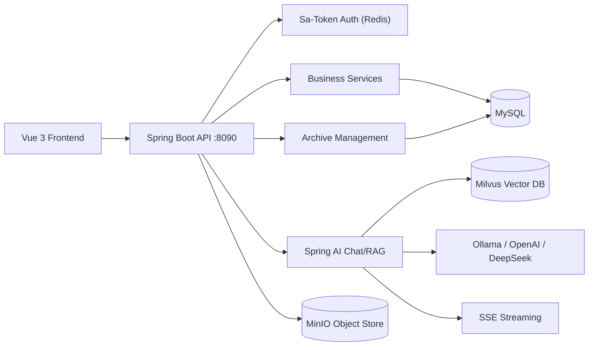

# Intelligent Information Management System (IIMS)

**AI-Powered Knowledge & Archive Management Platform**

A Spring Boot 3 multi-module backend + Vue 3 frontend platform for enterprise knowledge management, document archiving, and AI-powered Q&A with RAG (Retrieval-Augmented Generation).

## Core Capabilities

### 1. Permission & Organization Management
- User authentication with RSA-encrypted login + JWT token
- Role-based access control (RBAC) via Sa-Token + Redis
- Dynamic menu generation from backend permission tree
- Organization hierarchy and dictionary management
- Menu and permission-key level access control

### 2. Document Archiving (DMS)
- Multi-level archive fond (tree) structure
- Archive metadata management with type-specific form configurations
- Archive metadata CRUD, pagination, and detail view
- Multi-type archive support (financial, technical, personnel, contracts, etc.)
- File upload/download with MinIO object storage

### 3. Knowledge Management
- Wiki (knowledge base) with catalog tree and Markdown content
- Article management with tagging and comments
- Markdown rendering with Mermaid diagrams and MathJax support

### 4. AI Chat & RAG Q&A
- Multi-model chat: Ollama (local), OpenAI-compatible, DeepSeek Chat
- SSE streaming response for real-time AI output
- Session/topic management (history, delete, copy, favorite)
- **Knowledge Base RAG**: Document → chunking → embedding (Milvus) → semantic retrieval → augmented prompt → LLM response
- **File Q&A**: Upload files as single-session context for ad-hoc document Q&A

### 5. Technical Features
- SSE real-time notifications for async task completion
- Spring event-driven async document embedding pipeline
- MinIO-backed file storage with MySQL metadata tracking
- Configurable thread pool for background processing
- SnowFlake ID generation distributed across services

## Tech Stack

| Layer | Technology |
|-------|-----------|
| Backend | Java 17, Spring Boot 3.5, MyBatis-Plus, PageHelper |
| Auth | Sa-Token + Redis + JWT |
| AI | Spring AI 1.1.2 (Ollama, OpenAI, DeepSeek) |
| Vector DB | Milvus |
| File Storage | MinIO |
| Database | MySQL 8 |
| Cache | Redis 7 |
| Frontend | Vue 3 + TypeScript + Vite 7 + Element Plus + TailwindCSS 4 |
| Infra | Docker Compose |

## Project Structure

```
IIMS
├── iims-server/                  # Java backend (Maven multi-module)
│   ├── iims-starter              # Spring Boot entry point
│   ├── iims-module-common        # Shared: entities, exceptions, utils, MinIO
│   ├── iims-module-auth          # Authentication: Sa-Token, JWT, CORS
│   ├── iims-module-integral      # Core business: user/role/menu/org/wiki/article
│   ├── iims-module-ai            # AI chat, ReAct agent, RAG pipeline, Milvus
│   ├── iims-module-archive       # Archive fond tree & metadata management
│   └── iims-module-subscriber    # SSE real-time notification service
├── iims-client/                  # Vue 3 frontend
├── deploy-bundle/                # Docker Compose + Nginx + init scripts
└── resources/sql/                # Database init scripts
```

## Quick Start (Local Development)

Prerequisites: Java 17, Node.js 20+, Docker, Maven.

### 1. Infrastructure
```powershell
cd deploy-bundle
docker compose up -d                       # MySQL 8 + Redis 7 + MinIO
docker compose -f docker-compose-ai.yml up -d  # Milvus + Ollama (for AI features)
```

### 2. Database
```powershell
docker exec -i iims-mysql mysql -uroot -proot < resources/sql/init-data.sql
```

### 3. Backend
```powershell
cd iims-server
mvn -pl iims-starter -am -DskipTests package
java -jar .\iims-starter\target\iims-starter-1.0.0.jar
```
Runs on `http://localhost:8090`.

### 4. Frontend
```powershell
cd iims-client
npm install
npm run dev
```
Runs on `http://localhost:8089`.

### Demo Accounts
| Username | Password | Role |
|----------|----------|------|
| `Aitenry` | `admin` | Super Admin |
| `G-001` | `admin` | Archive Admin |

## Architecture Overview



## Project Status

The system is under active development. Core permission management, archive management, knowledge base, and AI chat with RAG are functional. See [docs/LOCAL_STARTUP.md](docs/LOCAL_STARTUP.md) for detailed startup instructions, and [PROJECT_TRANSFORMATION_PLAN.md](./PROJECT_TRANSFORMATION_PLAN.md) for the ongoing refactoring roadmap.