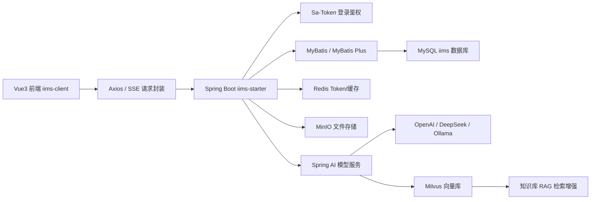

# IIMS 就业导向 30 课时课程大纲

> 项目路径：`C:\Users\MoLin\Desktop\IIMS`
> 课程目标：先把 IIMS 项目完整跑通，尤其是模型配置、AI 对话、知识库 RAG、文件服务与部署链路；再围绕真实代码掌握 Spring Boot、Spring AI、MySQL、MyBatis Plus、Redis，并能把项目讲成可面试、可维护、可二次开发的个人项目经验。

## 一、项目研究结论

IIMS 是一个前后端分离、多模块的智能信息管理系统。后端是 Maven 多模块 Spring Boot 3.5 项目，入口在 `iims-server/iims-starter`，业务拆成 `auth`、`integral`、`archive`、`ai`、`search`、`subscriber`、`common` 等模块。前端是 Vue 3 + Vite + TypeScript + Element Plus，入口在 `iims-client`，通过动态路由和接口权限加载后台菜单。

核心运行链路如下：

课程主线不是“从零写一个玩具项目”，而是按企业接手项目的方式学习：先部署、再排错、再看架构、再改功能、最后形成面试表达。

## 二、最终能力与成果物

学完后至少产出 6 个可展示成果：

1. 一份完整部署说明：本地开发、阿里云 ECS、Docker 中间件、Nginx 前端代理、后端 Jar 启动。
2. 一份模型配置说明：OpenAI 兼容接口、DeepSeek、Ollama、Embedding 模型、默认模型选择、密钥加密入库。
3. 一份项目源码地图：每个模块负责什么，Controller、Service、Mapper、XML、VO/DTO 如何协作。
4. 一个可演示系统：登录、菜单、用户角色、文件、档案、知识库、AI 对话、RAG 至少主流程可用。
5. 一组二次开发小功能：例如模型连通性检测、用户默认模型配置、AI 对话异常提示优化、部署健康检查接口。
6. 一套面试讲法：技术栈、架构取舍、问题排查、性能与安全、部署经验。

## 三、重点源码地图

### 后端

| 模块 | 重点路径 | 学习重点 |
|---|---|---|
| 启动模块 | `iims-server/iims-starter` | Spring Boot 启动、配置、日志、环境隔离 |
| 公共模块 | `iims-server/iims-module-common` | 统一返回、上下文、枚举、文件服务、基础实体 |
| 鉴权模块 | `iims-server/iims-module-auth` | 登录、Token、权限、Sa-Token |
| 综合管理 | `iims-server/iims-module-integral` | 用户、角色、菜单、组织、模型管理入口 |
| AI 模块 | `iims-server/iims-module-ai` | Spring AI、模型配置、SSE、Agent、RAG、Milvus |
| 档案模块 | `iims-server/iims-module-archive` | 业务 CRUD、复杂表单、档案类型 |
| 搜索模块 | `iims-server/iims-module-search` | 搜索能力与业务查询 |
| 订阅模块 | `iims-server/iims-module-subscriber` | 事件推送、订阅、异步交互 |
| 初始化数据 | `resources/sql/init-data.sql` | 表结构、菜单权限、初始数据、模型表 |

### 前端

| 模块 | 重点路径 | 学习重点 |
|---|---|---|
| 工程入口 | `iims-client/package.json`、`vite.config.ts` | Vite、依赖、环境变量 |
| 请求封装 | `src/utils/request.ts`、`request-sse.ts` | Axios、Token、错误处理、SSE |
| 路由权限 | `src/router`、`src/router-guard.ts`、`src/store/modules/permission.ts` | 动态路由、菜单渲染、权限控制 |
| 登录页 | `src/views/login` | 登录流程、验证码/密钥、Token 保存 |
| AI 对话 | `src/views/ai`、`src/api/ai/chat.ts` | 模型选择、流式输出、会话管理 |
| 模型设置 | `src/views/settings/model/Index.vue`、`src/api/settings/model.ts` | 模型增删改查、OpenAI/Ollama/DeepSeek 配置 |
| 文件/知识库 | `src/views/file`、`src/views/knowledge` | MinIO、知识库、RAG 入口 |

## 四、30 课时安排

### 第 1 课：项目接手与运行目标拆解

- 就业目标：像公司新人接手老项目一样判断项目结构、运行入口和风险点。
- 源码定位：`README.md`、`iims-client/package.json`、`iims-server/pom.xml`、`iims-server/iims-starter/src/main/resources/application.yml`。
- 核心内容：前后端分离、Maven 多模块、Vite 前端、MySQL/Redis/MinIO/Milvus/Ollama 等依赖边界。
- 实操任务：画出本项目运行拓扑图，列出必须启动的服务和可选服务。
- 验收标准：能解释“为什么登录必须有 MySQL 和 Redis，文件必须有 MinIO，知识库问答必须有 Embedding 与 Milvus”。

### 第 2 课：本地开发环境与依赖修复

- 就业目标：具备 Windows 本地排错能力，不被环境问题卡死。
- 源码定位：`iims-client`、`iims-server`、`resources/sql/init-data.sql`。
- 核心内容：Java 17、Maven、Node、npm execution policy、Vite、Docker Desktop 或远程 Docker。
- 实操任务：完成 `mvn clean install -DskipTests`、`npm install`、`npm run dev`。
- 验收标准：前端 Vite 正常启动，后端 Jar 能编译，能说明缺少 `prettier` 这类依赖错误如何定位。

### 第 3 课：数据库初始化与启动错误修复

- 就业目标：会读 SQL 初始化脚本，能处理“表不存在”“字段不匹配”问题。
- 源码定位：`resources/sql/init-data.sql`、`application-dev.yml`。
- 核心内容：数据库 `iims`、初始化表、菜单权限数据、测试账号、Druid 配置。
- 实操任务：导入 SQL，修复或验证 `iims_integral_user` 表是否存在，检查登录相关数据。
- 验收标准：登录接口不再出现 `Table 'iims.iims_integral_user' doesn't exist`。

### 第 4 课：Docker 中间件一键启动

- 就业目标：掌握项目依赖服务的容器化启动。
- 源码定位：部署目录 `/opt/iims/docker-compose.yml`，本地可自建 `docker-compose.yml`。
- 核心内容：MySQL 8、Redis 7、MinIO、Milvus 的职责与端口。
- 实操任务：用 Docker Compose 启动 MySQL、Redis、MinIO，检查端口与数据卷。
- 验收标准：`mysql`、`redis`、`minio` 均可连接，重启后数据不丢。

### 第 5 课：后端启动配置全链路

- 就业目标：读懂 Spring Boot 配置层级和 profile 覆盖。
- 源码定位：`application.yml`、`application-dev.yml`、`IimsStarterApplication.java`。
- 核心内容：`spring.profiles.active`、Druid、Redis、MinIO、Sa-Token、`iims.vector.host`。
- 实操任务：整理本地和服务器两套配置表。
- 验收标准：能说清楚配置项从哪里来、如何覆盖、为什么本地开发要关闭 Druid 密码解密。

### 第 6 课：前端工程启动与请求代理

- 就业目标：能独立启动并定位前端请求失败。
- 源码定位：`vite.config.ts`、`src/utils/request.ts`、`.env` 或运行时环境变量。
- 核心内容：Vite、环境变量 `VITE_APP_API_URL`、Axios baseURL、浏览器跨域与反向代理。
- 实操任务：分别配置本地后端地址与公网后端地址。
- 验收标准：前端登录页能请求 `/iims/user/login/key` 并拿到响应。

### 第 7 课：Nginx 部署前端与公网访问

- 就业目标：掌握 Vue 单页应用部署。
- 源码定位：`iims-client/dist`、服务器 `/etc/nginx/nginx.conf`。
- 核心内容：`npm run build-only`、静态资源、`try_files`、前端刷新 404。
- 实操任务：构建前端并部署到服务器 `/opt/iims/frontend`。
- 验收标准：公网 `http://服务器IP/` 能打开前端页面，刷新任意路由不 404。

### 第 8 课：Spring Boot 多模块架构

- 就业目标：能向面试官讲清楚后端模块拆分。
- 源码定位：`iims-server/pom.xml`、各 `iims-module-*` 子模块。
- 核心内容：父 POM、依赖管理、模块边界、启动模块聚合业务模块。
- 实操任务：画模块依赖图，标注哪些模块被 starter 引入。
- 验收标准：能解释为什么公共实体、枚举、工具类放在 common，而业务逻辑分模块。

### 第 9 课：统一返回、异常与上下文

- 就业目标：掌握企业项目基础设施代码。
- 源码定位：`iims-module-common` 中的 `Result`、`BaseContext`、基础实体。
- 核心内容：统一响应、当前用户上下文、逻辑删除、创建/更新时间字段。
- 实操任务：追踪一次登录后请求如何拿到当前用户 ID。
- 验收标准：能说明上下文在线程内传递的风险，尤其是异步和 SSE 场景。

### 第 10 课：登录鉴权与 Sa-Token

- 就业目标：理解后台管理系统最常见的认证授权链路。
- 源码定位：`iims-module-auth`、`UserController.java`、`router-guard.ts`。
- 核心内容：登录、Token、请求头、Token 失效、接口拦截。
- 实操任务：用浏览器 DevTools 观察登录请求和后续请求头。
- 验收标准：能解释“前端路由权限”和“后端接口权限”的区别。

### 第 11 课：RBAC 用户、角色、菜单

- 就业目标：掌握后台系统高频业务模型。
- 源码定位：`iims-module-integral` 用户/角色/菜单相关 Controller、Service、Mapper。
- 核心内容：用户、角色、权限字符、菜单树、按钮权限。
- 实操任务：新增一个测试角色，只开放部分菜单。
- 验收标准：切换账号后菜单和接口权限符合预期。

### 第 12 课：MySQL 表结构与业务数据建模

- 就业目标：能从 SQL 反推业务模型。
- 源码定位：`resources/sql/init-data.sql`。
- 核心内容：AI 表、用户表、角色表、菜单表、档案表、文件表、知识库表。
- 实操任务：整理核心表说明文档。
- 验收标准：能回答“新增一个模型配置，会写入哪张表，字段含义是什么”。

### 第 13 课：MyBatis 与 XML Mapper

- 就业目标：掌握 Java 后端常用 ORM 查询写法。
- 源码定位：各模块 `mapper` 接口与 `resources/mapper/*.xml`。
- 核心内容：接口映射、XML SQL、ResultMap、动态 SQL、分页。
- 实操任务：选择模型列表接口，从 Controller 一路追到 SQL。
- 验收标准：能独立新增一个分页查询接口。

### 第 14 课：MyBatis Plus 与基础 CRUD

- 就业目标：理解 MyBatis Plus 在项目中的使用方式。
- 源码定位：`mybatis-plus` 配置、继承基础 Mapper/Service 的业务代码。
- 核心内容：枚举处理器、逻辑删除、自动字段、Wrapper 思路。
- 实操任务：实现一个简单业务表的增删改查。
- 验收标准：接口可分页、可新增、可修改、可逻辑删除。

### 第 15 课：Redis 在项目中的定位

- 就业目标：知道 Redis 不是“装了就算会”，要能说业务用途。
- 源码定位：`application.yml` Redis 配置、Sa-Token 配置。
- 核心内容：Token 存储、会话状态、缓存隔离、Redis 数据库编号。
- 实操任务：登录后观察 Redis 中 Token 或会话相关数据。
- 验收标准：能解释 Redis 挂掉时登录/鉴权会怎样受影响。

### 第 16 课：MinIO 文件服务与智能云库

- 就业目标：掌握对象存储在业务系统中的落地方式。
- 源码定位：`FileStorageService`、文件上传相关 Controller、`src/views/file`。
- 核心内容：Bucket、对象 Key、文件元数据、下载 URL、权限。
- 实操任务：上传文件、查看数据库记录和 MinIO 对象。
- 验收标准：能通过前端上传并下载文件，能定位文件显示失败原因。

### 第 17 课：档案管理业务模块

- 就业目标：训练复杂业务 CRUD 和动态字段理解能力。
- 源码定位：`iims-module-archive`、`src/views/system/archives`。
- 核心内容：档案类型、元数据、动态属性、档案查询、收藏。
- 实操任务：新增一条档案，关联文件和档案类型。
- 验收标准：列表、详情、编辑、收藏主流程可用。

### 第 18 课：知识库业务模块

- 就业目标：为 RAG 做业务入口铺垫。
- 源码定位：`iims-module-integral` 的 wiki 相关代码、`src/views/knowledge`。
- 核心内容：知识库、目录、文档、文件关联。
- 实操任务：创建知识库，上传文档，触发文档入库。
- 验收标准：知识库列表和文档详情正常，能说明后续如何进入向量化流程。

### 第 19 课：Spring AI 总览与项目接入方式

- 就业目标：掌握 Spring AI 在真实项目中的位置。
- 源码定位：`iims-module-ai`、`ModelServiceImpl.java`、`ModelsConfig.java`。
- 核心内容：`ChatModel`、`EmbeddingModel`、OpenAI、DeepSeek、Ollama。
- 实操任务：阅读 `ModelServiceImpl#getChatModel`，画出模型选择分支。
- 验收标准：能解释 `OPENAI`、`DEEPSEEK`、`OLLAMA` 三类模型如何被创建。

### 第 20 课：模型配置表与前端模型管理

- 就业目标：完成“所有模型配置”的第一块拼图。
- 源码定位：`iims_ai_chat_models`、`AiModel.java`、`AiChatModelsServiceImpl.java`、`src/views/settings/model/Index.vue`。
- 核心内容：模型名称、展示名、接口协议、模型类型、URL、API Key、上下文 Token。
- 实操任务：在后台新增语言模型和 Embedding 模型。
- 验收标准：模型列表能显示，密钥能加密入库，聊天入口能选择在线模型。

### 第 21 课：OpenAI 兼容接口配置

- 就业目标：能接入任意 OpenAI-compatible 大模型平台。
- 源码定位：`ModelServiceImpl#getOpenAIChatModel`、`getOpenAiEmbeddingModel`。
- 核心内容：`baseUrl`、`apiKey`、`model`、`maxTokens`、兼容供应商差异。
- 实操任务：配置一个 OpenAI 兼容语言模型和一个 OpenAI 兼容 Embedding 模型。
- 验收标准：AI 对话能返回流式结果，知识库向量化能调用 Embedding。

### 第 22 课：DeepSeek 模型配置

- 就业目标：掌握国产常用模型平台接入。
- 源码定位：`AiApiType.DEEPSEEK`、`ModelServiceImpl#getDeepSeekChatModel`。
- 核心内容：DeepSeek API Key、baseUrl、语言模型参数。
- 实操任务：新增 DeepSeek 语言模型，并设置为用户默认聊天模型。
- 验收标准：前端 AI 对话选择 DeepSeek 后能正常输出。

### 第 23 课：Ollama 本地模型配置

- 就业目标：理解本地模型与云端 API 的差异。
- 源码定位：`ModelServiceImpl#getOllamaChatModel`、`getOllamaEmbeddingModel`、`ModelsConfig.java`。
- 核心内容：Ollama 服务地址、模型拉取、语言模型、Embedding 模型、服务器资源限制。
- 实操任务：本机或更高配置机器启动 Ollama，配置聊天模型与 Embedding 模型。
- 验收标准：Ollama 语言模型可对话，Embedding 模型能被 RAG 调用。2GB ECS 不建议承载大模型，只适合作为 Web/API 部署机。

### 第 24 课：用户默认模型与模型设置

- 就业目标：把模型配置从“能加”推进到“能完整使用”。
- 源码定位：`iims_ai_chat_settings`、`ModelSetting.java`、`AiChatSettingService`。
- 核心内容：用户默认聊天模型、默认 Embedding 模型、模型类型校验。
- 实操任务：为当前用户绑定默认语言模型和 Embedding 模型。
- 验收标准：新建对话默认选中可用模型，知识库检索能找到 Embedding 模型。

### 第 25 课：SSE 流式对话

- 就业目标：掌握 AI 应用常见的流式输出实现。
- 源码定位：`ChatController.java`、`ChatServiceImpl.java`、`src/api/ai/chat.ts`、`request-sse.ts`。
- 核心内容：`SseEmitter`、异步线程、开始事件、输出事件、停止回答、异常返回。
- 实操任务：发送一次 AI 对话，观察 Network 中 EventStream。
- 验收标准：能解释前端为什么不是普通 Axios 等待完整响应，而是逐段接收。

### 第 26 课：对话历史、主题与消息存储

- 就业目标：理解 AI 产品中的会话数据结构。
- 源码定位：`AiChatTopic`、`AiChatDialogue`、`DialogueManageService`、`TopicManageService`。
- 核心内容：主题创建、历史消息加载、最近 6 条上下文、重新生成、收藏/反馈。
- 实操任务：完成多轮对话，查看数据库中的 topic/dialogue 记录。
- 验收标准：能解释上下文窗口、历史压缩、Token 限制与用户体验的关系。

### 第 27 课：RAG 文档处理与 Prompt 组装

- 就业目标：掌握知识库问答的完整业务过程。
- 源码定位：`iims-module-ai/rag`、`PromptHandlerContext`、`PromptTemplateUtil`、`MilvusStoreServiceImpl.java`。
- 核心内容：文件读取、文档切分、Prompt 模板、知识库文档注入。
- 实操任务：上传知识文档，基于知识库发起问答。
- 验收标准：回答能引用知识库内容，而不是纯模型自由发挥。

### 第 28 课：Milvus 向量库与 Embedding 检索

- 就业目标：能讲清楚 RAG 的工程底座。
- 源码定位：`CustomizeVectorStoreServiceImpl.java`、`MilvusStoreServiceImpl.java`。
- 核心内容：Milvus 连接、database/collection、COSINE 相似度、topK、metadata filter。
- 实操任务：启动 Milvus，建立 `iims/wiki` 向量集合，完成文档入库和检索。
- 验收标准：能用日志或调试确认 `similaritySearch` 返回相关文档。

### 第 29 课：生产部署、日志与故障排查

- 就业目标：形成真正能写进简历的部署经验。
- 源码定位：服务器 `/opt/iims`、`server.log`、Nginx 日志、Docker 日志。
- 核心内容：Jar 启动、Nginx 静态站点、Docker Compose、端口、安全组、日志排错。
- 实操任务：整理一份从空服务器到公网可访问的部署步骤。
- 验收标准：公网前端、后端健康接口、登录、文件、AI 对话至少主流程通过。

### 第 30 课：二次开发、简历包装与面试攻防

- 就业目标：把项目从“我跑过”升级成“我理解并能维护”。
- 源码定位：全项目。
- 核心内容：功能改造、测试策略、安全风险、性能优化、简历表述。
- 实操任务：完成一个小改造并写项目复盘，例如“新增模型连通性检测接口”或“优化 AI 对话失败提示”。
- 验收标准：能用 3 分钟讲项目背景、架构、个人贡献、技术难点、排错案例和改进空间。

## 五、模型配置专项清单

这是课程前期必须优先完成的主线，避免“页面能开，但 AI 功能缺胳膊少腿”。

### 1. 语言模型

| 类型 | 适合场景 | 表单配置 |
|---|---|---|
| `OPENAI` | OpenAI 兼容平台，如第三方中转、企业网关 | `name` 填模型名，`url` 填 baseUrl，`key` 填 API Key，`modelType` 选 `LANGUAGE` |
| `DEEPSEEK` | DeepSeek 官方或兼容服务 | `name` 填 deepseek 模型名，`url` 填 DeepSeek baseUrl，`key` 填 API Key |
| `OLLAMA` | 本地模型、自建模型 | `url` 填 Ollama 服务地址，`key` 不需要，`name` 填本地模型名 |

### 2. Embedding 模型

| 类型 | 适合场景 | 注意点 |
|---|---|---|
| `OPENAI` + `EMBEDDING` | 稳定、省服务器资源 | 需要选择支持 embedding 的模型名 |
| `OLLAMA` + `EMBEDDING` | 本地私有化 | 需要本地已拉取 embedding 模型，2GB ECS 不建议跑 |

### 3. 必查配置

- `iims_ai_chat_models`：模型是否存在，`type`、`model_type` 是否正确。
- `iims_ai_chat_settings`：当前用户是否绑定默认语言模型和 Embedding 模型。
- `iims.vector.host`：Milvus 地址是否正确。
- `spring.data.redis`：Redis 是否可连。
- `iims.minio`：MinIO endpoint、accessKey、secretKey、bucketName 是否正确。
- 前端 `VITE_APP_API_URL`：是否指向实际后端 `/iims` 根路径。

## 六、就业面试表达模板

### 项目一句话

IIMS 是一个基于 Spring Boot 3、Vue 3 和 Spring AI 的智能信息管理系统，包含用户权限、档案管理、文件存储、知识库、AI 流式对话和 RAG 检索增强能力。

### 技术栈表达

后端使用 Spring Boot 多模块架构，MyBatis/MyBatis Plus 负责数据访问，MySQL 存储业务数据，Redis 支撑登录会话和缓存，MinIO 做对象存储，Spring AI 统一接入 OpenAI、DeepSeek、Ollama，Milvus 做向量检索。前端使用 Vue 3、Vite、TypeScript、Element Plus，并通过动态路由实现菜单权限。

### 个人贡献表达

我主要负责项目部署运行、环境配置、模型接入和 AI 模块梳理。过程中处理过数据库初始化表缺失、前端依赖缺失、生产构建路径错误、服务器 Docker 环境异常、Nginx 单页应用刷新、Spring AI 模型配置和 SSE 流式对话排错等问题。

### 难点表达

难点不在单个接口，而在模型配置链路比较长：前端模型管理写入数据库，后端根据 `AiApiType` 动态创建不同 `ChatModel`，对话接口通过 SSE 推流，知识库问答还需要 Embedding 模型、Milvus 向量库和 Prompt 组装一起工作。任何一环配置错，页面都可能表现为“AI 没反应”。

## 七、阶段性验收路线

| 阶段 | 验收内容 |
|---|---|
| 第 1 阶段 | 本地前后端启动，数据库导入，登录成功 |
| 第 2 阶段 | 服务器前端公网访问，后端接口公网可用 |
| 第 3 阶段 | 用户、角色、菜单、文件、档案主流程可用 |
| 第 4 阶段 | OpenAI/DeepSeek/Ollama 至少一种语言模型可对话 |
| 第 5 阶段 | Embedding 模型 + Milvus + 知识库问答可用 |
| 第 6 阶段 | 完成一个二次开发功能并形成简历讲法 |

## 八、建议学习节奏

如果以求职为目标，建议不要平均用力：

- 第 1 到 7 课必须先快速完成，因为项目跑不起来，后面都是空谈。
- 第 19 到 28 课是项目差异化亮点，尤其是 Spring AI、SSE、RAG、Milvus。
- 第 8 到 18 课是 Java 后端基本盘，面试最容易被追问。
- 第 29 到 30 课负责把“学习项目”转化为“简历项目”。

最理想的节奏是：先用 3 到 5 天跑通部署和模型，再用 2 到 3 周按模块深挖源码，最后用 1 周完成二次开发和面试稿。

