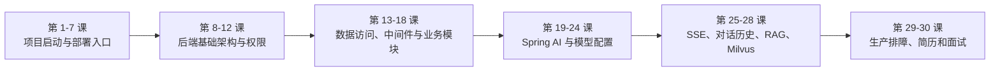

# IIMS 就业导向 30 课课程总索引
> 目标：用 30 课把 IIMS 从“能启动”学到“能部署、能配置模型、能讲源码、能写简历、能应对面试”。学习顺序建议严格按课号推进，因为前面的环境、数据库、权限和模型配置，是后面 AI、RAG 和部署排障的基础。

## 1. 学习路线总览



## 2. 阶段一：项目启动与部署入口

这一阶段解决“项目怎么跑起来”。目标不是理解所有源码，而是先能建立本地和服务器运行闭环。

| 课时 | 文件 | 主题 | 验收物 |
| --- | --- | --- | --- |
| 第 1 课 | [lesson-01-project-onboarding.md](lesson-01-project-onboarding.md) | 项目接手与运行目标拆解 | 项目模块地图、运行目标清单 |
| 第 2 课 | [lesson-02-dev-environment.md](lesson-02-dev-environment.md) | 本地开发环境与依赖修复 | Java、Maven、Node、npm 环境记录 |
| 第 3 课 | [lesson-03-database-initialization.md](lesson-03-database-initialization.md) | 数据库初始化与表缺失修复 | 初始化 SQL 执行记录、表结构检查 |
| 第 4 课 | [lesson-04-docker-middleware.md](lesson-04-docker-middleware.md) | Docker 中间件一键启动 | MySQL、Redis、MinIO 启动记录 |
| 第 5 课 | [lesson-05-backend-configuration.md](lesson-05-backend-configuration.md) | 后端启动配置全链路 | application 配置说明、后端启动日志 |
| 第 6 课 | [lesson-06-frontend-start-and-api.md](lesson-06-frontend-start-and-api.md) | 前端工程启动与请求代理 | 前端启动记录、API baseURL 说明 |
| 第 7 课 | [lesson-07-nginx-frontend-deploy.md](lesson-07-nginx-frontend-deploy.md) | Nginx 部署前端与公网访问 | 公网访问地址、Nginx 配置说明 |

阶段验收：

```text
前端能打开
后端能启动
数据库表完整
登录流程能走通
服务器公网能访问页面
```

## 3. 阶段二：后端基础架构与权限

这一阶段解决“后端项目为什么这样分层”。面试中 Spring Boot、统一返回、异常处理、登录鉴权和 RBAC 是高频追问。

| 课时 | 文件 | 主题 | 验收物 |
| --- | --- | --- | --- |
| 第 8 课 | [lesson-08-springboot-multimodule.md](lesson-08-springboot-multimodule.md) | Spring Boot 多模块架构 | 模块依赖图 |
| 第 9 课 | [lesson-09-common-result-exception-context.md](lesson-09-common-result-exception-context.md) | 统一返回、异常与上下文 | Result、异常处理、BaseContext 笔记 |
| 第 10 课 | [lesson-10-login-satoken.md](lesson-10-login-satoken.md) | 登录鉴权与 Sa-Token | 登录链路图、token 验证记录 |
| 第 11 课 | [lesson-11-rbac-user-role-menu.md](lesson-11-rbac-user-role-menu.md) | RBAC 用户、角色、菜单 | 权限模型图、菜单权限说明 |
| 第 12 课 | [lesson-12-mysql-schema-modeling.md](lesson-12-mysql-schema-modeling.md) | MySQL 表结构与业务建模 | 核心表关系图 |

阶段验收：

```text
能讲清楚多模块职责
能讲清楚登录 token 从哪里来
能讲清楚权限注解如何生效
能看懂用户角色菜单关系
```

## 4. 阶段三：数据访问、中间件与业务模块

这一阶段解决“项目真实业务如何落到数据库和中间件”。这部分是从启动者变成维护者的关键。

| 课时 | 文件 | 主题 | 验收物 |
| --- | --- | --- | --- |
| 第 13 课 | [lesson-13-mybatis-xml-mapper.md](lesson-13-mybatis-xml-mapper.md) | MyBatis 与 XML Mapper | 复杂 SQL 分析笔记 |
| 第 14 课 | [lesson-14-mybatis-plus-crud.md](lesson-14-mybatis-plus-crud.md) | MyBatis Plus 与基础 CRUD | CRUD 分层说明 |
| 第 15 课 | [lesson-15-redis-positioning.md](lesson-15-redis-positioning.md) | Redis 在项目中的定位 | Redis 使用点排查笔记 |
| 第 16 课 | [lesson-16-minio-file-service.md](lesson-16-minio-file-service.md) | MinIO 文件服务与智能云盘 | 文件上传链路图 |
| 第 17 课 | [lesson-17-archive-module.md](lesson-17-archive-module.md) | 档案管理业务模块 | 档案模块接口和表关系说明 |
| 第 18 课 | [lesson-18-knowledge-module.md](lesson-18-knowledge-module.md) | 知识库业务模块 | Wiki、Catalog、Article 关系图 |

阶段验收：

```text
能读懂 XML 动态 SQL
能区分 MyBatis Plus 和手写 Mapper 的分工
能完成文件上传排查
能讲清楚档案和知识库模块业务流
```

## 5. 阶段四：Spring AI 与模型配置

这一阶段解决“所有模型配置到能用”。这是项目的求职亮点核心。

| 课时 | 文件 | 主题 | 验收物 |
| --- | --- | --- | --- |
| 第 19 课 | [lesson-19-spring-ai-overview.md](lesson-19-spring-ai-overview.md) | Spring AI 总览与 IIMS 接入方式 | AI 对话链路图 |
| 第 20 课 | [lesson-20-model-config-frontend-db.md](lesson-20-model-config-frontend-db.md) | 模型配置表与前端模型管理 | 模型字段说明表 |
| 第 21 课 | [lesson-21-openai-compatible-config.md](lesson-21-openai-compatible-config.md) | OpenAI 兼容接口配置与联调 | OpenAI 兼容模型联调记录 |
| 第 22 课 | [lesson-22-deepseek-config.md](lesson-22-deepseek-config.md) | DeepSeek 模型配置与项目联调 | DeepSeek 模型配置记录 |
| 第 23 课 | [lesson-23-ollama-local-config.md](lesson-23-ollama-local-config.md) | Ollama 本地模型配置 | Ollama 语言和向量模型配置 |
| 第 24 课 | [lesson-24-user-default-model-settings.md](lesson-24-user-default-model-settings.md) | 用户默认模型与模型设置 | 默认聊天和向量模型检查清单 |

阶段验收：

```text
至少配置一个可用语言模型
至少配置一个可用 embedding 模型
当前用户默认模型设置正确
普通 AI 对话能返回结果
知道 DeepSeek、OpenAI 兼容、Ollama 的区别
```

## 6. 阶段五：SSE、对话历史、RAG 与 Milvus

这一阶段解决“AI 功能为什么能流式回复、为什么能基于知识库回答”。这是面试中最能拉开差距的部分。

| 课时 | 文件 | 主题 | 验收物 |
| --- | --- | --- | --- |
| 第 25 课 | [lesson-25-sse-streaming-chat.md](lesson-25-sse-streaming-chat.md) | SSE 流式对话实现 | SSE 请求和 EventStream 记录 |
| 第 26 课 | [lesson-26-dialogue-topic-history.md](lesson-26-dialogue-topic-history.md) | 对话历史、话题与消息存储 | Topic/Dialogue 数据库记录 |
| 第 27 课 | [lesson-27-rag-document-prompt.md](lesson-27-rag-document-prompt.md) | RAG 文档检索与 Prompt 组装 | RAG 调试报告 |
| 第 28 课 | [lesson-28-milvus-vector-embedding.md](lesson-28-milvus-vector-embedding.md) | Milvus 向量库与 Embedding 检索 | 向量化和 topK 检索记录 |

阶段验收：

```text
能解释 SSE 为什么适合 AI 对话
能解释模型为什么需要历史消息
能解释 RAG 的检索增强流程
能解释 Milvus、EmbeddingModel、ChatModel 的职责
```

## 7. 阶段六：生产排障、简历和面试

这一阶段解决“如何把项目变成求职材料”。最终目标不是只会运行，而是能讲清楚技术价值和个人贡献。

| 课时 | 文件 | 主题 | 验收物 |
| --- | --- | --- | --- |
| 第 29 课 | [lesson-29-production-logs-troubleshooting.md](lesson-29-production-logs-troubleshooting.md) | 生产部署、日志与故障排查 | 生产排障手册 |
| 第 30 课 | [lesson-30-resume-interview.md](lesson-30-resume-interview.md) | 二次开发、简历包装与面试攻防 | 简历描述、面试问答稿、二开计划 |

阶段验收：

```text
有公网演示环境
有项目架构图
有排障手册
有简历项目描述
有 8 分钟演示路线
有至少一个二次开发计划
```

## 8. 最终学习交付包

完成 30 课后，建议整理出：

```text
1. 项目运行说明
2. 环境安装说明
3. 数据库初始化说明
4. 中间件启动说明
5. 后端配置说明
6. 前端配置说明
7. Nginx 部署说明
8. 模型配置说明
9. RAG 流程图
10. 生产排障手册
11. 简历项目描述
12. 面试问答稿
13. 二次开发计划
```

## 9. 推荐复习顺序

如果时间紧，优先复习：

```text
第 3 课：数据库初始化
第 5 课：后端配置
第 10 课：登录鉴权
第 11 课：RBAC
第 16 课：MinIO 文件服务
第 19 课：Spring AI 总览
第 20 课：模型配置表
第 24 课：默认模型设置
第 25 课：SSE 流式对话
第 27 课：RAG
第 28 课：Milvus
第 30 课：简历面试
```

这 12 课覆盖启动、权限、文件、AI、RAG 和就业表达，是最核心的面试主线。

