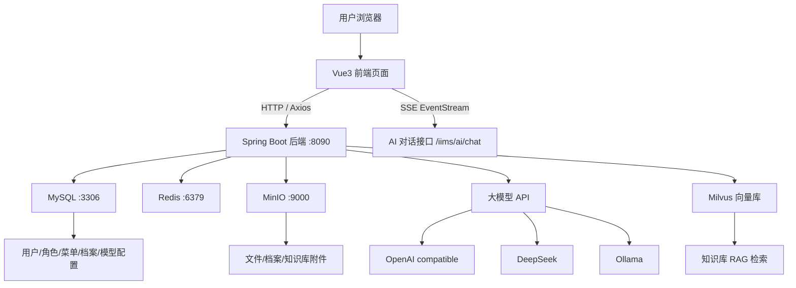

# 第 1 课：项目接手与运行目标拆解

> 课程定位：这一课不急着写代码，而是训练“接手真实项目”的第一反应。你要学会看目录、识别技术栈、找到启动入口、判断依赖服务、拆出运行目标，并把这些内容讲成面试里能成立的项目理解。

## 1. 本课目标

### 1.1 教学目标

学完本课后，学生应该能做到：

1. 说清楚 IIMS 是什么类型的项目。
2. 区分前端、后端、数据库、中间件、AI 服务各自的职责。
3. 找到前端启动入口、后端启动入口、数据库初始化脚本、核心配置文件。
4. 画出项目运行拓扑图。
5. 列出“必须启动”和“后续增强”的服务清单。
6. 知道下一步应该先跑什么、后跑什么、为什么不能一上来就乱改代码。
7. 用求职面试语言描述这个项目，而不是只说“我把 GitHub 项目跑起来了”。

### 1.2 就业目标

真实公司里，你接手的多数项目都不是从零开始，而是：

- 代码已经存在。
- 文档不完整。
- 配置可能过期。
- 环境可能缺失。
- 前端、后端、数据库、中间件互相依赖。
- 报错不会告诉你完整原因，只会告诉你某个局部坏了。

所以第一课训练的是工程判断力：

> 我拿到一个陌生项目后，能不能在 30 分钟内判断它是什么架构、怎么启动、依赖什么、风险在哪里、下一步怎么验证。

这是初级工程师和“只会照教程敲命令”的人之间，非常明显的分界线。

## 2. 本课使用的项目位置

本地项目根目录：

```text
C:\Users\MoLin\Desktop\IIMS
```

主要目录：

```text
C:\Users\MoLin\Desktop\IIMS
├── iims-client                 # 前端项目，Vue 3 + Vite
├── iims-server                 # 后端项目，Spring Boot + Maven 多模块
├── resources
│   └── sql
│       └── init-data.sql       # 数据库初始化脚本
├── jiaoxue                     # 教学文档目录
├── README.md                   # 项目说明
└── 启动配置.txt                # 本地启动相关记录
```

本课重点查看这些文件：

```text
C:\Users\MoLin\Desktop\IIMS\README.md
C:\Users\MoLin\Desktop\IIMS\iims-client\package.json
C:\Users\MoLin\Desktop\IIMS\iims-client\vite.config.ts
C:\Users\MoLin\Desktop\IIMS\iims-server\pom.xml
C:\Users\MoLin\Desktop\IIMS\iims-server\iims-starter\src\main\java\cn\aitenry\iims\IimsStarterApplication.java
C:\Users\MoLin\Desktop\IIMS\iims-server\iims-starter\src\main\resources\application.yml
C:\Users\MoLin\Desktop\IIMS\iims-server\iims-starter\src\main\resources\application-dev.yml
C:\Users\MoLin\Desktop\IIMS\resources\sql\init-data.sql
```

## 3. 课前准备

### 3.1 学生需要知道的基础概念

不用一开始就完全掌握，但至少要听得懂这些词：

| 概念 | 先理解成什么 |
|---|---|
| 前后端分离 | 浏览器里的页面和服务器里的业务接口分开开发、分开运行 |
| Vue | 前端页面框架 |
| Vite | 前端开发服务器和构建工具 |
| Spring Boot | Java 后端服务框架 |
| Maven | Java 项目依赖管理和打包工具 |
| MySQL | 存业务数据的关系型数据库 |
| Redis | 存 Token、缓存、临时状态的内存数据库 |
| MinIO | 存文件的对象存储服务 |
| Milvus | 存向量数据的数据库，服务于 RAG |
| Ollama | 本地运行大模型的工具 |
| Spring AI | Spring 生态里调用大模型、Embedding、向量库的框架 |
| Nginx | 部署前端静态页面和反向代理的 Web 服务器 |

### 3.2 本课不做什么

本课先不要求：

- 不要求立刻写新功能。
- 不要求立刻读懂每一行代码。
- 不要求立刻配置所有大模型。
- 不要求立刻理解 RAG 的所有算法细节。

本课只做一件事：

> 把项目全貌看明白，把运行目标拆清楚。

这件事做好，后面遇到错误才知道错误属于哪个层级。

## 4. 课堂时间建议

建议本课时长：2.5 到 3 小时。

| 时间 | 内容 |
|---|---|
| 0-15 分钟 | 讲清楚为什么接手项目不能先乱跑命令 |
| 15-35 分钟 | 浏览项目根目录，建立第一印象 |
| 35-60 分钟 | 识别前端技术栈和启动入口 |
| 60-95 分钟 | 识别后端技术栈和启动入口 |
| 95-125 分钟 | 识别数据库和中间件依赖 |
| 125-155 分钟 | 画运行拓扑图和服务清单 |
| 155-175 分钟 | 制定后续跑通路线 |
| 175-180 分钟 | 总结、作业、面试表达 |

如果是自学，可以分成两次：

- 第一次：看目录和技术栈。
- 第二次：画图、列清单、写项目介绍。

## 5. 第一部分：拿到项目后的第一反应

### 5.1 不要先做的事情

拿到陌生项目后，最容易犯的错是：

```text
看到 package.json 就 npm install
看到 pom.xml 就 mvn install
看到 SQL 就直接导入
看到报错就复制报错去搜索
```

这些动作不是一定错，但顺序容易错。

正确的第一步应该是：

1. 看根目录。
2. 找 README。
3. 判断项目是单体还是前后端分离。
4. 找前端入口。
5. 找后端入口。
6. 找数据库脚本。
7. 找配置文件。
8. 找运行依赖。
9. 画出服务关系。
10. 再决定启动顺序。

### 5.2 为什么要先画图

因为这个项目不是一个单独的 Java 程序，也不是一个单独的 Vue 页面。

它至少涉及：

- 浏览器访问前端。
- 前端请求后端。
- 后端连接 MySQL。
- 后端连接 Redis。
- 后端连接 MinIO。
- AI 对话调用大模型接口。
- 知识库问答调用 Embedding 模型。
- RAG 检索调用 Milvus。

如果你不画图，你看到一个错误时就会慌。

例如：

```text
Table 'iims.iims_integral_user' doesn't exist
```

这不是前端问题，也不是登录按钮问题，而是数据库表结构没有正确初始化。

再例如：

```text
Cannot find package 'prettier'
```

这不是后端问题，也不是 MySQL 问题，而是前端依赖缺失。

再例如：

```text
AI 对话没响应
```

这可能是：

- 前端 SSE 请求地址错了。
- 后端模型配置表没有模型。
- API Key 错了。
- baseUrl 错了。
- 默认模型没有绑定。
- Redis 鉴权失败。
- 后端异步线程报错。
- 模型供应商接口不可用。

所以第一课的核心是建立“分层定位”的思维。

## 6. 第二部分：查看根目录

### 6.1 操作命令

在 PowerShell 中进入项目：

```powershell
cd C:\Users\MoLin\Desktop\IIMS
```

查看一级目录：

```powershell
Get-ChildItem
```

推荐再看得紧凑一点：

```powershell
Get-ChildItem | Select-Object Name, Mode
```

### 6.2 看到什么

你应该能看到类似：

```text
iims-client
iims-server
resources
jiaoxue
README.md
LICENSE
```

这里立刻可以得到第一条判断：

> 这是前后端分离项目。

依据是：

- `iims-client` 通常表示客户端、前端。
- `iims-server` 通常表示服务端、后端。
- `resources/sql/init-data.sql` 表示需要数据库初始化。

### 6.3 教学提问

老师可以问：

1. 为什么看到 `iims-client` 和 `iims-server` 就可以初步判断前后端分离？
2. 如果只有一个 `src/main/java`，没有前端目录，可能是什么项目？
3. 如果只有 `package.json`，没有 `pom.xml`，可能是什么项目？
4. 为什么 `resources/sql` 对部署很重要？

学生应该能回答：

- 前端和后端分别有独立工程目录。
- 前端一般用 Node/npm 管理依赖。
- 后端 Java 项目一般用 Maven/Gradle 管理依赖。
- SQL 初始化决定数据库表是否存在，登录和业务功能都依赖它。

## 7. 第三部分：识别前端项目

### 7.1 查看前端目录

命令：

```powershell
cd C:\Users\MoLin\Desktop\IIMS\iims-client
Get-ChildItem
```

重点看这些文件：

```text
package.json
vite.config.ts
index.html
src
public
tsconfig.json
```

### 7.2 package.json 怎么读

打开：

```powershell
Get-Content C:\Users\MoLin\Desktop\IIMS\iims-client\package.json
```

重点看三块：

#### 第一块：scripts

通常会有：

```json
{
  "scripts": {
    "dev": "vite",
    "build-only": "vite build"
  }
}
```

含义：

- `npm run dev`：启动前端开发服务器。
- `npm run build-only`：打包生产环境静态文件。

就业表达：

> 前端开发阶段使用 Vite dev server，本地调试时通过环境变量指定后端 API 地址；生产部署时执行 Vite build，生成 dist 静态资源，再由 Nginx 托管。

#### 第二块：dependencies

重点识别：

```text
vue
vue-router
pinia 或 vuex
element-plus
axios
```

含义：

- `vue`：页面框架。
- `vue-router`：前端路由。
- `element-plus`：后台管理 UI 组件库。
- `axios`：普通 HTTP 请求。
- `request-sse.ts`：项目自定义的 SSE 流式请求封装。

#### 第三块：devDependencies

重点识别：

```text
vite
typescript
sass
prettier
```

如果报：

```text
Cannot find package 'prettier'
```

说明有某个开发插件依赖 `prettier`，但本地依赖没有装完整。

处理思路：

```powershell
npm install prettier --save-dev --legacy-peer-deps
```

这不是本课重点，但要知道它属于前端工程依赖问题。

### 7.3 前端源码怎么初步看

查看 `src`：

```powershell
Get-ChildItem C:\Users\MoLin\Desktop\IIMS\iims-client\src
```

常见目录：

```text
api
assets
components
router
store
utils
views
```

初步判断：

| 目录 | 作用 |
|---|---|
| `api` | 和后端接口对应的请求函数 |
| `views` | 页面 |
| `components` | 可复用组件 |
| `router` | 前端路由 |
| `store` | 全局状态，用户信息、菜单、权限 |
| `utils/request.ts` | Axios 封装 |
| `utils/request-sse.ts` | AI 流式对话请求封装 |

### 7.4 前端运行目标

第一课只需要明确前端运行目标，不一定马上跑：

```text
目标 1：npm install 能安装依赖。
目标 2：npm run dev 能启动 Vite。
目标 3：浏览器能打开前端页面。
目标 4：前端能请求后端 /iims/user/login/key。
目标 5：生产构建 npm run build-only 能生成 dist。
```

### 7.5 前端常见错误分类

| 错误 | 所属层级 | 处理方向 |
|---|---|---|
| `npm.ps1 cannot be loaded` | Windows PowerShell 策略 | 调整执行策略或使用 npm.cmd |
| `Cannot find package` | Node 依赖 | `npm install` 或补装依赖 |
| `vite config load failed` | 前端构建配置 | 检查 `vite.config.ts` 和缺失依赖 |
| 页面空白 | 前端运行时 | 看浏览器 Console |
| 请求 404 | API 地址或后端路由 | 检查 `VITE_APP_API_URL` |
| 请求 500 | 后端业务异常 | 看后端日志 |

## 8. 第四部分：识别后端项目

### 8.1 查看后端目录

命令：

```powershell
cd C:\Users\MoLin\Desktop\IIMS\iims-server
Get-ChildItem
```

应该看到多个模块：

```text
iims-module-ai
iims-module-archive
iims-module-auth
iims-module-common
iims-module-integral
iims-module-search
iims-module-subscriber
iims-starter
pom.xml
```

立刻得到判断：

> 这是 Maven 多模块 Spring Boot 项目。

### 8.2 pom.xml 怎么读

打开父 POM：

```powershell
Get-Content C:\Users\MoLin\Desktop\IIMS\iims-server\pom.xml
```

重点看：

```xml
<packaging>pom</packaging>
<modules>
    ...
</modules>
```

含义：

- 父工程本身不是直接启动的 Jar。
- 父工程负责统一版本、统一依赖、聚合子模块。
- 真正启动一般在 `iims-starter` 模块。

### 8.3 后端模块职责

| 模块 | 初步职责 |
|---|---|
| `iims-starter` | Spring Boot 启动入口，聚合其他模块 |
| `iims-module-common` | 公共类、统一返回、工具、基础实体、枚举 |
| `iims-module-auth` | 登录、认证、Token、鉴权 |
| `iims-module-integral` | 用户、角色、菜单、组织、模型管理 |
| `iims-module-archive` | 档案业务 |
| `iims-module-ai` | AI 对话、模型服务、Agent、RAG |
| `iims-module-search` | 搜索 |
| `iims-module-subscriber` | 订阅、消息、事件 |

### 8.4 找启动类

启动类路径：

```text
C:\Users\MoLin\Desktop\IIMS\iims-server\iims-starter\src\main\java\cn\aitenry\iims\IimsStarterApplication.java
```

查看：

```powershell
Get-Content C:\Users\MoLin\Desktop\IIMS\iims-server\iims-starter\src\main\java\cn\aitenry\iims\IimsStarterApplication.java
```

如果看到：

```java
@SpringBootApplication
public class IimsStarterApplication {
    public static void main(String[] args) {
        SpringApplication.run(IimsStarterApplication.class, args);
    }
}
```

含义：

- 这就是后端主入口。
- IDEA 里运行它即可启动后端。
- 命令行打包后也会由这个入口启动。

### 8.5 找后端端口

查看：

```powershell
Get-Content C:\Users\MoLin\Desktop\IIMS\iims-server\iims-starter\src\main\resources\application.yml
```

重点：

```yaml
server:
  port: 8090
```

含义：

> 后端默认监听 8090 端口。

所以后端基础地址通常是：

```text
http://127.0.0.1:8090
```

项目接口有统一前缀 `/iims`，例如：

```text
http://127.0.0.1:8090/iims/user/login/key
```

### 8.6 后端运行目标

第一课只需要建立目标：

```text
目标 1：Maven 能编译。
目标 2：Spring Boot 能启动。
目标 3：8090 端口监听成功。
目标 4：/iims/user/login/key 能返回 200。
目标 5：登录接口能连接 MySQL 和 Redis。
目标 6：文件功能能连接 MinIO。
目标 7：AI 功能能连接模型配置。
```

### 8.7 后端常见错误分类

| 错误 | 所属层级 | 处理方向 |
|---|---|---|
| Maven 找不到依赖 | Java 依赖 | 检查网络、镜像、pom |
| Java 版本不匹配 | JDK 环境 | 本项目使用 Java 17 |
| 端口 8090 占用 | 运行环境 | 关掉占用进程或改端口 |
| 数据库连接失败 | MySQL 配置 | 检查 host、port、username、password |
| 表不存在 | SQL 初始化 | 重新导入或修复 SQL |
| Redis 连接失败 | Redis 配置 | 检查 Redis 是否启动 |
| MinIO 报错 | 文件服务 | 检查 endpoint、bucket、账号密码 |
| AI 报错 | 模型配置 | 检查模型表、API Key、baseUrl、默认模型 |

## 9. 第五部分：识别数据库脚本

### 9.1 SQL 文件位置

```text
C:\Users\MoLin\Desktop\IIMS\resources\sql\init-data.sql
```

### 9.2 SQL 文件的作用

它通常包含：

```text
DROP TABLE IF EXISTS ...
CREATE TABLE ...
INSERT INTO ...
```

作用：

- 创建表结构。
- 插入菜单。
- 插入角色。
- 插入测试用户。
- 插入业务演示数据。
- 插入 AI 模型相关默认数据。

### 9.3 为什么数据库是第一批必须跑通的

因为登录就依赖数据库。

登录不是单纯判断用户名密码字符串，而是：

```text
前端输入账号密码
-> 后端登录接口
-> 查询用户表
-> 校验密码/状态/权限
-> 生成 Token
-> 写入 Redis 或 Sa-Token 上下文
-> 前端保存 Token
-> 加载菜单和用户信息
```

如果数据库表不存在，前端页面再正常也没用。

### 9.4 典型错误解释

错误：

```text
Table 'iims.iims_integral_user' doesn't exist
```

翻译成人话：

```text
后端正在查询 iims 数据库里的 iims_integral_user 表，
但是 MySQL 里没有这张表。
```

可能原因：

1. 没有创建 `iims` 数据库。
2. 没有导入 `init-data.sql`。
3. SQL 导入失败但没有注意。
4. SQL 文件里表名写错。
5. 后端连错数据库。

排查顺序：

```text
先确认 MySQL 是否启动
再确认数据库 iims 是否存在
再确认表 iims_integral_user 是否存在
再确认 SQL 是否完整导入
最后确认 application-dev.yml 连接的是不是这个库
```

## 10. 第六部分：识别配置文件

### 10.1 application.yml

路径：

```text
C:\Users\MoLin\Desktop\IIMS\iims-server\iims-starter\src\main\resources\application.yml
```

它是主配置文件。

重点配置：

```yaml
server:
  port: 8090

spring:
  profiles:
    active: dev

  datasource:
    druid:
      url: jdbc:mysql://${iims.datasource.host}:${iims.datasource.port}/${iims.datasource.database}

  data:
    redis:
      host: localhost
      port: 6379

iims:
  vector:
    host: localhost
  minio:
    endpoint: ${iims.minio.endpoint}
```

关键理解：

```text
application.yml 里有很多 ${...}
这些不是最终值，而是占位符。
真正的值可能来自 application-dev.yml。
```

### 10.2 application-dev.yml

路径：

```text
C:\Users\MoLin\Desktop\IIMS\iims-server\iims-starter\src\main\resources\application-dev.yml
```

它是开发环境配置。

重点看：

```yaml
iims:
  datasource:
    host: 127.0.0.1
    port: 3306
    database: iims
    username: root
    password: root

  minio:
    endpoint: http://127.0.0.1:9000
    accessKey: minioadmin
    secretKey: minioadmin
    bucketName: iims-bucket
```

注意：

```text
这个文件通常会包含本地密码和环境差异，所以实际公司项目中经常不提交到 Git。
```

### 10.3 配置文件怎么讲给面试官

可以这样说：

> 后端采用 Spring Boot profile 区分环境，`application.yml` 保留通用配置和占位符，`application-dev.yml` 提供开发环境的 MySQL、Redis、MinIO 等具体连接信息。这样做的好处是本地、测试、生产可以使用不同配置，避免把环境写死在代码里。

## 11. 第七部分：识别中间件依赖

### 11.1 必须服务和增强服务

| 服务 | 是否第一阶段必须 | 用途 |
|---|---|---|
| MySQL | 必须 | 用户、角色、菜单、档案、模型配置等业务数据 |
| Redis | 必须 | 登录 Token、会话、缓存 |
| MinIO | 建议必须 | 文件上传、云库、知识库文件 |
| Nginx | 生产部署必须，本地开发可不用 | 部署前端静态页面 |
| Milvus | RAG 阶段必须 | 向量存储和相似度检索 |
| Ollama | 可选 | 本地语言模型或本地 Embedding |
| OpenAI/DeepSeek API | AI 对话必须至少一种 | 云端大模型能力 |

### 11.2 为什么 MySQL 必须先启动

因为：

```text
没有 MySQL -> 没有用户表 -> 不能登录
没有菜单表 -> 登录后没有路由
没有模型表 -> AI 模型列表为空
没有业务表 -> 档案/知识库/文件记录无法保存
```

### 11.3 为什么 Redis 必须先启动

因为：

```text
登录成功后需要 Token 状态
后端接口需要识别当前用户
Sa-Token 通常依赖缓存或会话存储
```

如果 Redis 没启动，可能出现：

- 登录失败。
- 登录成功后立刻失效。
- 接口提示未登录。
- 后端启动时报 Redis 连接异常。

### 11.4 为什么 MinIO 很重要

因为项目里有：

- 文件上传。
- 智能云库。
- 知识库文件。
- 档案附件。

这些内容不适合直接放 MySQL。

MySQL 存：

```text
文件 ID、文件名、路径、大小、上传人、创建时间
```

MinIO 存：

```text
真实文件对象
```

所以文件功能要同时看：

```text
数据库记录 + MinIO 对象
```

### 11.5 为什么 Milvus 不是一开始必须

因为 Milvus 主要服务于 RAG。

如果只是：

- 登录
- 用户管理
- 菜单
- 档案
- 文件上传
- 普通 AI 对话

可以暂时不启动 Milvus。

但如果要实现：

```text
上传文档 -> 文档向量化 -> 根据问题检索相关段落 -> 拼进 Prompt -> 让模型回答
```

就必须要：

- Embedding 模型。
- Milvus。
- RAG 文档处理代码。

### 11.6 为什么 2GB ECS 不适合跑所有东西

阿里云 2 核 2GB 服务器适合：

- 跑前端 Nginx。
- 跑 Spring Boot 后端。
- 跑 MySQL。
- 跑 Redis。
- 跑 MinIO。

但不太适合：

- 跑大型 Ollama 模型。
- 跑完整 Milvus 栈。
- 同时承载高并发 AI 对话。

求职项目阶段可以这么设计：

```text
ECS：部署 Web 系统、后端接口、MySQL、Redis、MinIO。
云模型 API：提供语言模型和 Embedding。
本机或更高配置机器：可选运行 Ollama、Milvus。
```

这样更现实，也更像小团队实际部署方式。

## 12. 第八部分：项目运行拓扑图

本课要求学生能画出下面这张图。



### 12.1 图的讲解顺序

讲解时按请求流向走：

1. 用户打开浏览器。
2. 浏览器加载 Vue 前端。
3. 前端通过 Axios 请求后端普通接口。
4. AI 对话通过 SSE 请求后端流式接口。
5. 后端查 MySQL 获取用户、权限、业务数据。
6. 后端用 Redis 维护登录状态。
7. 后端用 MinIO 存文件。
8. 后端根据模型配置表选择 OpenAI、DeepSeek 或 Ollama。
9. 知识库问答时，后端先用 Embedding 模型向量化，再去 Milvus 检索。
10. 检索结果拼进 Prompt，最后让语言模型回答。

### 12.2 学生必须能回答的问题

1. 前端页面是后端 Java 渲染的吗？

答案：不是。前端是 Vue 单页应用，后端提供 API。

2. 为什么后端启动了，页面还可能打不开？

答案：前端没启动或 Nginx 没部署。

3. 为什么页面打开了，登录还可能失败？

答案：后端、MySQL、Redis、用户表、接口地址任一环节可能有问题。

4. 为什么普通聊天能用，知识库问答不能用？

答案：普通聊天只需要语言模型；知识库问答还需要 Embedding 模型、Milvus、文档入库。

5. 为什么文件列表有记录，但文件打不开？

答案：数据库有元数据，但 MinIO 对象、bucket、访问地址可能有问题。

## 13. 第九部分：制定运行优先级

### 13.1 第一优先级：能登录

必须完成：

```text
MySQL 启动
iims 数据库存在
init-data.sql 导入完成
Redis 启动
后端 8090 启动
前端能请求后端
登录接口成功
```

为什么先登录？

因为登录是后台系统所有功能的入口。

如果登录不能成功：

- 菜单加载不了。
- 用户身份没有。
- 文件上传不知道是谁传的。
- AI 对话不知道用户默认模型。
- 权限控制无法验证。

### 13.2 第二优先级：后台基础功能可用

包括：

```text
菜单显示
用户管理
角色管理
组织管理
字典/日志/统计
```

为什么第二步做这些？

因为这些功能验证的是：

- MySQL 表结构完整。
- 权限数据完整。
- 前端动态路由正常。
- 后端 CRUD 正常。
- Token 传递正常。

### 13.3 第三优先级：文件和档案功能

包括：

```text
MinIO 启动
bucket 存在
文件上传成功
文件下载成功
档案新增
档案关联文件
```

为什么第三步做？

因为文件功能比普通 CRUD 多一个对象存储服务。

### 13.4 第四优先级：AI 普通对话

包括：

```text
模型配置表有语言模型
API Key 正确
baseUrl 正确
当前用户有默认模型
前端 AI 页面能选择模型
SSE 能接收流式响应
```

为什么不一开始就做 AI？

因为 AI 功能依赖登录、用户、模型表、前后端请求、SSE。如果基础功能没通，AI 报错很难定位。

### 13.5 第五优先级：知识库 RAG

包括：

```text
文件上传成功
知识库创建成功
Embedding 模型配置成功
Milvus 启动成功
文档向量化成功
similaritySearch 有结果
语言模型能基于检索内容回答
```

这是最后攻坚，不应该放在第一天硬刚。

## 14. 第十部分：启动路线总表

### 14.1 本地开发路线

```text
第 1 步：确认 Java 17
第 2 步：确认 Maven
第 3 步：确认 Node/npm
第 4 步：启动 MySQL
第 5 步：导入 init-data.sql
第 6 步：启动 Redis
第 7 步：启动 MinIO
第 8 步：配置 application-dev.yml
第 9 步：启动后端 IimsStarterApplication
第 10 步：启动前端 npm run dev
第 11 步：访问前端并登录
第 12 步：验证基础页面
第 13 步：配置模型
第 14 步：验证 AI 对话
第 15 步：配置 Milvus 和 Embedding
第 16 步：验证知识库 RAG
```

### 14.2 服务器部署路线

```text
第 1 步：开放安全组端口 80、8090、22
第 2 步：安装 Docker
第 3 步：启动 MySQL/Redis/MinIO
第 4 步：导入 SQL
第 5 步：上传后端 Jar
第 6 步：配置 application-dev.yml 或外部配置
第 7 步：启动后端 Jar
第 8 步：构建前端 dist
第 9 步：上传 dist 到 /opt/iims/frontend
第 10 步：配置 Nginx
第 11 步：公网访问前端
第 12 步：验证登录
第 13 步：验证模型配置和 AI 对话
```

### 14.3 运行状态检查命令

本地 Windows：

```powershell
java -version
mvn -version
node -v
npm -v
```

检查端口：

```powershell
netstat -ano | findstr :8090
netstat -ano | findstr :3306
netstat -ano | findstr :6379
netstat -ano | findstr :9000
```

检查后端接口：

```powershell
Invoke-WebRequest http://127.0.0.1:8090/iims/user/login/key
```

服务器 Linux：

```bash
docker ps
docker logs iims-mysql --tail=100
docker logs iims-redis --tail=100
docker logs iims-minio --tail=100
ps -ef | grep iims-starter
tail -n 100 /opt/iims/server.log
curl -I http://127.0.0.1:8090/iims/user/login/key
curl -I http://127.0.0.1/
```

## 15. 第十一部分：本项目的核心接口入口

第一课不要求逐个读完 Controller，但要知道从哪里找接口。

### 15.1 登录相关

常见路径：

```text
/iims/user/login/key
/iims/user/login
/iims/user/info
```

源码定位：

```text
iims-server/iims-module-auth
iims-server/iims-module-integral
```

前端定位：

```text
iims-client/src/views/login
iims-client/src/utils/request.ts
iims-client/src/router-guard.ts
```

### 15.2 模型管理相关

接口：

```text
/iims/model/page
/iims/model/create
/iims/model/update
/iims/model/del/{id}
```

源码定位：

```text
iims-server/iims-module-integral/src/main/java/cn/aitenry/iims/integral/controller/AiModelController.java
iims-server/iims-module-ai/src/main/java/cn/aitenry/iims/ai/chat/service/impl/AiChatModelsServiceImpl.java
```

前端定位：

```text
iims-client/src/views/settings/model/Index.vue
iims-client/src/api/settings/model.ts
```

### 15.3 AI 对话相关

接口：

```text
/iims/ai/chat/endpoint/list
/iims/ai/chat/receive/answer/{uuid}
/iims/ai/chat/stop/answer/{uuid}
```

源码定位：

```text
iims-server/iims-module-ai/src/main/java/cn/aitenry/iims/ai/chat/controller/ChatController.java
iims-server/iims-module-ai/src/main/java/cn/aitenry/iims/ai/chat/service/impl/ChatServiceImpl.java
iims-server/iims-module-ai/src/main/java/cn/aitenry/iims/ai/chat/service/impl/ModelServiceImpl.java
```

前端定位：

```text
iims-client/src/api/ai/chat.ts
iims-client/src/utils/request-sse.ts
iims-client/src/views/ai
```

### 15.4 文件和知识库相关

源码定位：

```text
iims-server/iims-module-common
iims-server/iims-module-integral
iims-server/iims-module-ai/src/main/java/cn/aitenry/iims/ai/rag
```

前端定位：

```text
iims-client/src/views/file
iims-client/src/views/knowledge
```

## 16. 第十二部分：课堂演示脚本

这一节给老师或自学者一个完整讲课顺序。

### 16.1 开场

可以这样讲：

> 今天我们不急着改代码。真实工作中，最危险的不是不会写某个接口，而是没搞清项目结构就开始乱跑、乱改、乱删。第一课我们要训练的是项目接手能力：拿到 IIMS 后，快速判断它的架构、依赖、入口和运行路线。

### 16.2 演示根目录

命令：

```powershell
cd C:\Users\MoLin\Desktop\IIMS
Get-ChildItem
```

讲解：

> 看到 `iims-client` 和 `iims-server`，我们先判断这是前后端分离。看到 `resources/sql`，说明它不是纯静态项目，而是依赖数据库初始化。看到 `README.md`，先不要无视它，哪怕文档不完整，也要先看。

### 16.3 演示前端

命令：

```powershell
cd C:\Users\MoLin\Desktop\IIMS\iims-client
Get-Content package.json
```

讲解：

> 前端的启动命令来自 `scripts`。`dev` 对应本地开发，`build-only` 对应生产构建。依赖里出现 Vue、Element Plus、Axios，说明这是典型后台管理系统前端。

### 16.4 演示后端

命令：

```powershell
cd C:\Users\MoLin\Desktop\IIMS\iims-server
Get-ChildItem
Get-Content pom.xml
```

讲解：

> 后端不是单模块，而是 Maven 多模块。多模块项目要先找启动模块。这里 `iims-starter` 就是启动模块，其他模块提供具体业务能力。

### 16.5 演示配置

命令：

```powershell
Get-Content C:\Users\MoLin\Desktop\IIMS\iims-server\iims-starter\src\main\resources\application.yml
```

讲解：

> `server.port=8090` 告诉我们后端端口。`spring.profiles.active=dev` 告诉我们还要看 `application-dev.yml`。配置里的 `${...}` 是占位符，不是最终值。

### 16.6 演示 SQL

命令：

```powershell
Get-Content C:\Users\MoLin\Desktop\IIMS\resources\sql\init-data.sql | Select-Object -First 80
```

讲解：

> SQL 里既有建表，也有初始数据。后台管理项目能不能登录，菜单能不能显示，很多时候不是代码问题，而是初始化数据有没有导进去。

### 16.7 课堂小结

讲：

> 到这里我们还没启动项目，但已经知道了它的大体形态：Vue 前端、Spring Boot 多模块后端、MySQL/Redis/MinIO 基础中间件、Spring AI 模型接入、Milvus 知识库检索。下一课再处理环境和依赖，会稳很多。

## 17. 第十三部分：学生课堂练习

### 17.1 练习 1：写项目一句话介绍

要求学生用自己的话写一句：

```text
IIMS 是一个 ______ 项目，前端使用 ______，后端使用 ______，主要包含 ______、______、______ 等功能。
```

参考答案：

```text
IIMS 是一个前后端分离的智能信息管理系统，前端使用 Vue 3 和 Vite，后端使用 Spring Boot 多模块架构，主要包含用户权限、档案管理、文件存储、知识库和 AI 对话等功能。
```

### 17.2 练习 2：列出必须服务

要求学生填写：

| 服务 | 是否必须 | 理由 |
|---|---|---|
| MySQL |  |  |
| Redis |  |  |
| MinIO |  |  |
| Milvus |  |  |
| Ollama |  |  |
| Nginx |  |  |

参考答案：

| 服务 | 是否必须 | 理由 |
|---|---|---|
| MySQL | 第一阶段必须 | 存用户、菜单、业务表、模型配置 |
| Redis | 第一阶段必须 | 登录 Token 和会话状态 |
| MinIO | 文件阶段必须 | 文件上传、档案附件、知识库文件 |
| Milvus | RAG 阶段必须 | 向量检索 |
| Ollama | 可选 | 本地模型或 Embedding |
| Nginx | 生产部署必须 | 托管前端静态资源 |

### 17.3 练习 3：判断错误属于哪一层

题目：

| 错误 | 属于哪一层 |
|---|---|
| `Cannot find package 'prettier'` |  |
| `Table 'iims.iims_integral_user' doesn't exist` |  |
| `Connection refused: Redis` |  |
| 页面刷新后 404 |  |
| AI 对话一直等待无输出 |  |

参考答案：

| 错误 | 属于哪一层 |
|---|---|
| `Cannot find package 'prettier'` | 前端依赖 |
| `Table 'iims.iims_integral_user' doesn't exist` | MySQL 初始化 |
| `Connection refused: Redis` | Redis 服务或配置 |
| 页面刷新后 404 | Nginx / Vue Router 部署 |
| AI 对话一直等待无输出 | SSE、模型配置、后端 AI 服务都有可能，需要分层排查 |

### 17.4 练习 4：画运行拓扑图

要求：

学生不用画得漂亮，但必须包含：

```text
浏览器
Vue 前端
Spring Boot 后端
MySQL
Redis
MinIO
OpenAI/DeepSeek/Ollama
Milvus
```

并用箭头标出谁调用谁。

### 17.5 练习 5：找源码入口

要求学生填写：

| 问题 | 文件路径 |
|---|---|
| 前端启动命令在哪里看 |  |
| 后端父工程在哪里 |  |
| 后端启动类在哪里 |  |
| 后端端口在哪里配置 |  |
| 数据库初始化脚本在哪里 |  |
| AI 聊天 Controller 在哪里 |  |
| 模型管理前端页面在哪里 |  |

参考答案：

| 问题 | 文件路径 |
|---|---|
| 前端启动命令在哪里看 | `iims-client/package.json` |
| 后端父工程在哪里 | `iims-server/pom.xml` |
| 后端启动类在哪里 | `iims-server/iims-starter/src/main/java/cn/aitenry/iims/IimsStarterApplication.java` |
| 后端端口在哪里配置 | `iims-server/iims-starter/src/main/resources/application.yml` |
| 数据库初始化脚本在哪里 | `resources/sql/init-data.sql` |
| AI 聊天 Controller 在哪里 | `iims-server/iims-module-ai/src/main/java/cn/aitenry/iims/ai/chat/controller/ChatController.java` |
| 模型管理前端页面在哪里 | `iims-client/src/views/settings/model/Index.vue` |

## 18. 第十四部分：本课验收标准

本课结束后，学生必须能不看答案完成下面内容。

### 18.1 口头验收

能讲清楚：

1. IIMS 是前后端分离项目。
2. 前端用 Vue 3 + Vite。
3. 后端用 Spring Boot 3 + Maven 多模块。
4. MySQL 存业务数据。
5. Redis 支撑登录状态。
6. MinIO 存文件。
7. Spring AI 负责模型调用。
8. Milvus 负责 RAG 向量检索。
9. 普通 AI 对话和知识库问答不是一回事。
10. 2GB ECS 适合部署 Web 系统，不适合强行跑大模型。

### 18.2 文件定位验收

能在 1 分钟内找到：

```text
package.json
pom.xml
IimsStarterApplication.java
application.yml
application-dev.yml
init-data.sql
ChatController.java
ModelServiceImpl.java
Index.vue 模型配置页面
```

### 18.3 图示验收

能画出：

```text
浏览器 -> 前端 -> 后端 -> MySQL/Redis/MinIO/模型服务/Milvus
```

并能解释每条箭头。

### 18.4 排错验收

看到错误能先归类：

```text
这是前端依赖问题？
这是后端编译问题？
这是数据库问题？
这是 Redis 问题？
这是文件存储问题？
这是模型配置问题？
这是部署代理问题？
```

## 19. 第十五部分：本课作业

### 作业 1：写项目全貌说明

写一段 200 到 300 字说明：

```text
IIMS 项目的整体架构是什么？
前端、后端、数据库、中间件、AI 服务分别负责什么？
```

要求：

- 不能只堆技术名词。
- 必须说明组件之间的调用关系。
- 必须提到 MySQL、Redis、MinIO、Spring AI、Milvus。

### 作业 2：制作运行清单

写一个表格：

```text
服务名称
本地端口
是否必须
启动方式
验证方式
常见错误
```

至少包含：

- 前端 Vite
- 后端 Spring Boot
- MySQL
- Redis
- MinIO
- Milvus
- Nginx
- 模型 API

### 作业 3：整理源码地图

写出至少 12 个路径和作用，例如：

```text
iims-client/package.json：前端依赖和启动脚本
iims-server/pom.xml：后端父工程
...
```

### 作业 4：准备 1 分钟面试介绍

要求学生录音或口头说一遍：

```text
我做的这个项目是一个什么系统？
用了什么技术？
我负责什么？
项目最复杂的地方在哪里？
```

## 20. 第十六部分：面试表达

### 20.1 初级版本

> 我接手并部署了一个前后端分离的智能信息管理系统，前端使用 Vue 3、Vite 和 Element Plus，后端使用 Spring Boot 多模块架构。项目依赖 MySQL、Redis、MinIO，并集成 Spring AI 支持 OpenAI、DeepSeek、Ollama 等模型，后续还通过 Milvus 做知识库 RAG 检索。

### 20.2 更好的版本

> 我在这个项目里主要做的是部署运行、环境配置和 AI 模块梳理。刚接手时我先从目录结构、启动入口、配置文件和 SQL 初始化脚本入手，把项目拆成前端、后端、数据库、中间件、模型服务几层。后端是 Spring Boot 多模块，MySQL 存用户、菜单、档案和模型配置，Redis 支撑登录状态，MinIO 负责文件存储。AI 部分通过 Spring AI 根据数据库里的模型配置动态创建 OpenAI、DeepSeek 或 Ollama 的 ChatModel，知识库问答再结合 Embedding 模型和 Milvus 做 RAG。

### 20.3 面试官可能追问

#### 问：你为什么说这是前后端分离项目？

答：

> 因为项目里有独立的 `iims-client` 前端工程和 `iims-server` 后端工程。前端用 Vite 启动和构建，后端用 Spring Boot 提供 REST API。生产部署时前端打包成静态资源交给 Nginx，后端独立运行在 8090 端口。

#### 问：这个项目必须启动哪些中间件？

答：

> 基础运行至少需要 MySQL 和 Redis。MySQL 存用户、角色、菜单、档案、模型配置等业务数据，Redis 主要支撑登录 Token 和会话。文件相关功能需要 MinIO。知识库 RAG 需要 Embedding 模型和 Milvus。普通 AI 对话不一定需要 Milvus，但必须至少配置一个可用的语言模型。

#### 问：你怎么判断一个报错属于哪一层？

答：

> 我会先按调用链分层：浏览器控制台看前端错误，Network 看请求地址和状态码，后端日志看接口异常，数据库错误看 SQL 和表结构，Redis/MinIO 看连接配置和容器日志，AI 相关再检查模型表、API Key、baseUrl 和 SSE 流式接口。这样可以避免所有错误都混在一起排查。

#### 问：这个项目最值得讲的亮点是什么？

答：

> 亮点是它不是简单 CRUD，而是在后台管理系统基础上集成了 Spring AI。模型配置存在数据库中，后端根据模型类型动态创建 ChatModel，前端通过 SSE 接收流式回答；知识库场景又引入 Embedding 和 Milvus 做 RAG 检索增强。这条链路比较完整，适合展示工程整合能力。

## 21. 第十七部分：教师提示

### 21.1 不要让学生第一天陷入细节

第一天最容易陷入：

- 某个 npm 报错。
- 某个 Maven 依赖下载慢。
- 某个 SQL 字段不认识。
- 某个中文乱码。
- 某个模型接口没配好。

教师要拉回来：

> 今天先判断层级和路线，不在第一课解决所有问题。

### 21.2 但要让学生知道每个问题放在哪

例如：

```text
npm 报错 -> 第 2 课环境依赖
SQL 报错 -> 第 3 课数据库初始化
Docker 报错 -> 第 4 课中间件
模型没响应 -> 第 20 到 25 课
RAG 不工作 -> 第 27 到 28 课
```

这样学生不会乱。

### 21.3 鼓励学生建立项目笔记

建议从第一课开始维护：

```text
jiaoxue/my-notes.md
```

记录：

- 今天看了哪些文件。
- 每个目录负责什么。
- 遇到哪些报错。
- 报错属于哪一层。
- 后续要验证什么。

这份笔记后面可以直接整理成面试材料。

## 22. 本课最终交付物

本课结束后，学生应提交：

1. 一张项目运行拓扑图。
2. 一张服务依赖清单。
3. 一张源码入口清单。
4. 一段 200 到 300 字项目说明。
5. 一段 1 分钟面试介绍。

只要这 5 个东西完成，第一课就算真正过关。

