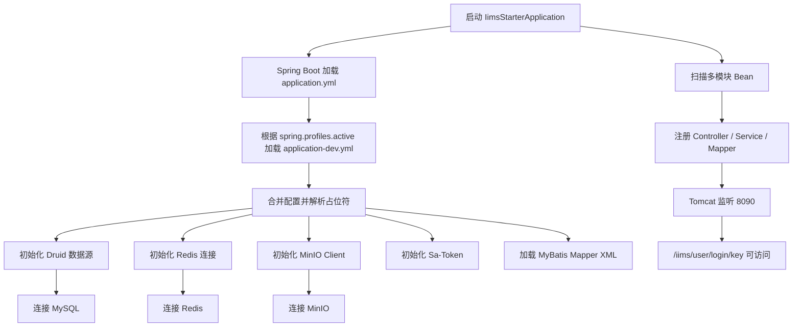

# 第 5 课：后端启动配置全链路

> 课程定位：这一课解决“后端到底读了哪些配置、为什么启动失败、怎么从配置文件一路追到服务运行”。IIMS 的后端不是只运行一个 Java main 方法那么简单，它依赖 Spring Boot profile、Druid 数据源、MySQL、Redis、MinIO、Sa-Token、MyBatis、日志系统、AI 配置和多模块扫描。学完本课后，学生要能独立整理本地和服务器两套后端配置，并能根据日志判断是哪一项配置出了问题。

## 1. 本课目标

### 1.1 教学目标

学完本课后，学生应该能做到：

1. 找到后端启动类，并理解启动注解的作用。
2. 读懂 `application.yml` 和 `application-dev.yml` 的关系。
3. 知道 `spring.profiles.active=dev` 如何影响配置加载。
4. 理解 MySQL、Redis、MinIO、Sa-Token、MyBatis、日志的后端配置。
5. 能整理本地开发环境和服务器部署环境的配置表。
6. 能用 IDEA 启动后端，也能用 Jar 命令启动后端。
7. 能判断端口占用、数据库连接失败、Redis 连接失败、MinIO 配置错误、Druid 解密错误分别如何排查。
8. 理解为什么启动类排除了 Milvus 自动配置。
9. 能通过 `/iims/user/login/key` 验证后端是否启动成功。
10. 能把“后端配置全链路”讲成面试中的工程经验。

### 1.2 就业目标

真实工作中，后端启动失败经常不是代码逻辑问题，而是配置问题：

- 本地配置和服务器配置不一致。
- profile 没切对。
- 数据库 host 或端口错了。
- 明文密码被 Druid 当成密文解密。
- Redis 没启动。
- MinIO bucket 没创建。
- 日志目录没有权限。
- 端口被占用。
- 多模块没有被 Spring 扫描到。

这一课训练的是：

> 从启动类、配置文件、环境变量、依赖服务、日志输出一路排查后端启动问题的能力。

这是后端开发和部署排错的基本功。

## 2. 本课涉及的项目文件

重点文件：

```text
C:\Users\MoLin\Desktop\IIMS\iims-server\iims-starter\src\main\java\cn\aitenry\iims\starter\IimsStarterApplication.java
C:\Users\MoLin\Desktop\IIMS\iims-server\iims-starter\src\main\resources\application.yml
C:\Users\MoLin\Desktop\IIMS\iims-server\iims-starter\src\main\resources\application-dev.yml
C:\Users\MoLin\Desktop\IIMS\iims-server\iims-starter\src\main\resources\logback-iims.xml
C:\Users\MoLin\Desktop\IIMS\iims-server\pom.xml
C:\Users\MoLin\Desktop\IIMS\iims-server\iims-starter\pom.xml
```

后端打包产物通常在：

```text
C:\Users\MoLin\Desktop\IIMS\iims-server\iims-starter\target\iims-starter-1.0.0.jar
```

服务器部署目录参考：

```text
/opt/iims/app/iims-starter-1.0.0.jar
/opt/iims/server.log
/opt/iims/docker-compose.yml
```

## 3. 课前准备

学习这一课前，应该已经完成：

1. Java 17 可用。
2. Maven 可用。
3. 后端 `mvn clean install -DskipTests` 能编译。
4. MySQL、Redis、MinIO 已经启动。
5. MySQL 中已经有 `iims` 数据库和基础表。
6. MinIO 已经创建 `iims-bucket`。

如果还没有完成，先回到第 2、3、4 课。

## 4. 后端启动全链路概览

后端启动不是单点动作，而是一条链：



这一课要把图上的每一步都讲清楚。

## 5. 第一部分：找到启动类

### 5.1 启动类路径

```text
C:\Users\MoLin\Desktop\IIMS\iims-server\iims-starter\src\main\java\cn\aitenry\iims\starter\IimsStarterApplication.java
```

### 5.2 启动类代码

核心代码：

```java
@SpringBootApplication(exclude = {
        org.springframework.ai.vectorstore.milvus.autoconfigure.MilvusVectorStoreAutoConfiguration.class
})
@EnableTransactionManagement
@EnableCaching
@ComponentScan({"cn.aitenry.iims.*"})
public class IimsStarterApplication {

    public static void main(String[] args) {
        SpringApplication.run(IimsStarterApplication.class, args);
    }
}
```

### 5.3 `@SpringBootApplication` 的作用

它可以理解为三个注解的组合：

```text
@SpringBootConfiguration
@EnableAutoConfiguration
@ComponentScan
```

作用：

- 标记这是 Spring Boot 应用。
- 开启自动配置。
- 扫描 Spring Bean。

### 5.4 为什么排除 Milvus 自动配置

代码中：

```java
@SpringBootApplication(exclude = {
        org.springframework.ai.vectorstore.milvus.autoconfigure.MilvusVectorStoreAutoConfiguration.class
})
```

含义：

```text
启动时不让 Spring Boot 自动初始化 MilvusVectorStore。
```

为什么这样做？

因为 Milvus 是 RAG 阶段才需要的增强服务。如果启动阶段就自动连接 Milvus，而本地或服务器没有启动 Milvus，后端可能直接启动失败。

项目现在采用的是：

```text
基础服务启动时不强制要求 Milvus。
真正做知识库向量检索时，再通过自定义服务加载 Milvus。
```

这和我们的课程路线一致：

```text
先跑通登录、权限、文件、普通 AI 对话。
再攻克知识库 RAG 和 Milvus。
```

### 5.5 `@EnableTransactionManagement`

作用：

```text
开启注解式事务管理。
```

常见场景：

```java
@Transactional
```

例如新增用户、保存档案、上传文件记录、写入多张表时，如果中间失败，可以回滚数据库操作。

### 5.6 `@EnableCaching`

作用：

```text
开启 Spring Cache 缓存能力。
```

缓存可能和 Redis 配合使用，也可能使用本地缓存，具体取决于项目配置和代码。

### 5.7 `@ComponentScan({"cn.aitenry.iims.*"})`

这个非常关键。

IIMS 是多模块项目：

```text
iims-module-ai
iims-module-auth
iims-module-common
iims-module-integral
iims-module-archive
iims-module-search
iims-module-subscriber
iims-starter
```

这些模块的 Java 包都在：

```text
cn.aitenry.iims
```

所以启动类手动指定：

```java
@ComponentScan({"cn.aitenry.iims.*"})
```

确保多模块里的 Controller、Service、配置类都能被扫描到。

如果扫描范围不对，可能出现：

```text
NoSuchBeanDefinitionException
Controller 不生效
Service 注入失败
Mapper 找不到
接口 404
```

### 5.8 面试表达

可以这样说：

> IIMS 是 Maven 多模块项目，启动入口在 `iims-starter`。启动类通过 `@ComponentScan("cn.aitenry.iims.*")` 扫描所有业务模块，并开启事务和缓存。项目排除了 Milvus 的自动配置，避免基础服务启动时强依赖向量库，等 RAG 功能真正使用时再通过自定义服务加载 Milvus。

## 6. 第二部分：读懂 application.yml

### 6.1 文件位置

```text
C:\Users\MoLin\Desktop\IIMS\iims-server\iims-starter\src\main\resources\application.yml
```

这是后端主配置文件。

### 6.2 server 配置

```yaml
server:
  port: 8090
```

含义：

```text
后端启动后监听 8090 端口。
```

本地访问：

```text
http://127.0.0.1:8090
```

项目接口前缀常见为：

```text
/iims
```

例如：

```text
http://127.0.0.1:8090/iims/user/login/key
```

### 6.3 multipart 配置

```yaml
spring:
  servlet:
    multipart:
      max-file-size: 150MB
```

含义：

```text
允许上传最大 150MB 的文件。
```

这和项目的文件、档案附件、知识库文档有关。

如果上传大文件失败，可能要同时检查：

- Spring Boot multipart 限制。
- Nginx 上传限制。
- MinIO 是否正常。
- 前端上传组件限制。

### 6.4 application name

```yaml
spring:
  application:
    name: iims-starter
```

含义：

```text
应用名称是 iims-starter。
```

在日志、监控、微服务注册场景中有用。

### 6.5 profiles 配置

```yaml
spring:
  profiles:
    active: dev
```

含义：

```text
当前激活 dev 环境。
```

Spring Boot 会加载：

```text
application.yml
application-dev.yml
```

并合并配置。

### 6.6 main 配置

```yaml
spring:
  main:
    allow-circular-references: true
    banner-mode: off
```

含义：

| 配置 | 含义 |
|---|---|
| `allow-circular-references: true` | 允许循环依赖 |
| `banner-mode: off` | 关闭启动 Banner |

循环依赖不是最佳设计，但接手已有项目时，有些 Bean 之间可能互相依赖。这里开启是为了让项目能启动。

### 6.7 数据源配置

```yaml
spring:
  datasource:
    druid:
      driver-class-name: ${iims.datasource.driver-class-name}
      url: jdbc:mysql://${iims.datasource.host}:${iims.datasource.port}/${iims.datasource.database}?allowPublicKeyRetrieval=true&useUnicode=true&characterEncoding=UTF-8&serverTimezone=Asia/Shanghai&autoReconnect=true&useSSL=false&zeroDateTimeBehavior=convertToNull
      username: ${iims.datasource.username}
      password: ${iims.datasource.password}
```

这里没有直接写死值，而是引用：

```text
iims.datasource.driver-class-name
iims.datasource.host
iims.datasource.port
iims.datasource.database
iims.datasource.username
iims.datasource.password
```

这些值来自 `application-dev.yml`。

### 6.8 Redis 配置

```yaml
spring:
  data:
    redis:
      database: 0
      host: localhost
      port: 6379
      jedis:
        pool:
          max-active: 1000
          max-wait: -1ms
          max-idle: 16
          min-idle: 8
```

含义：

- Redis 地址是 `localhost:6379`。
- 使用第 0 个逻辑库。
- Jedis 连接池最大活跃连接 1000。

项目中 Redis 典型用途：

- 登录 RSA 私钥临时存储。
- Token/会话状态。
- Sa-Token 相关缓存。

### 6.9 Spring AI 基础配置

```yaml
spring:
  ai:
    openai:
      api-key: xxx
    deepseek:
      api-key: xxx
```

这里是 Spring AI starter 的基础配置。

但 IIMS 真正的业务模型配置主要来自数据库：

```text
iims_ai_chat_models
iims_ai_chat_settings
```

所以不要误以为这里只填 `xxx` 就能完成模型配置。模型配置会在后续第 20 到 24 课单独展开。

### 6.10 MyBatis 配置

```yaml
mybatis:
  mapper-locations: classpath*:mapper/*.xml
  configuration:
    map-underscore-to-camel-case: true
```

含义：

| 配置 | 含义 |
|---|---|
| `mapper-locations` | 扫描各模块 classpath 下的 `mapper/*.xml` |
| `map-underscore-to-camel-case` | 数据库下划线字段映射 Java 驼峰字段 |

例如：

```text
is_deleted -> isDeleted
create_time -> createTime
model_type -> modelType
```

### 6.11 PageHelper 配置

```yaml
pagehelper:
  helper-dialect: mysql
  reasonable: true
  support-methods-arguments: true
  params: count=countSql
```

作用：

```text
分页查询。
```

列表页、用户管理、模型管理、档案列表等都可能用到。

### 6.12 logging 配置

```yaml
logging:
  config: classpath:logback-iims.xml
```

含义：

```text
日志配置文件使用 logback-iims.xml。
```

日志不仅输出到控制台，还配置了文件和数据库 appender。

### 6.13 iims.vector 配置

```yaml
iims:
  vector:
    host: localhost
```

含义：

```text
Milvus 向量库 host 是 localhost。
```

这只在 RAG 向量检索阶段用到。

### 6.14 iims.jwt 配置

```yaml
iims:
  jwt:
    admin-secret-key: ${iims.jwt.admin-secret-key}
    admin-ttl: 72000000
    admin-token-name: token
```

含义：

| 配置 | 含义 |
|---|---|
| `admin-secret-key` | JWT 签名密钥 |
| `admin-ttl` | Token 过期时间 |
| `admin-token-name` | 前端请求头中的 token 名称 |

虽然项目同时使用 Sa-Token 配置，但这里保留了 JWT 相关配置，需要结合具体代码理解。

### 6.15 MinIO 配置

```yaml
iims:
  minio:
    endpoint: ${iims.minio.endpoint}
    accessKey: ${iims.minio.accessKey}
    secretKey: ${iims.minio.secretKey}
    bucketName: ${iims.minio.bucketName}
```

具体值来自 `application-dev.yml`。

### 6.16 Sa-Token 配置

```yaml
sa-token:
  token-name: token
  timeout: 2592000
  is-share: false
  token-style: uuid
  isReadCookie: false
  isConcurrent: false
  is-print: false
```

含义：

| 配置 | 含义 |
|---|---|
| `token-name: token` | 请求头 token 名称 |
| `timeout: 2592000` | Token 有效期，单位秒，约 30 天 |
| `is-share: false` | 多人登录同账号不共享同一个 Token |
| `token-style: uuid` | Token 生成风格 |
| `isReadCookie: false` | 不从 Cookie 读 Token |
| `isConcurrent: false` | 不允许同账号多处同时在线 |

前端请求必须带：

```text
token
```

否则后端会认为未登录。

### 6.17 MyBatis Plus 配置

```yaml
mybatis-plus:
  configuration:
    default-enum-type-handler: org.apache.ibatis.type.EnumOrdinalTypeHandler
  global-config:
    banner: off
```

注意：

```text
枚举默认按 ordinal 存储。
```

这会影响 AI 模型类型这类枚举字段的数据库值。

例如：

```java
public enum AiApiType {
    AGENT,
    OPENAI,
    OLLAMA,
    DEEPSEEK;
}
```

ordinal 对应：

```text
AGENT = 0
OPENAI = 1
OLLAMA = 2
DEEPSEEK = 3
```

所以数据库中 `type` 字段可能是数字。

## 7. 第三部分：读懂 application-dev.yml

### 7.1 文件位置

```text
C:\Users\MoLin\Desktop\IIMS\iims-server\iims-starter\src\main\resources\application-dev.yml
```

### 7.2 数据库配置

```yaml
iims:
  datasource:
    driver-class-name: com.mysql.cj.jdbc.Driver
    host: 127.0.0.1
    port: 3306
    database: iims
    username: root
    password: root
    publicKey: root
```

这是开发环境实际连接的数据库。

最终 JDBC URL 会变成：

```text
jdbc:mysql://127.0.0.1:3306/iims?allowPublicKeyRetrieval=true&useUnicode=true&characterEncoding=UTF-8&serverTimezone=Asia/Shanghai&autoReconnect=true&useSSL=false&zeroDateTimeBehavior=convertToNull
```

### 7.3 JWT 密钥

```yaml
iims:
  jwt:
    admin-secret-key: YourSuperSecretKeyForJwtKeepItSafe
```

本地学习可以使用这个值。

生产环境不应该使用默认值。

### 7.4 MinIO 配置

```yaml
iims:
  minio:
    endpoint: http://127.0.0.1:9000
    accessKey: minioadmin
    secretKey: minioadmin
    bucketName: iims-bucket
```

注意：

```text
endpoint 是 9000，不是 9001。
```

9000 是 API 端口，Java 后端用它。

9001 是 MinIO 控制台端口，人在浏览器里用它。

### 7.5 Druid 解密覆盖

```yaml
spring:
  datasource:
    druid:
      filter:
        config:
          enabled: false
      connection-properties: config.decrypt=false
```

作用：

```text
本地开发使用明文数据库密码，不让 Druid 解密。
```

如果这段删掉，本地密码 `root` 可能被当成密文处理，导致连接失败。

## 8. 第四部分：配置合并机制

### 8.1 加载顺序

当前配置：

```yaml
spring:
  profiles:
    active: dev
```

Spring Boot 会加载：

```text
application.yml
application-dev.yml
```

并合并。

### 8.2 合并原则

简单理解：

```text
application.yml 提供通用骨架。
application-dev.yml 提供 dev 环境具体值。
同名配置时，dev 环境覆盖主配置。
```

### 8.3 示例：数据库 URL

主配置：

```yaml
url: jdbc:mysql://${iims.datasource.host}:${iims.datasource.port}/${iims.datasource.database}
```

dev 配置：

```yaml
iims:
  datasource:
    host: 127.0.0.1
    port: 3306
    database: iims
```

最终：

```text
jdbc:mysql://127.0.0.1:3306/iims
```

### 8.4 示例：Druid 解密

主配置默认：

```yaml
connection-properties: config.decrypt=true
filter:
  config:
    enabled: true
```

dev 覆盖：

```yaml
connection-properties: config.decrypt=false
filter:
  config:
    enabled: false
```

最终本地不解密。

### 8.5 常见误区

误区 1：

```text
我改了 application-dev.yml，但没有生效。
```

排查：

```text
spring.profiles.active 是否真的是 dev？
打包后的 target/classes/application-dev.yml 是否更新？
IDEA 是否使用了旧构建产物？
启动参数是否覆盖了 profile？
```

误区 2：

```text
我只看 application.yml，以为数据库密码没写。
```

实际密码在：

```text
application-dev.yml
```

## 9. 第五部分：本地开发配置表

本地默认配置建议如下：

| 配置项 | 本地值 | 来源 |
|---|---|---|
| 后端端口 | `8090` | `application.yml` |
| Profile | `dev` | `application.yml` |
| MySQL host | `127.0.0.1` | `application-dev.yml` |
| MySQL port | `3306` | `application-dev.yml` |
| MySQL database | `iims` | `application-dev.yml` |
| MySQL username | `root` | `application-dev.yml` |
| MySQL password | `root` | `application-dev.yml` |
| Redis host | `localhost` | `application.yml` |
| Redis port | `6379` | `application.yml` |
| MinIO endpoint | `http://127.0.0.1:9000` | `application-dev.yml` |
| MinIO accessKey | `minioadmin` | `application-dev.yml` |
| MinIO secretKey | `minioadmin` | `application-dev.yml` |
| MinIO bucket | `iims-bucket` | `application-dev.yml` |
| Milvus host | `localhost` | `application.yml` |
| Token header | `token` | `sa-token.token-name` |

## 10. 第六部分：服务器部署配置表

服务器上如果所有中间件和后端都在同一台机器，常见配置：

| 配置项 | 服务器值 |
|---|---|
| 后端端口 | `8090` |
| MySQL host | `127.0.0.1` |
| MySQL port | `3306` |
| MySQL database | `iims` |
| MySQL username | `root` 或专用用户 |
| Redis host | `127.0.0.1` 或 `localhost` |
| Redis port | `6379` |
| MinIO endpoint | `http://127.0.0.1:9000` |
| MinIO bucket | `iims-bucket` |
| 前端公网 | `http://服务器IP/` |
| 后端公网测试 | `http://服务器IP:8090/iims` |

如果后端在 Docker 外，MySQL/Redis/MinIO 在 Docker 中，并映射了端口到宿主机，那么后端使用 `127.0.0.1` 是可以的。

如果后端也放进 Docker 容器，配置就不同：

```text
MySQL host 可能要写 mysql 服务名。
Redis host 可能要写 redis 服务名。
MinIO endpoint 可能要写 http://minio:9000。
```

本课程当前阶段后端 Jar 在宿主机运行，所以使用：

```text
127.0.0.1
```

## 11. 第七部分：IDEA 启动后端

### 11.1 打开项目

用 IDEA 打开：

```text
C:\Users\MoLin\Desktop\IIMS\iims-server
```

不要只打开 `iims-starter`。

### 11.2 检查 Project SDK

IDEA 中确认：

```text
Project SDK = Java 17
Language level = 17
```

Maven Runner 也应使用 Java 17。

### 11.3 找启动类

```text
iims-starter/src/main/java/cn/aitenry/iims/starter/IimsStarterApplication.java
```

右键：

```text
Run 'IimsStarterApplication'
```

### 11.4 IDEA Run Configuration 可配置项

常用：

| 配置项 | 示例 |
|---|---|
| Main class | `cn.aitenry.iims.starter.IimsStarterApplication` |
| JDK | Java 17 |
| Working directory | `C:\Users\MoLin\Desktop\IIMS\iims-server` |
| VM options | 可选 |
| Program arguments | 可选 |

如果要临时切 profile：

```text
--spring.profiles.active=dev
```

如果要临时改端口：

```text
--server.port=8091
```

## 12. 第八部分：命令行 Jar 启动

### 12.1 编译打包

```powershell
cd C:\Users\MoLin\Desktop\IIMS\iims-server
mvn clean install -DskipTests
```

### 12.2 找 Jar

```text
C:\Users\MoLin\Desktop\IIMS\iims-server\iims-starter\target\iims-starter-1.0.0.jar
```

### 12.3 启动 Jar

```powershell
cd C:\Users\MoLin\Desktop\IIMS\iims-server\iims-starter\target
java -jar iims-starter-1.0.0.jar
```

### 12.4 指定 profile 启动

```powershell
java -jar iims-starter-1.0.0.jar --spring.profiles.active=dev
```

### 12.5 指定端口启动

```powershell
java -jar iims-starter-1.0.0.jar --server.port=8091
```

### 12.6 同时指定

```powershell
java -jar iims-starter-1.0.0.jar --spring.profiles.active=dev --server.port=8091
```

### 12.7 服务器后台启动

Linux：

```bash
nohup java -jar /opt/iims/app/iims-starter-1.0.0.jar > /opt/iims/server.log 2>&1 &
```

含义：

| 片段 | 含义 |
|---|---|
| `nohup` | 退出终端后继续运行 |
| `java -jar` | 启动 Jar |
| `> /opt/iims/server.log` | 标准输出写入日志 |
| `2>&1` | 错误输出也写入同一个日志 |
| `&` | 后台运行 |

查看日志：

```bash
tail -n 100 /opt/iims/server.log
tail -f /opt/iims/server.log
```

查进程：

```bash
ps -ef | grep iims-starter
```

停止：

```bash
kill 进程ID
```

## 13. 第九部分：启动成功标志

### 13.1 控制台日志

成功时通常看到：

```text
Tomcat started on port 8090
Started IimsStarterApplication
```

这说明：

```text
Spring Boot 应用启动成功。
Web 容器监听 8090。
```

### 13.2 接口验证

PowerShell：

```powershell
Invoke-WebRequest http://127.0.0.1:8090/iims/user/login/key
```

浏览器：

```text
http://127.0.0.1:8090/iims/user/login/key
```

服务器本机：

```bash
curl -I http://127.0.0.1:8090/iims/user/login/key
```

公网测试：

```text
http://服务器IP:8090/iims/user/login/key
```

如果本机可访问但公网不可访问，通常是：

```text
安全组、防火墙或端口未开放。
```

## 14. 第十部分：日志配置

### 14.1 日志配置文件

```text
C:\Users\MoLin\Desktop\IIMS\iims-server\iims-starter\src\main\resources\logback-iims.xml
```

### 14.2 日志输出位置

配置中有：

```xml
<appender name="CONSOLE" class="ch.qos.logback.core.ConsoleAppender">
```

表示输出到控制台。

也有：

```xml
<appender name="FILE" class="ch.qos.logback.core.rolling.RollingFileAppender">
```

表示输出到文件。

文件路径：

```text
/log-warehouse/local/project/logs/iims/iims-data.log
```

### 14.3 日志文件路径风险

这个路径是 Linux 风格绝对路径。

在 Windows 本地运行时，可能出现：

```text
目录不存在
没有权限
文件 appender 写入失败
```

但通常控制台日志仍然可用。

如果日志目录导致启动失败，可以：

1. 创建对应目录。
2. 临时改成本地可写路径。
3. 先关注控制台输出。

### 14.4 数据库日志 appender

配置中还有：

```xml
<appender name="DATABASE" class="cn.aitenry.iims.common.appender.DatabaseLogAppender"/>
```

说明项目可能会把部分日志写入数据库。

如果数据库连接失败，日志写库也可能受影响。

### 14.5 看日志的原则

启动失败时不要只看最后一行。

要找：

```text
第一个 ERROR
第一个 Caused by
第一个业务相关类名
第一个连接失败信息
```

## 15. 第十一部分：常见错误一：端口 8090 被占用

### 15.1 表现

```text
Web server failed to start. Port 8090 was already in use.
```

### 15.2 Windows 排查

```powershell
netstat -ano | findstr :8090
```

查看进程：

```powershell
tasklist /FI "PID eq 进程ID"
```

结束进程：

```powershell
taskkill /PID 进程ID /F
```

### 15.3 Linux 排查

```bash
ss -lntp | grep :8090
```

结束：

```bash
kill 进程ID
```

### 15.4 临时改端口

```powershell
java -jar iims-starter-1.0.0.jar --server.port=8091
```

但前端 API 地址也要同步改。

## 16. 常见错误二：数据库连接失败

### 16.1 表现

```text
Communications link failure
Access denied for user
Unknown database 'iims'
Table doesn't exist
```

### 16.2 排查顺序

```text
MySQL 容器是否 Up
3306 是否监听
账号密码能否手动登录
iims 数据库是否存在
init-data.sql 是否导入
application-dev.yml 是否连对 host/port/database
Druid 解密是否关闭
```

### 16.3 命令

```powershell
docker ps
netstat -ano | findstr :3306
mysql -h 127.0.0.1 -P 3306 -uroot -p
```

SQL：

```sql
SHOW DATABASES LIKE 'iims';
USE iims;
SHOW TABLES LIKE 'iims_integral_user';
```

## 17. 常见错误三：Redis 连接失败

### 17.1 表现

```text
RedisConnectionFailureException
Unable to connect to Redis server
Connection refused
```

### 17.2 排查

```powershell
docker ps
docker logs iims-redis --tail=100
docker exec -it iims-redis redis-cli
PING
netstat -ano | findstr :6379
```

### 17.3 配置检查

```yaml
spring:
  data:
    redis:
      host: localhost
      port: 6379
      database: 0
```

如果 Redis 容器端口改了，后端也要改。

### 17.4 为什么 Redis 会影响登录

项目中登录密钥和会话状态依赖 Redis。

例如用户登录前获取密钥，后端会生成 RSA 私钥并放进 Redis，登录时再取出来解密。

所以 Redis 不通，登录链路可能失败。

## 18. 常见错误四：MinIO 配置错误

### 18.1 表现

```text
文件上传失败
头像不显示
档案附件打不开
知识库文件读取失败
```

启动时不一定马上失败，因为 MinIO 可能在文件操作时才用到。

### 18.2 排查

```powershell
docker ps
docker logs iims-minio --tail=100
```

浏览器：

```text
http://127.0.0.1:9001
```

检查 bucket：

```text
iims-bucket
```

### 18.3 配置检查

```yaml
iims:
  minio:
    endpoint: http://127.0.0.1:9000
    accessKey: minioadmin
    secretKey: minioadmin
    bucketName: iims-bucket
```

重点：

```text
后端 endpoint 必须是 9000 API 端口。
控制台 9001 不是 Java API 端口。
```

## 19. 常见错误五：Druid 解密错误

### 19.1 表现

数据库密码明明正确，但后端连接失败，日志里可能出现 Druid config decrypt 相关信息。

### 19.2 原因

主配置：

```yaml
connection-properties: config.decrypt=true
```

本地密码：

```yaml
password: root
```

如果不覆盖，Druid 会尝试解密明文密码。

### 19.3 解决

确保 `application-dev.yml` 有：

```yaml
spring:
  datasource:
    druid:
      filter:
        config:
          enabled: false
      connection-properties: config.decrypt=false
```

## 20. 常见错误六：Mapper XML 找不到

### 20.1 表现

```text
Invalid bound statement
```

或：

```text
找不到某个 Mapper 方法
```

### 20.2 配置相关

```yaml
mybatis:
  mapper-locations: classpath*:mapper/*.xml
```

这里使用 `classpath*:`，是为了扫描多个模块 classpath 下的 mapper XML。

### 20.3 排查

1. XML 文件是否在模块的 `src/main/resources/mapper`。
2. Maven 是否把资源文件打进 target。
3. Mapper 接口方法名是否和 XML 中 id 一致。
4. `mapper-locations` 是否被改错。

## 21. 常见错误七：Bean 扫描失败

### 21.1 表现

```text
NoSuchBeanDefinitionException
Field xxx required a bean that could not be found
```

### 21.2 可能原因

1. 模块没有被依赖进 starter。
2. 包路径不在扫描范围。
3. 类缺少 `@Service`、`@Component`、`@Configuration` 等注解。
4. IDEA 只打开了子模块，模块依赖不完整。

### 21.3 本项目关键配置

```java
@ComponentScan({"cn.aitenry.iims.*"})
```

### 21.4 排查

```text
看类的 package 是否是 cn.aitenry.iims 开头。
看 starter pom 是否引入模块。
看类上是否有 Spring 注解。
```

## 22. 常见错误八：Profile 没生效

### 22.1 表现

```text
后端没有读取 application-dev.yml
数据库配置变成空
占位符无法解析
连接了错误的数据库
```

### 22.2 排查

检查主配置：

```yaml
spring:
  profiles:
    active: dev
```

启动时看日志中 active profile：

```text
The following 1 profile is active: "dev"
```

### 22.3 启动参数强制指定

```powershell
java -jar iims-starter-1.0.0.jar --spring.profiles.active=dev
```

IDEA Program arguments：

```text
--spring.profiles.active=dev
```

## 23. 后端启动前检查清单

启动前检查：

```text
Java 17 是否可用
Maven 是否编译成功
MySQL 容器是否 Up
Redis 容器是否 Up
MinIO 容器是否 Up
iims 数据库是否存在
iims_integral_user 表是否存在
iims-bucket 是否存在
application-dev.yml 数据库密码是否正确
Druid 解密是否关闭
8090 端口是否空闲
```

对应命令：

```powershell
java -version
mvn -version
docker ps
netstat -ano | findstr :8090
```

MySQL：

```sql
USE iims;
SHOW TABLES LIKE 'iims_integral_user';
```

Redis：

```powershell
docker exec -it iims-redis redis-cli PING
```

MinIO：

```text
http://127.0.0.1:9001
```

## 24. 后端启动后检查清单

启动后检查：

```text
控制台是否有 Started IimsStarterApplication
Tomcat 是否监听 8090
/iims/user/login/key 是否返回
登录时 Redis 是否写入临时密钥
登录后 MySQL 是否正常查询用户和菜单
上传文件时 MinIO 是否可用
```

命令：

```powershell
Invoke-WebRequest http://127.0.0.1:8090/iims/user/login/key
netstat -ano | findstr :8090
```

服务器：

```bash
curl -I http://127.0.0.1:8090/iims/user/login/key
tail -n 100 /opt/iims/server.log
```

## 25. 本地与服务器配置对照

### 25.1 本地开发

```text
前端：Vite 本地启动
后端：IDEA 或 java -jar 本地启动
MySQL：Docker 映射 3306
Redis：Docker 映射 6379
MinIO：Docker 映射 9000/9001
```

### 25.2 服务器部署

```text
前端：Nginx 托管 dist
后端：java -jar 后台运行
MySQL：Docker 容器
Redis：Docker 容器
MinIO：Docker 容器
```

### 25.3 最大区别

本地开发看：

```text
IDEA 控制台
浏览器 Network
Docker Desktop
```

服务器部署看：

```text
/opt/iims/server.log
docker logs
nginx 日志
安全组
防火墙
```

## 26. 课堂演示脚本

### 26.1 开场

可以这样讲：

> 前面我们已经启动了数据库和中间件。今天要解决的是后端配置全链路：Spring Boot 从哪里启动，读哪些配置，如何连接 MySQL、Redis、MinIO，为什么一个 profile 或端口错了就会导致整个项目不可用。

### 26.2 演示启动类

```powershell
Get-Content C:\Users\MoLin\Desktop\IIMS\iims-server\iims-starter\src\main\java\cn\aitenry\iims\starter\IimsStarterApplication.java
```

讲解：

> 这个类是后端入口。注意它排除了 Milvus 自动配置，并手动扫描 `cn.aitenry.iims.*`，这是多模块项目能正常注册 Bean 的关键。

### 26.3 演示主配置

```powershell
Get-Content C:\Users\MoLin\Desktop\IIMS\iims-server\iims-starter\src\main\resources\application.yml
```

讲解：

> 主配置定义端口、profile、数据源骨架、Redis、MyBatis、日志、Sa-Token、MinIO 占位符。

### 26.4 演示 dev 配置

```powershell
Get-Content C:\Users\MoLin\Desktop\IIMS\iims-server\iims-starter\src\main\resources\application-dev.yml
```

讲解：

> dev 配置提供数据库、MinIO、JWT 密钥等具体值，并关闭 Druid 解密。主配置和 dev 配置合并后才是最终配置。

### 26.5 演示启动

IDEA 启动：

```text
Run IimsStarterApplication
```

或命令行：

```powershell
cd C:\Users\MoLin\Desktop\IIMS\iims-server
mvn clean install -DskipTests
java -jar .\iims-starter\target\iims-starter-1.0.0.jar
```

### 26.6 演示接口验证

```powershell
Invoke-WebRequest http://127.0.0.1:8090/iims/user/login/key
```

讲解：

> 这个接口能返回，说明后端服务可达。后续登录还要依赖 MySQL、Redis 和用户数据。

### 26.7 课堂收束

讲：

> 后端配置的核心不是背 YAML，而是理解配置如何流动：主配置给骨架，profile 给环境值，Spring Boot 合并后初始化数据源、Redis、MinIO、MyBatis、Sa-Token。出错时按这条链路查。

## 27. 学生课堂练习

### 27.1 练习 1：配置来源表

填写：

| 配置项 | 最终值 | 来自哪个文件 |
|---|---|---|
| server.port |  |  |
| spring.profiles.active |  |  |
| MySQL host |  |  |
| MySQL database |  |  |
| Redis host |  |  |
| Redis port |  |  |
| MinIO endpoint |  |  |
| MinIO bucket |  |  |
| token-name |  |  |
| iims.vector.host |  |  |

### 27.2 练习 2：启动类解释

解释下面注解：

```java
@SpringBootApplication
@EnableTransactionManagement
@EnableCaching
@ComponentScan({"cn.aitenry.iims.*"})
```

要求每个注解至少一句话。

### 27.3 练习 3：本地启动

执行：

```powershell
cd C:\Users\MoLin\Desktop\IIMS\iims-server
mvn clean install -DskipTests
java -jar .\iims-starter\target\iims-starter-1.0.0.jar
```

记录：

```text
是否看到 Tomcat started on port 8090：
是否看到 Started IimsStarterApplication：
第一个 ERROR 是什么：
```

### 27.4 练习 4：接口验证

执行：

```powershell
Invoke-WebRequest http://127.0.0.1:8090/iims/user/login/key
```

记录：

```text
状态码：
是否有响应体：
如果失败，失败属于端口、后端、数据库、Redis 还是配置：
```

### 27.5 练习 5：错误归类

填写：

| 错误 | 分类 | 下一步 |
|---|---|---|
| `Port 8090 was already in use` |  |  |
| `Communications link failure` |  |  |
| `RedisConnectionFailureException` |  |  |
| 文件上传失败 |  |  |
| `Invalid bound statement` |  |  |
| `NoSuchBeanDefinitionException` |  |  |

参考答案：

| 错误 | 分类 | 下一步 |
|---|---|---|
| `Port 8090 was already in use` | 端口占用 | 查 8090 进程或改端口 |
| `Communications link failure` | MySQL 连接失败 | 查 MySQL、端口、配置 |
| `RedisConnectionFailureException` | Redis 连接失败 | 查 Redis 容器和配置 |
| 文件上传失败 | MinIO 或文件配置 | 查 9000、bucket、账号密码 |
| `Invalid bound statement` | MyBatis XML 映射 | 查 mapper XML 和方法 id |
| `NoSuchBeanDefinitionException` | Bean 扫描/依赖 | 查模块依赖、包路径、注解 |

## 28. 本课验收标准

### 28.1 配置验收

必须能说清楚：

1. 后端端口在哪里配置。
2. `application-dev.yml` 为什么会生效。
3. MySQL 的最终 JDBC URL 是怎么拼出来的。
4. Redis 配置在哪里。
5. MinIO 的 9000 和 9001 区别。
6. Sa-Token 的 token 请求头叫什么。
7. 为什么本地关闭 Druid 解密。
8. 为什么启动类排除 Milvus 自动配置。

### 28.2 启动验收

必须能完成：

```powershell
cd C:\Users\MoLin\Desktop\IIMS\iims-server
mvn clean install -DskipTests
java -jar .\iims-starter\target\iims-starter-1.0.0.jar
```

并看到：

```text
Tomcat started on port 8090
Started IimsStarterApplication
```

### 28.3 接口验收

必须能访问：

```text
http://127.0.0.1:8090/iims/user/login/key
```

### 28.4 排错验收

看到后端启动失败，必须能按顺序检查：

```text
端口
Profile
MySQL
Redis
MinIO
Druid 解密
Mapper XML
Bean 扫描
日志
```

## 29. 本课作业

### 作业 1：配置表

整理一份本地配置表：

```text
server.port
spring.profiles.active
iims.datasource.*
spring.data.redis.*
iims.minio.*
iims.vector.host
sa-token.*
```

要求写明：

```text
最终值
来源文件
项目用途
错误后果
```

### 作业 2：启动记录

提交：

```text
启动方式：IDEA 或 java -jar
启动命令：
是否成功：
关键日志：
接口验证结果：
遇到的错误：
解决方式：
```

### 作业 3：本地与服务器配置对比

写一张表：

| 配置项 | 本地 | 服务器 | 是否一样 |
|---|---|---|---|
| MySQL host |  |  |  |
| Redis host |  |  |  |
| MinIO endpoint |  |  |  |
| 后端端口 |  |  |  |
| 日志位置 |  |  |  |

### 作业 4：错误复盘

写 300 字：

```text
如果 IIMS 后端启动失败，我会如何从配置链路排查？
```

必须包含：

- 启动类。
- profile。
- MySQL。
- Redis。
- MinIO。
- 日志。
- 接口验证。

### 作业 5：面试表达

准备 1 分钟说明：

```text
我如何理解并配置 IIMS 后端启动链路？
```

## 30. 面试表达

### 30.1 初级表达

> IIMS 后端启动入口在 `iims-starter` 的 `IimsStarterApplication`，配置文件是 `application.yml` 和 `application-dev.yml`。我配置了 MySQL、Redis、MinIO，关闭了本地 Druid 密码解密，并通过 8090 端口的登录密钥接口验证后端启动成功。

### 30.2 更好的表达

> IIMS 是 Spring Boot 多模块项目，启动入口在 `iims-starter`。启动类通过 `@ComponentScan("cn.aitenry.iims.*")` 扫描各业务模块，并排除了 Milvus 自动配置，避免基础启动阶段强依赖向量库。配置上，`application.yml` 负责通用配置和占位符，`spring.profiles.active=dev` 激活 `application-dev.yml`，后者提供本地 MySQL、MinIO、JWT 等具体值，并关闭 Druid 密码解密。启动后我通过日志确认 Tomcat 监听 8090，再访问 `/iims/user/login/key` 验证后端可达。

### 30.3 面试官可能追问

#### 问：为什么要区分 `application.yml` 和 `application-dev.yml`？

答：

> 主配置放通用配置和占位符，开发环境配置放本地具体值，比如数据库 host、密码、MinIO 地址。这样本地、测试、生产可以使用不同配置，避免把环境写死在代码里。

#### 问：为什么本地要关闭 Druid 解密？

答：

> 主配置默认开启了 Druid 的 `config.decrypt=true`，适合生产使用密文密码。本地开发通常直接写明文密码，如果不关闭解密，Druid 可能把明文当密文处理导致连接失败。

#### 问：为什么启动类要排除 Milvus 自动配置？

答：

> Milvus 只服务于 RAG 向量检索，不是登录、权限、文件等基础功能必须依赖。如果启动阶段强制自动连接 Milvus，没有部署 Milvus 时后端会启动失败。排除自动配置后，可以等真正使用知识库检索时再通过自定义服务加载向量库。

#### 问：后端启动成功但前端登录失败，你会怎么查？

答：

> 我会先看 `/iims/user/login/key` 是否可访问，再看浏览器 Network 请求地址是否正确，然后查后端日志。登录失败重点检查 MySQL 用户表、Redis 是否能写入临时密钥、Token 请求头配置和用户状态。

#### 问：`Invalid bound statement` 一般是什么问题？

答：

> 通常是 MyBatis Mapper 接口方法和 XML 映射没对应上，或者 XML 没被扫描到。本项目配置了 `classpath*:mapper/*.xml` 用于扫描多模块 mapper 文件，所以要检查 XML 路径、方法 id 和打包结果。

## 31. 本课最终交付物

本课结束后，学生应提交：

1. 后端启动配置表。
2. 本地和服务器配置对照表。
3. 一份后端启动前检查清单。
4. 一份后端启动失败排错清单。
5. 一次成功启动日志和接口验证记录。
6. 一段 1 分钟后端配置面试表达。

完成这些，第五课才算真正过关。

