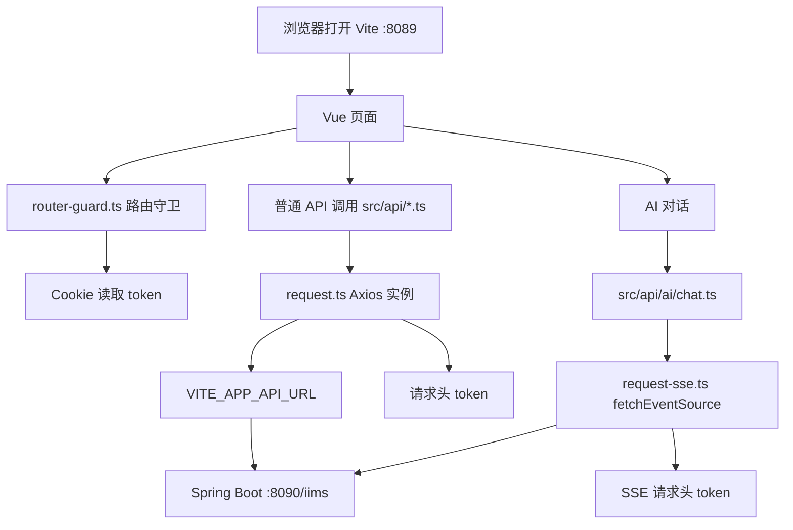

# 第 6 课：前端工程启动与请求代理

> 课程定位：这一课解决“前端为什么启动了但请求失败、登录为什么转圈、AI SSE 为什么没响应、API 地址到底在哪里配”。IIMS 前端是 Vue 3 + Vite + TypeScript + Element Plus 的后台管理系统，普通接口通过 Axios 请求，AI 流式对话通过 SSE 请求。学完本课后，学生要能独立启动前端、切换本地/公网后端、使用浏览器 Network 排查接口问题，并理解 token、动态路由和请求封装的关系。

## 1. 本课目标

### 1.1 教学目标

学完本课后，学生应该能做到：

1. 找到前端工程入口和启动命令。
2. 读懂 `vite.config.ts` 的核心配置。
3. 理解 `.env` 中 `VITE_APP_API_URL` 的作用。
4. 知道普通接口如何通过 `request.ts` 请求后端。
5. 知道 AI 流式接口如何通过 `request-sse.ts` 请求后端。
6. 理解 token 如何从 Cookie 进入请求头。
7. 理解路由守卫如何根据 token 和动态菜单控制页面访问。
8. 能在本地后端和公网后端之间切换 API 地址。
9. 能使用浏览器 DevTools 的 Console 和 Network 排查问题。
10. 能处理 Network Error、404、500、CORS、SSE 失败、接口前缀错误等常见问题。

### 1.2 就业目标

真实前端开发不是“页面能打开就完事”。后台系统经常遇到：

- 前端启动成功，但后端没启动。
- 后端启动成功，但前端 API 地址写错。
- 本地地址和服务器地址切换混乱。
- 少了 `/iims` 接口前缀。
- token 没带上，接口提示未登录。
- Axios 普通接口能用，SSE 流式接口不能用。
- 页面白屏但终端没报错。
- 前端刷新路由 404。

这一课训练的是：

> 以前端请求链路为中心，从 Vite、环境变量、Axios、Cookie、路由守卫、浏览器 Network 到后端接口逐层排查。

## 2. 本课涉及的项目文件

重点文件：

```text
C:\Users\MoLin\Desktop\IIMS\iims-client\package.json
C:\Users\MoLin\Desktop\IIMS\iims-client\vite.config.ts
C:\Users\MoLin\Desktop\IIMS\iims-client\.env
C:\Users\MoLin\Desktop\IIMS\iims-client\src\utils\request.ts
C:\Users\MoLin\Desktop\IIMS\iims-client\src\utils\request-sse.ts
C:\Users\MoLin\Desktop\IIMS\iims-client\src\utils\auth.ts
C:\Users\MoLin\Desktop\IIMS\iims-client\src\router-guard.ts
C:\Users\MoLin\Desktop\IIMS\iims-client\src\api\ai\chat.ts
C:\Users\MoLin\Desktop\IIMS\iims-client\src\api\settings\model.ts
```

本课重点端口：

| 服务 | 端口 | 作用 |
|---|---:|---|
| 前端 Vite | 8089 | 本地开发前端页面 |
| 后端 Spring Boot | 8090 | 后端 API |
| MinIO API | 9000 | 文件 API |
| MinIO Console | 9001 | MinIO 控制台 |

## 3. 前端运行链路总览



这张图是第六课的核心。

前端启动成功，只说明：

```text
Vue 页面可以被 Vite 编译和加载。
```

前端功能真正可用，还需要：

```text
后端地址正确
后端服务启动
接口前缀正确
token 正确
数据库和 Redis 正常
```

## 4. 第一部分：前端工程入口

### 4.1 前端目录

```text
C:\Users\MoLin\Desktop\IIMS\iims-client
```

进入：

```powershell
cd C:\Users\MoLin\Desktop\IIMS\iims-client
```

### 4.2 package.json

文件：

```text
C:\Users\MoLin\Desktop\IIMS\iims-client\package.json
```

重点：

```json
"scripts": {
  "dev": "vite",
  "build": "run-p type-check \"build-only {@}\" --",
  "preview": "vite preview",
  "build-only": "vite build",
  "type-check": "vue-tsc --build"
}
```

### 4.3 启动命令

开发启动：

```powershell
npm run dev
```

生产构建：

```powershell
npm run build-only
```

类型检查：

```powershell
npm run type-check
```

预览构建产物：

```powershell
npm run preview
```

### 4.4 Node 版本要求

`package.json` 中：

```json
"engines": {
  "node": "^20.19.0 || >=22.12.0"
}
```

说明：

```text
Node 要求 20.19 以上，或 22.12 以上。
```

因为项目使用 Vite 7，老版本 Node 可能启动失败。

## 5. 第二部分：读懂 vite.config.ts

文件：

```text
C:\Users\MoLin\Desktop\IIMS\iims-client\vite.config.ts
```

### 5.1 base

```ts
base: '/',
```

含义：

```text
构建后的资源以网站根路径为基础加载。
```

部署到：

```text
http://服务器IP/
```

时适合使用 `/`。

如果部署到子路径，例如：

```text
http://服务器IP/iims-client/
```

就要考虑改 base，但当前项目不是这样部署。

### 5.2 root

```ts
root: process.cwd(),
```

含义：

```text
项目根目录是当前执行 npm 命令的目录。
```

所以必须在：

```text
C:\Users\MoLin\Desktop\IIMS\iims-client
```

执行 `npm run dev`。

### 5.3 build

```ts
build: {
  outDir: 'dist',
  assetsDir: 'static',
  sourcemap: false,
}
```

含义：

| 配置 | 作用 |
|---|---|
| `outDir: dist` | 构建产物输出到 `dist` |
| `assetsDir: static` | JS/CSS/图片等资源放到 `dist/static` |
| `sourcemap: false` | 生产构建不生成 sourcemap |

生产部署时上传：

```text
C:\Users\MoLin\Desktop\IIMS\iims-client\dist
```

### 5.4 server

```ts
server: {
  port: 8089,
  open: true,
  host: '0.0.0.0'
}
```

含义：

| 配置 | 作用 |
|---|---|
| `port: 8089` | Vite 开发服务器端口是 8089 |
| `open: true` | 启动后自动打开浏览器 |
| `host: 0.0.0.0` | 允许局域网访问 |

所以本地开发地址通常是：

```text
http://127.0.0.1:8089/
http://localhost:8089/
```

### 5.5 alias

```ts
alias: {
  '@': path.resolve(__dirname, 'src')
}
```

含义：

```text
@ 代表 src 目录。
```

所以：

```ts
import request from '@/utils/request.ts'
```

等价于：

```text
src/utils/request.ts
```

### 5.6 plugins

```ts
plugins: [
  vue(),
  vueJsx(),
  sass(),
  tailwindcss()
]
```

作用：

| 插件 | 作用 |
|---|---|
| `vue()` | 支持 `.vue` 单文件组件 |
| `vueJsx()` | 支持 Vue JSX |
| `sass()` | 生成 Sass 类型声明 |
| `tailwindcss()` | Tailwind CSS |

你之前遇到 `prettier` 缺失，就是 `vite-plugin-sass-dts` 相关依赖触发的。

### 5.7 visualizer

```ts
if (!isDevelopment) {
  config.plugins?.push(visualizer());
}
```

含义：

```text
只有生产构建时才加入打包分析插件。
```

所以 `npm run dev` 不启用 visualizer，`npm run build-only` 会生成构建分析相关内容。

## 6. 第三部分：环境变量 VITE_APP_API_URL

### 6.1 .env 文件

文件：

```text
C:\Users\MoLin\Desktop\IIMS\iims-client\.env
```

当前内容：

```text
VITE_APP_API_URL='http://localhost:8090/iims'
```

含义：

```text
前端普通接口默认请求 http://localhost:8090/iims。
```

### 6.2 为什么必须以 VITE_ 开头

Vite 只会把特定前缀的环境变量暴露给前端代码。

默认前缀是：

```text
VITE_
```

所以：

```text
VITE_APP_API_URL
```

可以在前端代码里通过：

```ts
import.meta.env.VITE_APP_API_URL
```

读取。

如果写成：

```text
APP_API_URL
```

前端代码默认读不到。

### 6.3 本地后端配置

如果后端在本机：

```text
VITE_APP_API_URL='http://localhost:8090/iims'
```

或：

```text
VITE_APP_API_URL='http://127.0.0.1:8090/iims'
```

### 6.4 公网后端配置

如果后端在服务器：

```text
VITE_APP_API_URL='http://47.93.158.196:8090/iims'
```

实际写自己的服务器 IP。

### 6.5 临时使用 PowerShell 覆盖

不改 `.env`，只在当前终端生效：

```powershell
$env:VITE_APP_API_URL='http://127.0.0.1:8090/iims'
npm run dev
```

公网：

```powershell
$env:VITE_APP_API_URL='http://47.93.158.196:8090/iims'
npm run dev
```

### 6.6 改 .env 后要重启 Vite

重要：

```text
修改 .env 后，必须重新执行 npm run dev。
```

原因：

```text
Vite 在启动时加载环境变量。
```

如果你只保存 `.env` 但不重启，前端可能仍然使用旧地址。

## 7. 第四部分：普通请求封装 request.ts

文件：

```text
C:\Users\MoLin\Desktop\IIMS\iims-client\src\utils\request.ts
```

### 7.1 Axios 实例

核心代码：

```ts
const service: AxiosInstance = axios.create({
  baseURL: import.meta.env.VITE_APP_API_URL as string,
  withCredentials: true
})
```

含义：

```text
所有通过 request.ts 发出的普通请求，基础地址都是 VITE_APP_API_URL。
```

例如：

```ts
request({
  url: '/user/page',
  method: 'post',
  data
})
```

最终请求：

```text
http://localhost:8090/iims/user/page
```

### 7.2 withCredentials

```ts
withCredentials: true
```

含义：

```text
跨域请求时允许携带 Cookie。
```

但本项目主要鉴权方式是请求头 `token`，Cookie 用来本地保存 token。

### 7.3 请求拦截器

```ts
service.interceptors.request.use(config => {
  if (store.getters.token) {
    config.headers['token'] = getStorage('token')
  }
  return config
})
```

含义：

```text
如果前端 store 中有 token，就从 Cookie 读取 token，并放到请求头 token。
```

请求头示例：

```text
token: xxxxxxxx
```

后端 Sa-Token 配置：

```yaml
sa-token:
  token-name: token
```

前后端正好对应。

### 7.4 响应拦截器

核心逻辑：

```ts
const code = response.data.code
const errCode = response.data.errCode

if (code === 0) {
  if (errCode === 10007) {
    // 登录过期，清空状态，跳回登录页
  } else {
    // 普通错误提示
  }
} else {
  return response.data
}
```

含义：

```text
项目约定 code 为 0 时表示失败，非 0 表示成功。
```

注意这个约定和有些项目相反。有些项目 `code=0` 表示成功，但 IIMS 这里不是。

### 7.5 Network Error 处理

```ts
if (message === 'Network Error') {
  message = '后端接口连接异常'
}
```

可能原因：

- 后端没启动。
- API 地址写错。
- 端口不通。
- 浏览器跨域被拦截。
- 服务器安全组未开放。

## 8. 第五部分：API 文件如何拼请求

以用户接口为例：

文件：

```text
C:\Users\MoLin\Desktop\IIMS\iims-client\src\api\user.ts
```

代码：

```ts
export function getAdminList(data: any) {
  return request({
    url: '/user/page',
    method: 'post',
    data
  }) as any
}
```

如果：

```text
VITE_APP_API_URL='http://localhost:8090/iims'
```

最终请求：

```text
POST http://localhost:8090/iims/user/page
```

再看模型管理：

```text
C:\Users\MoLin\Desktop\IIMS\iims-client\src\api\settings\model.ts
```

```ts
export function getModelPage(data: any) {
  return request({
    url: '/model/page',
    method: 'post',
    data
  }) as any
}
```

最终请求：

```text
POST http://localhost:8090/iims/model/page
```

### 8.1 为什么 API 文件里不写完整地址

因为完整地址由环境变量统一控制。

好处：

```text
本地开发用 localhost。
服务器部署用公网 IP 或域名。
代码不用到处改。
```

## 9. 第六部分：AI SSE 请求封装

### 9.1 request-sse.ts

文件：

```text
C:\Users\MoLin\Desktop\IIMS\iims-client\src\utils\request-sse.ts
```

核心使用：

```ts
fetchEventSource(obj.url, {
  method: obj.method || 'POST',
  headers: {
    'Content-Type': 'application/json',
    'Cache-Control': 'no-cache',
    'Connection': 'keep-alive',
    'token': getStorage('token') || ''
  },
  body: JSON.stringify(obj.data),
  onmessage: ...
})
```

### 9.2 SSE 和 Axios 的区别

普通 Axios：

```text
请求 -> 等后端完整响应 -> 一次性拿到结果
```

SSE：

```text
请求 -> 后端持续推送事件 -> 前端一段一段接收
```

AI 对话要流式输出，所以使用 SSE。

### 9.3 AI chat.ts

文件：

```text
C:\Users\MoLin\Desktop\IIMS\iims-client\src\api\ai\chat.ts
```

核心代码：

```ts
const VITE_APP_API_URL = import.meta.env.VITE_APP_API_URL

export function receiveAnswer(uuid: string, data: any, callback: any) {
  const cancelConnection = sse({
    url: `${VITE_APP_API_URL}/ai/chat/receive/answer/${uuid}`,
    method: 'POST',
    data
  }, {}, callback)

  return () => {
    if (cancelConnection) {
      cancelConnection()
    }
  }
}
```

如果 API 地址是：

```text
http://localhost:8090/iims
```

最终 SSE 请求：

```text
POST http://localhost:8090/iims/ai/chat/receive/answer/{uuid}
```

### 9.4 为什么 SSE 单独拼完整 URL

普通请求使用 Axios `baseURL`。

SSE 使用 `fetchEventSource`，所以代码里手动拼：

```ts
`${VITE_APP_API_URL}/ai/chat/receive/answer/${uuid}`
```

因此：

```text
如果 VITE_APP_API_URL 错，普通请求和 SSE 都会错。
```

### 9.5 SSE 常见问题

| 表现 | 可能原因 |
|---|---|
| AI 页面一直等待 | 模型配置错误、SSE 没连上、后端报错 |
| `SSE connection error` | SSE 请求失败 |
| 收不到 token | Cookie 中 token 不存在 |
| 401/未登录 | token 没带或过期 |
| 404 | API 地址或接口路径错 |
| 500 | 后端模型调用或业务异常 |

## 10. 第七部分：Token 与 Cookie

### 10.1 auth.ts

文件：

```text
C:\Users\MoLin\Desktop\IIMS\iims-client\src\utils\auth.ts
```

代码：

```ts
import Cookies from 'js-cookie'

export function getStorage(key: string) {
    return Cookies.get(key)
}

export function setStorage(key: string, value: string) {
    return Cookies.set(key, value)
}

export function removeStorage(key: string) {
    return Cookies.remove(key)
}
```

含义：

```text
token、用户名等登录状态存在 Cookie 中。
```

### 10.2 request.ts 如何带 token

```ts
config.headers['token'] = getStorage('token')
```

### 10.3 request-sse.ts 如何带 token

```ts
headers: {
  'token': getStorage('token') || ''
}
```

### 10.4 后端如何认 token

后端配置：

```yaml
sa-token:
  token-name: token
```

所以请求头必须是：

```text
token
```

不是：

```text
Authorization
Bearer token
access_token
```

除非后端代码改了。

## 11. 第八部分：路由守卫 router-guard.ts

文件：

```text
C:\Users\MoLin\Desktop\IIMS\iims-client\src\router-guard.ts
```

### 11.1 白名单

```ts
const whiteList = ['/login']
```

含义：

```text
没有 token 时，只允许访问登录页。
```

### 11.2 有 token 时

```ts
const hasToken = getStorage('token')
```

如果有 token：

- 访问 `/login` 或 `/`，跳到 `/home`。
- 访问其他页面，检查用户信息是否已加载。
- 如果没加载用户信息，就调用 `permission/generateRoutes` 生成动态路由。

### 11.3 没有 token 时

如果访问登录页：

```text
放行。
```

如果访问其他页：

```text
跳转到 /login。
```

### 11.4 动态路由和菜单

登录后不是前端写死所有页面权限，而是：

```text
前端拿 token
-> 请求后端用户/菜单数据
-> store 生成动态路由
-> router.addRoute 添加路由
```

如果登录后页面空白或菜单不显示，可能是：

- token 无效。
- 后端用户信息接口失败。
- 菜单表数据缺失。
- 动态路由生成失败。
- 前端组件路径和菜单配置不匹配。

## 12. 第九部分：本地启动前端

### 12.1 确认后端先启动

先验证后端：

```powershell
Invoke-WebRequest http://127.0.0.1:8090/iims/user/login/key
```

返回正常后再启动前端。

### 12.2 进入前端目录

```powershell
cd C:\Users\MoLin\Desktop\IIMS\iims-client
```

### 12.3 安装依赖

如果没装过：

```powershell
npm install --legacy-peer-deps
```

如果缺 `prettier`：

```powershell
npm install prettier --save-dev --legacy-peer-deps
```

### 12.4 设置本地 API 地址

`.env`：

```text
VITE_APP_API_URL='http://localhost:8090/iims'
```

或者临时：

```powershell
$env:VITE_APP_API_URL='http://127.0.0.1:8090/iims'
```

### 12.5 启动

```powershell
npm run dev
```

### 12.6 访问

Vite 配置端口是 8089，所以访问：

```text
http://127.0.0.1:8089/
```

或：

```text
http://localhost:8089/
```

## 13. 第十部分：连接公网后端

### 13.1 什么场景需要公网后端

例如：

```text
前端在本机开发
后端部署在阿里云 ECS
```

此时前端 API 地址应指向：

```text
http://服务器IP:8090/iims
```

### 13.2 修改 .env

```text
VITE_APP_API_URL='http://47.93.158.196:8090/iims'
```

保存后重启：

```powershell
npm run dev
```

### 13.3 先验证公网接口

```powershell
Invoke-WebRequest http://47.93.158.196:8090/iims/user/login/key
```

如果这个都不通，前端必然不通。

### 13.4 公网常见问题

| 表现 | 原因 |
|---|---|
| 本机后端可用，公网不可用 | 安全组或防火墙未开放 8090 |
| 浏览器 Network Error | 后端公网地址不可达 |
| 请求 404 | 少了 `/iims` 或路径错 |
| 请求 500 | 后端业务异常 |
| 请求 blocked | 协议、跨域或浏览器安全策略 |

## 14. 第十一部分：跨域与代理

### 14.1 什么是跨域

浏览器认为下面这些不同源：

```text
http://localhost:8089
http://localhost:8090
```

因为端口不同。

所以前端开发时请求后端属于跨域请求。

### 14.2 当前项目怎么处理

当前 `vite.config.ts` 没有配置 `server.proxy`。

前端直接请求完整后端地址：

```text
VITE_APP_API_URL='http://localhost:8090/iims'
```

所以跨域需要后端允许。

### 14.3 代理方式是什么

如果要使用 Vite 代理，可以将前端请求写成相对路径，例如：

```text
/api
```

再在 `vite.config.ts` 中配置：

```ts
server: {
  proxy: {
    '/api': {
      target: 'http://localhost:8090',
      changeOrigin: true,
      rewrite: path => path.replace(/^\/api/, '/iims')
    }
  }
}
```

但当前项目默认不是这么写的。

本课不强制改代理，先理解当前模式：

```text
环境变量直接指向后端完整地址。
```

### 14.4 面试表达

可以说：

> IIMS 前端开发环境没有使用 Vite proxy，而是通过 `VITE_APP_API_URL` 指向后端完整地址。普通请求由 Axios baseURL 拼接，SSE 请求手动拼接完整 URL。这样本地和公网后端切换只需要改环境变量。

## 15. 第十二部分：浏览器 DevTools 排错

### 15.1 打开 DevTools

浏览器中按：

```text
F12
```

或：

```text
Ctrl + Shift + I
```

重点看：

```text
Console
Network
Application
```

### 15.2 Console 看什么

Console 看：

- JavaScript 报错。
- Vue 运行时错误。
- Vite 热更新错误。
- SSE error 输出。
- 请求封装里的 console.log。

### 15.3 Network 看什么

Network 看：

| 项 | 看什么 |
|---|---|
| Request URL | 请求地址是否正确 |
| Method | GET/POST 是否正确 |
| Status | 200/404/500/401 |
| Request Headers | token 是否存在 |
| Payload | 请求体是否正确 |
| Response | 后端返回什么 |
| EventStream | SSE 是否有数据 |

### 15.4 Application 看什么

Application / Cookies：

```text
是否有 token
token 是否过期
name 等用户信息是否存在
```

如果 Cookie 没 token，请求头就不会带 token。

## 16. 第十三部分：常见错误一：Network Error

### 16.1 表现

前端提示：

```text
后端接口连接异常
```

### 16.2 可能原因

1. 后端没启动。
2. `VITE_APP_API_URL` 写错。
3. 后端端口不是 8090。
4. 服务器安全组没开。
5. 浏览器跨域被拦截。
6. HTTP/HTTPS 混用。

### 16.3 排查

先直接访问：

```powershell
Invoke-WebRequest http://127.0.0.1:8090/iims/user/login/key
```

再看 Network 的 Request URL。

如果 Request URL 是：

```text
undefined/user/login/key
```

说明环境变量没读到。

如果是：

```text
http://localhost:8090/user/login/key
```

说明少了 `/iims`。

## 17. 常见错误二：404

### 17.1 表现

Network 状态码：

```text
404
```

### 17.2 可能原因

1. API 地址少了 `/iims`。
2. API 文件里的路径写错。
3. 后端 Controller 路径不同。
4. 前端访问了不存在的路由。

### 17.3 例子

错误：

```text
http://localhost:8090/user/page
```

正确：

```text
http://localhost:8090/iims/user/page
```

因为 `.env` 应该是：

```text
VITE_APP_API_URL='http://localhost:8090/iims'
```

## 18. 常见错误三：500

### 18.1 表现

Network 状态码：

```text
500
```

### 18.2 含义

请求已经到达后端，但后端内部出错。

常见原因：

- 数据库表不存在。
- Redis 连接失败。
- 业务参数错误。
- 模型配置错误。
- 文件服务错误。

### 18.3 排查

前端看 Response：

```text
后端返回的 msg 是什么
```

后端看日志：

```text
第一个 ERROR
Caused by
SQL 错误
业务异常
```

前端不要盲目改页面。

## 19. 常见错误四：登录后又跳回登录页

### 19.1 可能原因

1. token 没保存到 Cookie。
2. 请求头没带 token。
3. 后端 Sa-Token 判断 token 无效。
4. 用户信息接口失败。
5. `errCode === 10007`，前端清空状态。

### 19.2 排查

浏览器 Application：

```text
Cookies 中是否有 token
```

Network：

```text
请求头是否有 token
```

后端：

```text
Sa-Token 是否报未登录
Redis 是否正常
```

### 19.3 关键对应

前端：

```ts
config.headers['token'] = getStorage('token')
```

后端：

```yaml
sa-token:
  token-name: token
```

二者必须一致。

## 20. 常见错误五：AI SSE 没响应

### 20.1 表现

- AI 页面一直等待。
- 没有流式输出。
- Console 出现 `SSE connection error`。
- Network 里请求挂起或失败。

### 20.2 排查顺序

1. 先看 Network 是否发出 `/ai/chat/receive/answer/{uuid}`。
2. 看 Request URL 是否包含 `/iims`。
3. 看 Request Headers 是否有 `token`。
4. 看状态码。
5. 看 EventStream 是否有消息。
6. 看后端日志。
7. 检查模型配置表和默认模型。

### 20.3 前端路径

```text
src/api/ai/chat.ts
src/utils/request-sse.ts
```

### 20.4 后端路径

```text
iims-module-ai/.../ChatController.java
iims-module-ai/.../ChatServiceImpl.java
iims-module-ai/.../ModelServiceImpl.java
```

### 20.5 注意

AI SSE 不响应，不一定是前端问题。

很可能是：

```text
模型 API Key 没配
模型 baseUrl 错
默认模型没绑定
后端调用模型失败
```

## 21. 常见错误六：Unsafe attempt to load URL

### 21.1 表现

你之前看到过类似：

```text
Unsafe attempt to load URL http://47.93.158.196/ from frame with URL chrome-error://chromewebdata/. Domains, protocols and ports must match.
```

### 21.2 含义

这通常不是 Vue 业务代码的核心错误，而是浏览器在错误页面、iframe 或安全上下文中尝试加载不同源 URL 时触发的提示。

更应该关注：

```text
真正访问的 URL 是否可达
Network 中是否有请求
状态码是什么
后端是否启动
安全组是否开放
```

### 21.3 排查

直接在浏览器地址栏访问：

```text
http://47.93.158.196/
http://47.93.158.196:8090/iims/user/login/key
```

如果地址栏都打不开，先查部署和安全组。

## 22. 前端启动前检查清单

```text
Node 版本是否满足
npm 是否可用
node_modules 是否安装
.env 是否有 VITE_APP_API_URL
VITE_APP_API_URL 是否包含 /iims
后端 8090 是否启动
/iims/user/login/key 是否可访问
8089 端口是否空闲
```

命令：

```powershell
node -v
npm -v
Get-Content .env
Invoke-WebRequest http://127.0.0.1:8090/iims/user/login/key
netstat -ano | findstr :8089
```

## 23. 前端启动后检查清单

```text
浏览器是否打开 http://127.0.0.1:8089
Console 是否报错
Network 是否请求正确后端
登录页是否正常显示
Cookie 是否写入 token
请求头是否带 token
动态路由是否加载
菜单是否显示
AI SSE 是否能发出 EventStream 请求
```

## 24. 本地与公网后端切换表

| 场景 | VITE_APP_API_URL |
|---|---|
| 本地前端 + 本地后端 | `http://127.0.0.1:8090/iims` |
| 本地前端 + 服务器后端 | `http://服务器IP:8090/iims` |
| 生产前端 + 服务器后端直连 | `http://服务器IP:8090/iims` |
| 生产前端 + Nginx 反向代理 | 根据代理路径配置，例如 `/iims` |

当前项目之前生产构建曾用：

```powershell
$env:VITE_APP_API_URL='http://47.93.158.196:8090/iims'
npm run build-only
```

这表示生产 dist 中会写入公网后端地址。

## 25. 课堂演示脚本

### 25.1 开场

可以这样讲：

> 前端启动成功不代表项目成功。今天我们要看清楚前端从哪里读后端地址、普通请求怎么发、token 怎么带、AI 流式请求为什么单独封装，以及如何用浏览器 Network 判断问题到底在前端还是后端。

### 25.2 演示 vite.config.ts

```powershell
Get-Content C:\Users\MoLin\Desktop\IIMS\iims-client\vite.config.ts
```

讲解：

> Vite 开发端口是 8089，host 是 0.0.0.0，构建输出到 dist，`@` 指向 src。

### 25.3 演示 .env

```powershell
Get-Content C:\Users\MoLin\Desktop\IIMS\iims-client\.env
```

讲解：

> `VITE_APP_API_URL` 是前端请求后端的基础地址，必须带 `/iims`。

### 25.4 演示 request.ts

```powershell
Get-Content C:\Users\MoLin\Desktop\IIMS\iims-client\src\utils\request.ts
```

讲解：

> 普通接口都走 Axios。请求前从 Cookie 取 token 放进请求头，响应后根据 code 和 errCode 判断成功、失败或登录过期。

### 25.5 演示 request-sse.ts

```powershell
Get-Content C:\Users\MoLin\Desktop\IIMS\iims-client\src\utils\request-sse.ts
```

讲解：

> AI 对话使用 fetchEventSource，它不是普通 Axios，一段一段接收后端推送的数据。

### 25.6 演示启动

```powershell
cd C:\Users\MoLin\Desktop\IIMS\iims-client
npm run dev
```

打开：

```text
http://127.0.0.1:8089/
```

### 25.7 演示 Network

操作：

1. 打开 F12。
2. 进入 Network。
3. 点击登录或请求登录密钥。
4. 查看 Request URL。
5. 查看 Request Headers。
6. 查看 Response。

讲解：

> 以后任何接口错误，先看 Network，不要先猜。

## 26. 学生课堂练习

### 26.1 练习 1：配置读取

填写：

| 配置项 | 当前值 |
|---|---|
| Vite 端口 |  |
| VITE_APP_API_URL |  |
| 构建输出目录 |  |
| 静态资源目录 |  |
| alias `@` 指向 |  |

### 26.2 练习 2：请求拼接

已知：

```text
VITE_APP_API_URL='http://localhost:8090/iims'
```

填写最终请求地址：

| API 文件路径 | url | 最终地址 |
|---|---|---|
| `src/api/user.ts` | `/user/page` |  |
| `src/api/settings/model.ts` | `/model/page` |  |
| `src/api/ai/chat.ts` | `/ai/chat/endpoint/list` |  |
| `src/api/ai/chat.ts` | `/ai/chat/receive/answer/{uuid}` |  |

### 26.3 练习 3：启动前端

执行：

```powershell
cd C:\Users\MoLin\Desktop\IIMS\iims-client
npm run dev
```

记录：

```text
启动端口：
浏览器地址：
Console 是否报错：
Network 第一个接口请求：
```

### 26.4 练习 4：切换后端

分别配置：

```text
本地后端：http://127.0.0.1:8090/iims
公网后端：http://服务器IP:8090/iims
```

每次改完后：

```text
重启 Vite
查看 Network Request URL 是否变化
```

### 26.5 练习 5：错误归类

填写：

| 错误 | 分类 | 下一步 |
|---|---|---|
| Network Error |  |  |
| 404 |  |  |
| 500 |  |  |
| 登录后跳回登录页 |  |  |
| SSE connection error |  |  |
| Request URL 是 undefined |  |  |

参考答案：

| 错误 | 分类 | 下一步 |
|---|---|---|
| Network Error | 后端不可达或跨域 | 查 API 地址和后端状态 |
| 404 | 路径错误 | 检查 `/iims` 和接口路径 |
| 500 | 后端业务异常 | 看后端日志和 Response |
| 登录后跳回登录页 | token/用户信息/权限 | 查 Cookie、请求头、Sa-Token |
| SSE connection error | AI 流式请求失败 | 查 SSE URL、token、后端 AI 日志 |
| Request URL 是 undefined | 环境变量没读取 | 检查 `.env` 和 `VITE_` 前缀 |

## 27. 本课验收标准

### 27.1 启动验收

必须能执行：

```powershell
cd C:\Users\MoLin\Desktop\IIMS\iims-client
npm run dev
```

并打开：

```text
http://127.0.0.1:8089/
```

### 27.2 配置验收

必须能说清楚：

1. 前端端口在哪里配置。
2. API 地址在哪里配置。
3. 为什么环境变量必须以 `VITE_` 开头。
4. 为什么 API 地址要包含 `/iims`。
5. 改 `.env` 后为什么要重启 Vite。

### 27.3 请求验收

必须能在 Network 中确认：

```text
Request URL 正确
Request Headers 有 token
Response 能看到后端返回
```

### 27.4 SSE 验收

必须能说明：

```text
普通请求走 Axios。
AI 流式请求走 fetchEventSource。
SSE 请求也要带 token。
```

### 27.5 排错验收

看到前端接口失败，必须能按顺序检查：

```text
Console
Network
Request URL
Status
Headers
Payload
Response
Cookie
后端日志
```

## 28. 本课作业

### 作业 1：前端配置表

整理：

```text
vite.config.ts 中 server、build、alias、plugins 的作用。
.env 中 VITE_APP_API_URL 的当前值。
```

### 作业 2：请求链路说明

写 300 字：

```text
从点击页面按钮到后端接口收到请求，中间经过哪些文件和配置？
```

必须包含：

- API 文件。
- `request.ts`。
- `VITE_APP_API_URL`。
- token 请求头。
- 后端 `/iims` 前缀。

### 作业 3：Network 截图记录

提交一次接口请求记录：

```text
Request URL：
Method：
Status：
Request Headers 是否有 token：
Response：
```

### 作业 4：SSE 链路说明

写出 AI 对话请求经过：

```text
src/api/ai/chat.ts
src/utils/request-sse.ts
fetchEventSource
后端 /ai/chat/receive/answer/{uuid}
```

并说明它和 Axios 请求的区别。

### 作业 5：面试表达

准备 1 分钟说明：

```text
我如何配置和排查 IIMS 前端请求后端接口？
```

## 29. 面试表达

### 29.1 初级表达

> IIMS 前端使用 Vue 3 和 Vite，开发端口是 8089。后端地址通过 `.env` 中的 `VITE_APP_API_URL` 配置，普通接口通过 Axios 封装请求，登录后 token 存在 Cookie 中，请求拦截器会把 token 放到请求头。

### 29.2 更好的表达

> IIMS 前端的请求链路比较清晰：Vite 负责本地开发服务，`.env` 中的 `VITE_APP_API_URL` 决定后端基础地址，普通业务接口通过 `src/utils/request.ts` 的 Axios 实例统一发送，请求拦截器会从 Cookie 中读取 token 并写入请求头 `token`，这和后端 Sa-Token 的 `token-name` 对应。AI 对话因为需要流式输出，没有走 Axios，而是通过 `request-sse.ts` 中的 `fetchEventSource` 建立 SSE 连接，同样手动携带 token。我排查前端接口问题时，会优先看浏览器 Network 的 URL、状态码、请求头和响应内容。

### 29.3 面试官可能追问

#### 问：为什么 `.env` 里的变量要以 `VITE_` 开头？

答：

> Vite 默认只会把 `VITE_` 前缀的环境变量暴露给前端代码。项目中通过 `import.meta.env.VITE_APP_API_URL` 读取后端地址，所以变量名必须以 `VITE_` 开头。

#### 问：为什么请求地址要带 `/iims`？

答：

> 后端接口统一挂在 `/iims` 路径下。前端 API 文件里写的是相对业务路径，例如 `/user/page`，最终要通过 baseURL 拼成 `http://localhost:8090/iims/user/page`。如果少了 `/iims`，很容易 404。

#### 问：Axios 请求和 SSE 请求有什么区别？

答：

> Axios 适合普通接口，一次请求拿一次完整响应。SSE 用于服务端持续推送，AI 对话需要边生成边返回，所以项目用 `fetchEventSource` 建立流式连接，前端通过 `onmessage` 一段一段处理后端返回。

#### 问：登录后跳回登录页你怎么查？

答：

> 我先看 Cookie 里有没有 token，再看 Network 的请求头是否带 `token`，然后看后端是否返回登录过期或未登录。如果 token 有但仍失败，再查 Redis 和 Sa-Token 状态，以及用户信息和动态路由接口是否正常。

#### 问：前端提示 Network Error，你会先改代码吗？

答：

> 不会。Network Error 首先说明请求没正常到达或被浏览器拦截。我会先看 Request URL 是否正确，再直接访问后端健康接口，确认 8090 是否可达、安全组是否开放、跨域是否被拦截，最后才考虑前端代码。

## 30. 本课最终交付物

本课结束后，学生应提交：

1. 前端 Vite 配置说明表。
2. 本地和公网 API 地址切换记录。
3. 一次普通接口 Network 请求记录。
4. 一次 SSE 请求链路说明。
5. 一份前端接口错误排查表。
6. 一段 1 分钟前端请求链路面试表达。

完成这些，第六课才算真正过关。

