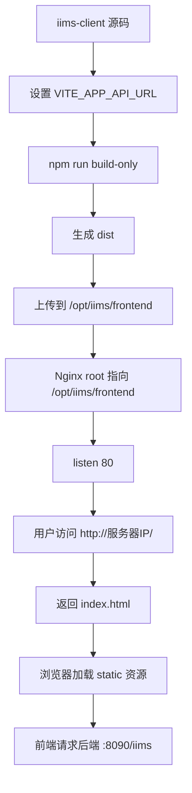

# 第 7 课：Nginx 部署前端与公网访问

> 课程定位：这一课解决“前端开发环境能打开，但怎么变成公网可访问的网站”。IIMS 前端本地开发靠 Vite，生产部署靠 `npm run build-only` 生成 `dist`，再由 Nginx 托管静态资源。学完本课后，学生要能独立完成前端构建、上传、Nginx 配置、80 端口公网访问、SPA 刷新 404 修复，以及生产 API 地址验证。

## 1. 本课目标

### 1.1 教学目标

学完本课后，学生应该能做到：

1. 区分 Vite 开发服务器和 Nginx 生产部署。
2. 理解 `npm run build-only` 生成的 `dist` 是什么。
3. 知道生产构建时 `VITE_APP_API_URL` 会被写入前端产物。
4. 能把 `dist` 部署到服务器 `/opt/iims/frontend`。
5. 能读懂 Nginx 配置中的 `listen`、`server_name`、`root`、`index`、`location`、`try_files`。
6. 能修复 Vue 单页应用刷新页面 404 的问题。
7. 能用 `nginx -t` 检查配置。
8. 能用 `systemctl restart nginx` 重启 Nginx。
9. 能从本机和公网验证前端页面是否可访问。
10. 能处理 403、404、502、静态资源加载失败、API 地址错误、安全组未开放等常见问题。

### 1.2 就业目标

很多人只会：

```text
npm run dev
```

但真实项目上线需要：

```text
npm run build
上传 dist
配置 Nginx
开放 80 端口
验证公网访问
处理刷新 404
处理接口地址
处理缓存
```

这一课训练的是：

> 把前端开发环境变成生产可访问站点的能力。

这是全栈项目和求职项目展示中非常关键的一步。

## 2. 本课涉及的项目文件

重点文件：

```text
C:\Users\MoLin\Desktop\IIMS\iims-client\package.json
C:\Users\MoLin\Desktop\IIMS\iims-client\vite.config.ts
C:\Users\MoLin\Desktop\IIMS\iims-client\.env
C:\Users\MoLin\Desktop\IIMS\iims-client\dist
C:\Users\MoLin\Desktop\IIMS\deploy-bundle\nginx\iims.conf
C:\Users\MoLin\Desktop\IIMS\deploy-bundle\start.sh
C:\Users\MoLin\Desktop\IIMS\deploy-bundle\restart.sh
```

服务器目标路径：

```text
/opt/iims/frontend
/opt/iims/nginx/iims.conf
/etc/nginx/conf.d/iims.conf
/etc/nginx/nginx.conf
```

## 3. 前端部署链路总览



这一课要记住一句话：

> Vite 负责构建前端，Nginx 负责在线上把构建后的静态文件发给浏览器。

## 4. 第一部分：开发环境和生产部署的区别

### 4.1 开发环境

开发时：

```powershell
npm run dev
```

Vite 会启动开发服务器：

```text
http://127.0.0.1:8089/
```

特点：

- 支持热更新。
- 修改代码后页面自动刷新。
- 适合本地开发。
- 不适合直接当生产服务长期运行。

### 4.2 生产部署

生产时：

```powershell
npm run build-only
```

生成：

```text
C:\Users\MoLin\Desktop\IIMS\iims-client\dist
```

然后交给 Nginx：

```text
/opt/iims/frontend
```

特点：

- 静态文件。
- 无热更新。
- 加载速度更稳定。
- 适合公网访问。

### 4.3 为什么不能用 npm run dev 当生产

原因：

1. Vite dev server 是开发工具，不是生产 Web 服务器。
2. 服务器重启后不方便守护。
3. 性能和安全不如 Nginx。
4. 热更新服务没有必要暴露给公网。
5. 生产部署应该使用构建后的静态资源。

面试表达：

> 开发阶段我用 Vite dev server，生产部署阶段执行 Vite build 生成静态资源，再由 Nginx 托管。

## 5. 第二部分：构建前的准备

### 5.1 确认前端依赖

进入：

```powershell
cd C:\Users\MoLin\Desktop\IIMS\iims-client
```

确认依赖：

```powershell
npm install --legacy-peer-deps
```

如果遇到 `prettier` 缺失：

```powershell
npm install prettier --save-dev --legacy-peer-deps
```

### 5.2 确认后端公网可达

如果生产前端要请求服务器后端，先验证：

```powershell
Invoke-WebRequest http://47.93.158.196:8090/iims/user/login/key
```

如果这个不通，前端构建成功也无法登录。

### 5.3 确认 API 地址

生产构建前必须确定：

```text
VITE_APP_API_URL
```

例如：

```text
http://47.93.158.196:8090/iims
```

本地构建时，可以用 PowerShell 临时设置：

```powershell
$env:VITE_APP_API_URL='http://47.93.158.196:8090/iims'
```

然后执行构建。

### 5.4 为什么构建前要设置 API 地址

Vite 前端环境变量在构建时会被写入 JS 产物。

这意味着：

```text
npm run build-only 时的 VITE_APP_API_URL 是什么，
dist 里的前端请求地址就是什么。
```

构建后再改服务器上的 `.env` 没用，因为浏览器加载的是已经构建好的 JS 文件。

如果 API 地址错了，要：

```text
重新设置 VITE_APP_API_URL
重新 npm run build-only
重新上传 dist
```

## 6. 第三部分：执行前端构建

### 6.1 构建命令

```powershell
cd C:\Users\MoLin\Desktop\IIMS\iims-client
$env:VITE_APP_API_URL='http://47.93.158.196:8090/iims'
npm run build-only
```

如果构建本地后端版本：

```powershell
$env:VITE_APP_API_URL='http://127.0.0.1:8090/iims'
npm run build-only
```

### 6.2 package.json 中的脚本

```json
"build-only": "vite build"
```

说明：

```text
npm run build-only 实际执行 vite build。
```

### 6.3 vite.config.ts 构建配置

```ts
build: {
  outDir: 'dist',
  assetsDir: 'static',
  sourcemap: false,
}
```

含义：

| 配置 | 结果 |
|---|---|
| `outDir: dist` | 构建产物在 `dist` |
| `assetsDir: static` | 静态资源在 `dist/static` |
| `sourcemap: false` | 不生成 sourcemap |

### 6.4 构建成功后应该看到

目录：

```text
C:\Users\MoLin\Desktop\IIMS\iims-client\dist
```

里面一般有：

```text
index.html
static
```

可能还有：

```text
stats.html
```

因为生产构建时启用了 visualizer 插件。

### 6.5 构建失败常见原因

| 错误 | 原因 | 处理 |
|---|---|---|
| `Cannot find package prettier` | 前端依赖缺失 | 安装 prettier |
| TypeScript 报错 | 类型检查或代码问题 | 看具体文件和行 |
| 模块找不到 | import 路径错 | 检查文件路径 |
| Node 版本不满足 | Node 太旧 | 升级 Node |
| 内存不足 | 构建资源不够 | 关闭其他程序或换机器构建 |

### 6.6 构建不等于部署

构建成功只代表：

```text
本地生成了静态文件。
```

还需要：

```text
上传 dist 到服务器
Nginx 指向该目录
开放 80 端口
浏览器验证
```

## 7. 第四部分：Nginx 配置文件

项目部署包中已有：

```text
C:\Users\MoLin\Desktop\IIMS\deploy-bundle\nginx\iims.conf
```

内容：

```nginx
server {
    listen 80;
    server_name _;

    root /opt/iims/frontend;
    index index.html;

    location / {
        try_files $uri $uri/ /index.html;
    }
}
```

下面逐行讲。

### 7.1 server

```nginx
server {
}
```

表示一个虚拟主机配置。

可以理解为：

```text
Nginx 收到某类请求时，用这个 server 规则处理。
```

### 7.2 listen 80

```nginx
listen 80;
```

表示监听 HTTP 默认端口 80。

用户访问：

```text
http://47.93.158.196/
```

浏览器默认就是访问 80 端口。

所以不需要写：

```text
http://47.93.158.196:80/
```

### 7.3 server_name _

```nginx
server_name _;
```

表示一个兜底 server_name。

当前没有绑定域名，所以用 `_` 接收默认请求。

如果以后有域名：

```nginx
server_name example.com;
```

### 7.4 root

```nginx
root /opt/iims/frontend;
```

表示静态文件根目录。

当用户请求：

```text
/
```

Nginx 会去找：

```text
/opt/iims/frontend/index.html
```

当用户请求：

```text
/static/xxx.js
```

Nginx 会去找：

```text
/opt/iims/frontend/static/xxx.js
```

### 7.5 index

```nginx
index index.html;
```

表示访问目录时默认返回：

```text
index.html
```

### 7.6 location /

```nginx
location / {
    try_files $uri $uri/ /index.html;
}
```

表示所有以 `/` 开头的路径都进入这个规则。

### 7.7 try_files

```nginx
try_files $uri $uri/ /index.html;
```

这是 Vue 单页应用部署的关键。

含义：

1. 先找请求的真实文件 `$uri`。
2. 再找请求的目录 `$uri/`。
3. 如果都找不到，就返回 `/index.html`。

为什么要这样？

Vue Router 的很多路由不是服务器真实文件，例如：

```text
/home
/permission/admin
/settings/model
/ai/talk
```

服务器上没有这些目录和 HTML 文件。

这些路由需要浏览器加载 `index.html` 后，由 Vue Router 在前端解析。

如果没有 `try_files`，刷新这些页面时 Nginx 会找真实文件，找不到就 404。

## 8. 第五部分：部署 dist 到服务器

### 8.1 服务器目录

目标目录：

```text
/opt/iims/frontend
```

确保存在：

```bash
mkdir -p /opt/iims/frontend
```

### 8.2 上传方式一：pscp

如果使用 PuTTY 的 `pscp`，可以从 Windows 上传。

先清空旧前端：

```bash
rm -rf /opt/iims/frontend/*
```

再上传 `dist` 里的内容到：

```text
/opt/iims/frontend
```

注意：

```text
上传的是 dist 里面的内容，不是把 dist 文件夹整体放成 /opt/iims/frontend/dist。
```

正确：

```text
/opt/iims/frontend/index.html
/opt/iims/frontend/static
```

错误：

```text
/opt/iims/frontend/dist/index.html
```

### 8.3 上传方式二：scp

如果本机有 OpenSSH：

```powershell
scp -r C:\Users\MoLin\Desktop\IIMS\iims-client\dist\* root@47.93.158.196:/opt/iims/frontend/
```

Windows PowerShell 对通配符和路径处理有时会有差异，如果失败，可以先压缩再上传。

### 8.4 上传方式三：压缩包

本地压缩 dist：

```powershell
Compress-Archive -Path C:\Users\MoLin\Desktop\IIMS\iims-client\dist\* -DestinationPath C:\Users\MoLin\Desktop\IIMS\frontend-dist.zip -Force
```

上传到服务器：

```powershell
scp C:\Users\MoLin\Desktop\IIMS\frontend-dist.zip root@47.93.158.196:/opt/iims/
```

服务器解压：

```bash
rm -rf /opt/iims/frontend/*
unzip -o /opt/iims/frontend-dist.zip -d /opt/iims/frontend
```

### 8.5 验证文件

服务器：

```bash
ls -la /opt/iims/frontend
```

应该看到：

```text
index.html
static
```

## 9. 第六部分：安装与启动 Nginx

### 9.1 安装

Alibaba Cloud Linux：

```bash
yum install -y nginx
```

或：

```bash
dnf install -y nginx
```

### 9.2 启动

```bash
systemctl enable --now nginx
```

含义：

| 命令 | 作用 |
|---|---|
| `enable` | 开机自启 |
| `--now` | 立即启动 |

### 9.3 查看状态

```bash
systemctl status nginx
```

### 9.4 重启

```bash
systemctl restart nginx
```

### 9.5 重载

```bash
nginx -s reload
```

或：

```bash
systemctl reload nginx
```

如果只是改配置，reload 通常够用；学习阶段用 restart 更直接。

## 10. 第七部分：启用项目 Nginx 配置

### 10.1 复制配置

项目部署脚本中：

```bash
cp /opt/iims/nginx/iims.conf /etc/nginx/conf.d/iims.conf
```

含义：

```text
把项目自己的 Nginx 配置复制到 Nginx 的 conf.d 目录。
```

### 10.2 检查配置

```bash
nginx -t
```

成功应看到：

```text
syntax is ok
test is successful
```

如果失败，Nginx 不应该重启，否则可能导致网站挂掉。

### 10.3 重启 Nginx

```bash
systemctl restart nginx
```

### 10.4 验证本机访问

服务器上执行：

```bash
curl -I http://127.0.0.1/
```

应该看到：

```text
HTTP/1.1 200 OK
```

### 10.5 验证公网访问

本机浏览器打开：

```text
http://47.93.158.196/
```

或 PowerShell：

```powershell
Invoke-WebRequest http://47.93.158.196/
```

## 11. 第八部分：安全组和防火墙

### 11.1 必须开放 80

公网访问前端需要开放：

```text
TCP 80
```

阿里云 ECS 安全组入方向规则：

```text
协议：TCP
端口：80
来源：0.0.0.0/0
```

### 11.2 后端 8090

学习阶段可以临时开放：

```text
TCP 8090
```

用于前端直接请求后端。

生产更推荐通过 Nginx 反向代理后端，而不是直接暴露 8090。

### 11.3 不建议开放

不建议公网开放：

```text
3306 MySQL
6379 Redis
```

MinIO 控制台 9001 学习阶段可临时开放，但生产要限制来源 IP。

### 11.4 Linux 防火墙

如果系统启用了 firewalld：

```bash
firewall-cmd --list-ports
firewall-cmd --permanent --add-port=80/tcp
firewall-cmd --reload
```

如果云安全组没开，系统防火墙开了也没用。

如果系统防火墙没开，云安全组没开也没用。

两层都要看。

## 12. 第九部分：生产 API 地址问题

### 12.1 构建时固化

前端代码：

```ts
baseURL: import.meta.env.VITE_APP_API_URL as string
```

构建后会被替换成具体值。

所以：

```text
dist 里不会再动态读取服务器上的 .env。
```

### 12.2 如何确认 dist 中 API 地址

可以在构建产物中搜索：

```powershell
rg "47.93.158.196|localhost:8090|127.0.0.1:8090" C:\Users\MoLin\Desktop\IIMS\iims-client\dist
```

如果生产 dist 里仍然有：

```text
localhost:8090
```

说明构建时 API 地址错了。

### 12.3 正确做法

构建生产前：

```powershell
$env:VITE_APP_API_URL='http://47.93.158.196:8090/iims'
npm run build-only
```

然后上传新的 `dist`。

### 12.4 后端公网验证

前端部署前先验证：

```powershell
Invoke-WebRequest http://47.93.158.196:8090/iims/user/login/key
```

如果后端接口不通，前端页面即使打开也无法登录。

## 13. 第十部分：SPA 刷新 404

### 13.1 问题表现

能打开：

```text
http://47.93.158.196/
```

但刷新：

```text
http://47.93.158.196/settings/model
```

出现：

```text
404 Not Found
```

### 13.2 原因

Vue Router 前端路由不是服务器真实文件。

Nginx 如果没有 fallback 到 `index.html`，就会去找：

```text
/opt/iims/frontend/settings/model
```

这个文件不存在，所以 404。

### 13.3 解决

Nginx 配置：

```nginx
location / {
    try_files $uri $uri/ /index.html;
}
```

含义：

```text
找不到真实文件时，把请求交给 index.html，让 Vue Router 处理。
```

### 13.4 验证

登录后进入某个页面，例如模型设置。

复制地址栏 URL。

刷新浏览器。

如果仍能显示页面，说明配置正确。

## 14. 第十一部分：常见错误一：403 Forbidden

### 14.1 表现

访问：

```text
http://服务器IP/
```

返回：

```text
403 Forbidden
```

### 14.2 可能原因

1. `/opt/iims/frontend` 没有 `index.html`。
2. Nginx 用户没有目录读取权限。
3. root 指向了错误目录。
4. 目录存在但文件权限不对。

### 14.3 排查

```bash
ls -la /opt/iims/frontend
cat /etc/nginx/conf.d/iims.conf
nginx -t
tail -n 100 /var/log/nginx/error.log
```

### 14.4 处理

确保：

```text
/opt/iims/frontend/index.html 存在
Nginx root 指向 /opt/iims/frontend
```

权限：

```bash
chmod -R 755 /opt/iims/frontend
```

## 15. 常见错误二：404 Not Found

### 15.1 首页 404

可能原因：

```text
root 错了
index.html 不存在
配置文件没生效
Nginx 仍在使用默认站点
```

排查：

```bash
nginx -T | grep -n "/opt/iims/frontend"
ls -la /opt/iims/frontend/index.html
```

### 15.2 刷新路由 404

原因：

```text
缺少 try_files fallback。
```

处理：

```nginx
try_files $uri $uri/ /index.html;
```

## 16. 常见错误三：静态资源 404

### 16.1 表现

首页 HTML 返回了，但页面白屏。

Network 中：

```text
/static/xxx.js 404
/static/xxx.css 404
```

### 16.2 可能原因

1. 只上传了 `index.html`，没上传 `static`。
2. 上传层级错误，变成 `/opt/iims/frontend/dist/static`。
3. Vite `base` 和部署路径不匹配。
4. Nginx root 错误。

### 16.3 排查

```bash
find /opt/iims/frontend -maxdepth 2 -type f | head
ls -la /opt/iims/frontend/static
```

### 16.4 正确目录

```text
/opt/iims/frontend/index.html
/opt/iims/frontend/static/xxx.js
/opt/iims/frontend/static/xxx.css
```

## 17. 常见错误四：页面打开但登录失败

### 17.1 表现

前端页面正常，但登录或登录密钥接口失败。

### 17.2 原因

这通常不是 Nginx 静态部署问题，而是 API 问题。

排查：

1. 浏览器 F12。
2. Network。
3. 看 Request URL。
4. 看是否请求 `http://47.93.158.196:8090/iims/...`。
5. 看状态码。

### 17.3 可能情况

| Request URL | 问题 |
|---|---|
| `http://localhost:8090/iims/...` | 构建时 API 地址错了 |
| `http://47.93.158.196:8090/user/...` | 少了 `/iims` |
| `http://47.93.158.196:8090/iims/...` 但失败 | 后端或安全组问题 |
| `undefined/user/...` | 环境变量没注入 |

### 17.4 处理

重新构建：

```powershell
$env:VITE_APP_API_URL='http://47.93.158.196:8090/iims'
npm run build-only
```

重新上传：

```text
dist -> /opt/iims/frontend
```

## 18. 常见错误五：Nginx 配置未生效

### 18.1 表现

改了配置，但访问还是旧页面或旧错误。

### 18.2 可能原因

1. 没有复制配置到 `/etc/nginx/conf.d`。
2. 没有执行 `nginx -t`。
3. 没有重启 Nginx。
4. 存在多个 server 配置冲突。
5. 浏览器缓存。

### 18.3 排查

查看最终配置：

```bash
nginx -T | less
```

搜索：

```bash
nginx -T | grep -n "/opt/iims/frontend"
```

重启：

```bash
nginx -t
systemctl restart nginx
```

浏览器强刷：

```text
Ctrl + F5
```

## 19. 常见错误六：80 端口不可访问

### 19.1 表现

服务器本机：

```bash
curl -I http://127.0.0.1/
```

正常。

但公网：

```text
http://服务器IP/
```

打不开。

### 19.2 可能原因

1. 阿里云安全组没开放 80。
2. Linux 防火墙没开放 80。
3. Nginx 没监听公网。
4. 服务器公网 IP 不对。

### 19.3 排查

服务器：

```bash
ss -lntp | grep :80
curl -I http://127.0.0.1/
```

本机：

```powershell
Invoke-WebRequest http://47.93.158.196/
```

阿里云控制台：

```text
安全组入方向 TCP 80
```

## 20. 常见错误七：502 Bad Gateway

### 20.1 当前配置通常不会出现 502

当前 `iims.conf` 只托管静态文件：

```nginx
root /opt/iims/frontend;
```

没有配置反向代理后端，所以一般不会因为后端挂掉而 502。

### 20.2 什么时候会 502

如果以后加：

```nginx
location /iims/ {
    proxy_pass http://127.0.0.1:8090/iims/;
}
```

后端挂了，才可能出现 502。

### 20.3 面试表达

> 当前前端 Nginx 只做静态资源托管，所以页面访问和后端 API 是两个链路。页面 200 不代表后端 API 可用；后端 API 要单独验证 8090 或代理路径。

## 21. 缓存问题

### 21.1 表现

上传了新前端，但浏览器仍显示旧页面。

### 21.2 处理

1. 浏览器 Ctrl + F5 强刷。
2. 清浏览器缓存。
3. 检查服务器文件时间。
4. 确认 Nginx root 指向当前目录。

### 21.3 验证服务器文件

```bash
ls -lah /opt/iims/frontend/index.html
stat /opt/iims/frontend/index.html
```

## 22. 部署脚本 start.sh 讲解

部署包中：

```text
C:\Users\MoLin\Desktop\IIMS\deploy-bundle\start.sh
```

关键片段：

```bash
yum install -y java-17-openjdk nginx docker || dnf install -y java-17-openjdk nginx docker
systemctl enable --now docker
systemctl enable --now nginx
```

作用：

```text
安装并启动基础服务。
```

启动中间件：

```bash
docker compose up -d
```

启动后端：

```bash
nohup java -jar /opt/iims/app/iims-starter-1.0.0.jar > /opt/iims/server.log 2>&1 &
```

部署 Nginx：

```bash
cp /opt/iims/nginx/iims.conf /etc/nginx/conf.d/iims.conf
nginx -t
systemctl restart nginx
```

输出访问地址：

```bash
echo "frontend: http://47.93.158.196"
echo "backend:  http://47.93.158.196:8090/iims/user/login/key"
```

### 22.1 脚本的价值

脚本把部署过程固化：

```text
安装基础软件
启动 Docker/Nginx
启动中间件
导入数据库
准备 MinIO bucket
启动后端
配置 Nginx
```

但学习时不能只会运行脚本，要能解释每一行。

## 23. 标准部署流程

### 23.1 本地构建

```powershell
cd C:\Users\MoLin\Desktop\IIMS\iims-client
$env:VITE_APP_API_URL='http://47.93.158.196:8090/iims'
npm run build-only
```

### 23.2 上传 dist

确保服务器目标：

```bash
mkdir -p /opt/iims/frontend
rm -rf /opt/iims/frontend/*
```

上传 `dist` 内容到：

```text
/opt/iims/frontend
```

### 23.3 配置 Nginx

```bash
cp /opt/iims/nginx/iims.conf /etc/nginx/conf.d/iims.conf
nginx -t
systemctl restart nginx
```

### 23.4 验证

服务器本机：

```bash
curl -I http://127.0.0.1/
```

公网：

```powershell
Invoke-WebRequest http://47.93.158.196/
```

浏览器：

```text
http://47.93.158.196/
```

后端：

```powershell
Invoke-WebRequest http://47.93.158.196:8090/iims/user/login/key
```

## 24. 部署后检查清单

```text
/opt/iims/frontend/index.html 是否存在
/opt/iims/frontend/static 是否存在
/etc/nginx/conf.d/iims.conf 是否存在
nginx -t 是否成功
systemctl status nginx 是否 active
80 端口是否监听
阿里云安全组是否开放 80
浏览器访问首页是否 200
刷新任意前端路由是否不 404
Network 中 API 地址是否正确
后端 8090 是否可达
```

命令：

```bash
ls -la /opt/iims/frontend
nginx -t
systemctl status nginx
ss -lntp | grep :80
curl -I http://127.0.0.1/
```

## 25. 课堂演示脚本

### 25.1 开场

可以这样讲：

> 前端开发时我们用 Vite，但上线时不能把 Vite dev server 当网站。今天我们要把 Vue 项目构建成 dist，然后用 Nginx 托管，让公网用户通过 80 端口访问。

### 25.2 演示构建配置

```powershell
Get-Content C:\Users\MoLin\Desktop\IIMS\iims-client\vite.config.ts
```

讲解：

> `outDir` 是 dist，`assetsDir` 是 static，`base` 是 `/`，所以这个项目适合部署在网站根路径。

### 25.3 演示构建

```powershell
cd C:\Users\MoLin\Desktop\IIMS\iims-client
$env:VITE_APP_API_URL='http://47.93.158.196:8090/iims'
npm run build-only
```

讲解：

> 构建时的 API 地址会进入最终 JS 文件，所以生产构建前必须确认后端公网地址。

### 25.4 演示 Nginx 配置

```powershell
Get-Content C:\Users\MoLin\Desktop\IIMS\deploy-bundle\nginx\iims.conf
```

讲解：

> `root` 指向 `/opt/iims/frontend`，`try_files` 解决 Vue Router 刷新 404。

### 25.5 演示服务器验证

```bash
nginx -t
systemctl restart nginx
curl -I http://127.0.0.1/
```

### 25.6 演示浏览器 Network

1. 打开公网首页。
2. F12。
3. Network。
4. 看 `index.html`。
5. 看 `static/*.js`。
6. 看 API 请求是否指向 `:8090/iims`。

## 26. 学生课堂练习

### 26.1 练习 1：构建产物检查

执行：

```powershell
cd C:\Users\MoLin\Desktop\IIMS\iims-client
npm run build-only
Get-ChildItem .\dist
```

填写：

| 文件/目录 | 是否存在 |
|---|---|
| `dist/index.html` |  |
| `dist/static` |  |
| `dist/stats.html` |  |

### 26.2 练习 2：Nginx 配置解释

解释：

```nginx
listen 80;
server_name _;
root /opt/iims/frontend;
index index.html;
try_files $uri $uri/ /index.html;
```

每行至少一句话。

### 26.3 练习 3：API 地址验证

构建后搜索：

```powershell
rg "localhost:8090|127.0.0.1:8090|47.93.158.196" C:\Users\MoLin\Desktop\IIMS\iims-client\dist
```

记录：

```text
dist 中实际后端地址：
是否符合预期：
```

### 26.4 练习 4：刷新路由测试

部署后：

1. 打开首页。
2. 登录。
3. 进入模型设置或 AI 页面。
4. 刷新浏览器。

记录：

```text
是否 404：
如果 404，Nginx try_files 是否存在：
```

### 26.5 练习 5：错误归类

填写：

| 错误 | 分类 | 下一步 |
|---|---|---|
| 首页 403 |  |  |
| 首页 404 |  |  |
| 刷新路由 404 |  |  |
| static JS 404 |  |  |
| 页面能开但登录失败 |  |  |
| 公网打不开但服务器 curl 正常 |  |  |

参考答案：

| 错误 | 分类 | 下一步 |
|---|---|---|
| 首页 403 | 文件/权限/root 问题 | 查 index.html 和权限 |
| 首页 404 | root 或配置未生效 | 查 Nginx 配置和文件路径 |
| 刷新路由 404 | SPA fallback 缺失 | 配置 `try_files` |
| static JS 404 | dist 上传层级错误 | 查 `/opt/iims/frontend/static` |
| 页面能开但登录失败 | API 地址或后端问题 | 看 Network 和后端接口 |
| 公网打不开但服务器 curl 正常 | 安全组/防火墙 | 开放 80 |

## 27. 本课验收标准

### 27.1 构建验收

必须能执行：

```powershell
cd C:\Users\MoLin\Desktop\IIMS\iims-client
npm run build-only
```

并生成：

```text
dist/index.html
dist/static
```

### 27.2 Nginx 验收

服务器上：

```bash
nginx -t
systemctl status nginx
curl -I http://127.0.0.1/
```

都正常。

### 27.3 公网验收

本机浏览器能打开：

```text
http://47.93.158.196/
```

### 27.4 路由验收

刷新：

```text
/home
/settings/model
/ai/talk
```

不出现 Nginx 404。

### 27.5 API 验收

浏览器 Network 中 API 请求指向：

```text
http://47.93.158.196:8090/iims/...
```

或你配置的正确后端地址。

## 28. 本课作业

### 作业 1：部署流程记录

记录：

```text
构建命令：
VITE_APP_API_URL：
dist 路径：
上传目标：
Nginx 配置路径：
重启命令：
公网访问地址：
```

### 作业 2：Nginx 配置说明

写 300 字解释：

```text
为什么 Vue 单页应用部署到 Nginx 时需要 try_files？
```

必须提到：

- 前端路由。
- 服务器真实文件。
- `index.html`。
- 刷新 404。

### 作业 3：错误复盘

写一段：

```text
如果页面能打开但登录失败，我如何判断是 Nginx 问题还是后端 API 问题？
```

必须包含：

- Network Request URL。
- 后端 `/iims/user/login/key`。
- 构建时 `VITE_APP_API_URL`。
- 后端日志。

### 作业 4：部署截图或输出

提交：

```text
nginx -t 输出
curl -I http://127.0.0.1/ 输出
公网首页截图或 Invoke-WebRequest 输出
```

### 作业 5：面试表达

准备 1 分钟说明：

```text
我如何把 IIMS 前端从 Vite 开发环境部署到 Nginx 公网访问？
```

## 29. 面试表达

### 29.1 初级表达

> 我使用 `npm run build-only` 构建 IIMS 前端，生成 `dist` 静态文件，然后把 `dist` 内容上传到服务器 `/opt/iims/frontend`，通过 Nginx 监听 80 端口并把 root 指向这个目录，实现公网访问。

### 29.2 更好的表达

> IIMS 前端开发阶段使用 Vite，生产部署阶段执行 `vite build` 生成 `dist`。构建前我会设置 `VITE_APP_API_URL`，因为 Vite 会在构建时把后端地址写入 JS 产物。服务器上我用 Nginx 托管 `/opt/iims/frontend`，配置 `listen 80`、`root /opt/iims/frontend`，并通过 `try_files $uri $uri/ /index.html` 解决 Vue Router 刷新路由 404。部署后我会用 `nginx -t` 检查配置，用 `curl -I http://127.0.0.1/` 验证服务器本机访问，再通过公网 IP 和浏览器 Network 验证静态资源和后端 API 地址。

### 29.3 面试官可能追问

#### 问：为什么生产环境不用 `npm run dev`？

答：

> `npm run dev` 启动的是 Vite 开发服务器，主要用于本地热更新和调试，不适合作为生产 Web 服务。生产环境应该构建静态资源，再由 Nginx 这类成熟 Web 服务器托管。

#### 问：为什么刷新 `/settings/model` 会 404？

答：

> `/settings/model` 是 Vue Router 的前端路由，不是服务器上的真实文件。刷新时浏览器直接请求这个路径，如果 Nginx 不 fallback 到 `index.html`，就会找不到文件而 404。配置 `try_files $uri $uri/ /index.html` 后，由 Vue Router 接管路由。

#### 问：页面能打开但登录失败，怎么排查？

答：

> 页面能打开说明 Nginx 静态资源基本正常。登录失败要看浏览器 Network，请求 URL 是否指向正确后端，例如是否包含 `/iims`，是否仍是 `localhost:8090`。再单独访问后端 `/iims/user/login/key`，确认后端和安全组是否正常。

#### 问：前端构建后还能通过改 `.env` 改 API 地址吗？

答：

> 不能。Vite 的环境变量会在构建时注入到 JS 产物里，构建完成后服务器上的 `.env` 不会被浏览器读取。API 地址错了需要重新构建并重新部署。

#### 问：Nginx 的 `root` 配错会怎样？

答：

> 如果 root 没指向真正的 dist 内容目录，可能首页 403 或 404，静态资源也会加载失败。正确结构应该是 `/opt/iims/frontend/index.html` 和 `/opt/iims/frontend/static`。

## 30. 本课最终交付物

本课结束后，学生应提交：

1. 前端构建记录。
2. `dist` 产物检查记录。
3. Nginx 配置逐行解释。
4. 公网访问验证记录。
5. 刷新路由不 404 的验证记录。
6. 一份部署常见错误排查表。
7. 一段 1 分钟 Nginx 前端部署面试表达。

完成这些，第七课才算真正过关。

