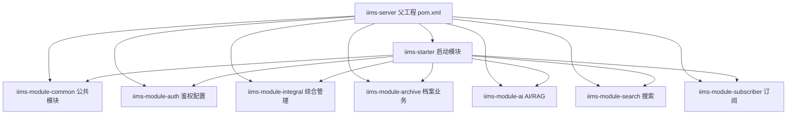

# 第 8 课：Spring Boot 多模块架构

> 课程定位：这一课解决“后端这么多模块到底怎么组织、为什么不是一个大工程、启动模块和业务模块怎么协作”。IIMS 后端是 Maven 多模块 Spring Boot 项目，理解它的模块拆分，是后面读 Controller、Service、Mapper、AI、档案、权限代码的前提。

## 1. 本课目标

### 1.1 教学目标

学完本课后，学生应该能做到：

1. 找到后端父工程和所有子模块。
2. 解释 `packaging=pom` 的含义。
3. 解释 `iims-starter` 为什么是启动模块。
4. 说清楚 common、auth、integral、archive、ai、search、subscriber 的职责。
5. 知道多模块项目为什么要从父工程执行 Maven。
6. 理解模块依赖、包扫描、资源扫描之间的关系。
7. 能画出 IIMS 后端模块图。
8. 能处理多模块项目常见的依赖、Bean 扫描、Mapper XML 找不到问题。

### 1.2 就业目标

公司项目很少是一个单文件 Demo。后台系统常见拆分方式是：

```text
启动模块
公共模块
鉴权模块
业务模块
工具模块
第三方集成模块
```

面试时，如果你能讲清楚多模块拆分边界，就比只会说“我用了 Spring Boot”更有说服力。

## 2. 源码定位

父工程：

```text
C:\Users\MoLin\Desktop\IIMS\iims-server\pom.xml
```

启动模块：

```text
C:\Users\MoLin\Desktop\IIMS\iims-server\iims-starter
```

业务模块：

```text
iims-module-common
iims-module-auth
iims-module-integral
iims-module-archive
iims-module-ai
iims-module-search
iims-module-subscriber
```

启动类：

```text
iims-server\iims-starter\src\main\java\cn\aitenry\iims\starter\IimsStarterApplication.java
```

## 3. 后端模块总览



## 4. 父工程 pom.xml 怎么读

父工程关键点：

```xml
<packaging>pom</packaging>
<modules>
    <module>iims-starter</module>
    <module>iims-module-integral</module>
    <module>iims-module-subscriber</module>
    <module>iims-module-common</module>
    <module>iims-module-auth</module>
    <module>iims-module-ai</module>
    <module>iims-module-archive</module>
    <module>iims-module-search</module>
</modules>
```

### 4.1 `packaging=pom`

含义：

```text
父工程本身不直接打 Jar，它负责聚合和管理子模块。
```

父工程主要做：

- 统一 Spring Boot 版本。
- 统一 Java 版本。
- 统一依赖版本。
- 声明子模块。
- 管理内部模块依赖。

### 4.2 `<modules>`

`modules` 定义 Maven 构建时要处理哪些子模块。

执行：

```powershell
cd C:\Users\MoLin\Desktop\IIMS\iims-server
mvn clean install -DskipTests
```

Maven 会按模块依赖关系编译所有子模块。

## 5. 为什么必须从父工程构建

如果你只进入：

```text
iims-starter
```

执行 Maven，可能出现：

```text
找不到 iims-module-common
找不到 iims-module-ai
找不到内部依赖
```

正确方式：

```powershell
cd C:\Users\MoLin\Desktop\IIMS\iims-server
mvn clean install -DskipTests
```

原因：

```text
多模块之间互相依赖，父工程知道完整构建顺序。
```

## 6. 各模块职责

| 模块 | 职责 | 典型内容 |
|---|---|---|
| `iims-starter` | 启动入口 | 启动类、配置文件、日志配置 |
| `iims-module-common` | 公共能力 | Result、BaseContext、实体、枚举、MinIO、文件服务 |
| `iims-module-auth` | 鉴权基础设施 | Sa-Token、CORS、拦截器、自动填充切面 |
| `iims-module-integral` | 综合管理 | 用户、角色、菜单、组织、字典、文章、知识库、模型入口 |
| `iims-module-archive` | 档案业务 | 档案类型、档案元数据、采集库 |
| `iims-module-ai` | AI 能力 | 模型服务、AI 对话、SSE、Agent、RAG、Milvus |
| `iims-module-search` | 搜索能力 | 搜索相关接口 |
| `iims-module-subscriber` | 订阅能力 | 事件、订阅、消息推送 |

## 7. 启动模块为什么叫 starter

`iims-starter` 的作用不是放所有业务代码，而是：

```text
把各业务模块组装起来，并启动 Spring Boot。
```

启动类：

```java
@SpringBootApplication(exclude = {
    MilvusVectorStoreAutoConfiguration.class
})
@EnableTransactionManagement
@EnableCaching
@ComponentScan({"cn.aitenry.iims.*"})
public class IimsStarterApplication {
    public static void main(String[] args) {
        SpringApplication.run(IimsStarterApplication.class, args);
    }
}
```

关键点：

- 扫描 `cn.aitenry.iims.*`。
- 开启事务。
- 开启缓存。
- 排除 Milvus 自动配置。

## 8. 包扫描为什么重要

多模块项目里，代码分散在多个模块，但 Spring 最终要把这些类注册成 Bean。

例如：

```text
UserController 在 iims-module-integral
ChatController 在 iims-module-ai
MinioConfiguration 在 iims-module-common
SaTokenConfigure 在 iims-module-auth
```

如果扫描不到，接口不会生效，依赖注入也会失败。

本项目用：

```java
@ComponentScan({"cn.aitenry.iims.*"})
```

确保扫描所有 `cn.aitenry.iims` 下的模块。

## 9. 资源文件扫描

多模块不仅有 Java 类，还有 Mapper XML。

配置：

```yaml
mybatis:
  mapper-locations: classpath*:mapper/*.xml
```

注意：

```text
classpath*: 表示扫描多个 classpath 下的 mapper XML。
```

这对多模块很重要，因为每个模块可能都有自己的：

```text
src/main/resources/mapper/*.xml
```

## 10. 常见错误

### 10.1 内部模块依赖找不到

表现：

```text
Could not find artifact cn.aitenry:iims-module-common
```

处理：

```powershell
cd C:\Users\MoLin\Desktop\IIMS\iims-server
mvn clean install -DskipTests
```

### 10.2 Bean 找不到

表现：

```text
NoSuchBeanDefinitionException
```

排查：

- 模块是否被 starter 引入。
- 类是否有 `@Service`、`@Component`、`@Configuration`。
- 包名是否在 `cn.aitenry.iims` 下。
- `@ComponentScan` 是否被改错。

### 10.3 Mapper XML 找不到

表现：

```text
Invalid bound statement
```

排查：

- XML 是否在 `resources/mapper`。
- 方法名和 XML id 是否一致。
- `mapper-locations` 是否正确。
- 是否从父工程完整编译。

### 10.4 循环依赖

配置中：

```yaml
spring.main.allow-circular-references: true
```

说明项目允许循环依赖。真实工作中要知道这是兼容已有代码的做法，不是最佳设计。

## 11. 实操任务

### 11.1 查看模块

```powershell
cd C:\Users\MoLin\Desktop\IIMS\iims-server
Get-ChildItem -Directory
```

### 11.2 查看父 POM

```powershell
Get-Content .\pom.xml
```

记录：

```text
packaging:
modules:
java.version:
spring boot version:
```

### 11.3 完整编译

```powershell
mvn clean install -DskipTests
```

### 11.4 找启动类

```powershell
Get-Content .\iims-starter\src\main\java\cn\aitenry\iims\starter\IimsStarterApplication.java
```

## 12. 验收标准

学生必须能回答：

1. 父工程为什么是 `pom` 打包。
2. 为什么 `iims-starter` 是启动模块。
3. `common` 模块放什么。
4. `auth` 模块放什么。
5. `integral` 和 `archive` 的区别。
6. `ai` 模块为什么单独拆。
7. 为什么要从父工程执行 Maven。
8. 为什么需要 `@ComponentScan`。
9. `classpath*:` 对 Mapper XML 有什么作用。

## 13. 作业

1. 画一张 IIMS 后端模块图。
2. 写出每个模块的职责。
3. 找出 3 个 Controller、3 个 Service、3 个 Mapper XML 的路径。
4. 记录一次完整 `mvn clean install -DskipTests` 输出结果。
5. 写 200 字解释多模块项目的好处和风险。

## 14. 面试表达

> IIMS 后端采用 Maven 多模块结构，父工程负责统一版本和聚合构建，`iims-starter` 是启动模块，业务能力拆到 common、auth、integral、archive、ai 等模块。这样可以把公共能力、鉴权配置、综合管理、档案业务、AI/RAG 能力分开维护。启动类通过 `@ComponentScan("cn.aitenry.iims.*")` 扫描各模块 Bean，MyBatis 使用 `classpath*:mapper/*.xml` 扫描多模块 XML。构建时我从父工程执行 `mvn clean install -DskipTests`，避免子模块单独编译找不到内部依赖。

