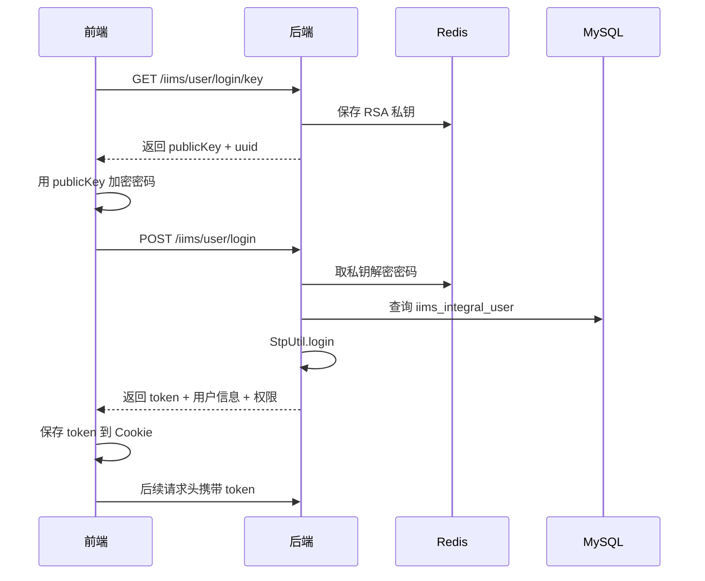

# 第 10 课：登录鉴权与 Sa-Token

> 课程定位：这一课解决“用户怎么登录、token 怎么生成、前端怎么带 token、后端怎么判断权限”。IIMS 的登录链路包含 RSA 登录密钥、Redis 临时存储、用户表校验、Sa-Token 登录、权限列表返回、前端 Cookie 保存、请求头携带 token。

## 1. 本课目标

学完本课后，学生应该能做到：

1. 说清楚登录接口和登录密钥接口的作用。
2. 理解 Redis 在登录中的作用。
3. 理解 Sa-Token 如何生成和校验 token。
4. 读懂前端 Cookie 保存和请求头携带 token 的逻辑。
5. 理解未登录、无权限、登录过期的区别。
6. 能排查登录失败、token 丢失、接口未授权。

## 2. 源码定位

后端：

```text
iims-module-integral/src/main/java/cn/aitenry/iims/integral/controller/UserController.java
iims-module-integral/src/main/java/cn/aitenry/iims/integral/service/impl/UserServiceImpl.java
iims-module-auth/src/main/java/cn/aitenry/iims/auth/config/SaTokenConfigure.java
iims-module-auth/src/main/java/cn/aitenry/iims/auth/config/GlobalCorsConfig.java
iims-module-auth/src/main/java/cn/aitenry/iims/auth/service/StpService.java
```

前端：

```text
iims-client/src/utils/request.ts
iims-client/src/utils/auth.ts
iims-client/src/router-guard.ts
iims-client/src/views/login
```

配置：

```text
iims-starter/src/main/resources/application.yml
```

## 3. 登录接口

`UserController`：

```java
@GetMapping("/login/key")
public Result<PublicKey> getPublicKey() {
    return Result.success(userService.getPublicKey());
}
```

作用：

```text
给前端一个登录加密用的公钥，同时后端保存私钥到 Redis。
```

登录：

```java
@PostMapping("/login")
public Result<Map<String, Object>> login(@RequestBody @Valid UserLoginDTO userLoginDto) {
    User user = userService.login(userLoginDto);
    String uid = String.valueOf(user.getId());
    StpUtil.logout(uid, "Web");
    StpUtil.login(uid, "Web");
    String token = StpUtil.getTokenValueByLoginId(uid, "Web");
    List<String> permissions = StpUtil.getPermissionList(uid);
    ...
    return Result.successWithNonNull(userVo);
}
```

关键点：

- 先校验用户。
- 使用 Sa-Token 登录。
- 生成 token。
- 获取权限列表。
- 返回用户信息。

## 4. 登录链路



## 5. Redis 为什么参与登录

登录前端获取公钥时，后端生成密钥对：

```text
公钥给前端
私钥临时放 Redis
```

前端用公钥加密密码。

登录时后端根据 uuid 去 Redis 找私钥解密。

如果 Redis 不通，可能出现：

```text
获取登录密钥失败
登录解密失败
登录状态异常
```

## 6. Sa-Token 配置

```yaml
sa-token:
  token-name: token
  timeout: 2592000
  is-share: false
  token-style: uuid
  isReadCookie: false
  isConcurrent: false
```

解释：

| 配置 | 含义 |
|---|---|
| `token-name` | 请求头名称是 `token` |
| `timeout` | 过期时间，单位秒 |
| `is-share` | 同账号是否共享 token |
| `token-style` | token 生成风格 |
| `isReadCookie` | 后端不从 Cookie 读 token |
| `isConcurrent` | 不允许同账号多端同时在线 |

重点：

```text
前端可以把 token 存 Cookie，但请求时必须放到 header token。
```

## 7. SaTokenConfigure

```java
registry.addInterceptor(new SaInterceptor())
        .addPathPatterns("/**")
        .excludePathPatterns("");
```

含义：

```text
给所有路径加 Sa-Token 拦截器。
```

真正哪些接口放行、哪些需要登录，还要结合 Sa-Token 注解、业务配置和具体拦截逻辑理解。

## 8. 权限注解

用户分页：

```java
@SaCheckPermission("permission:admin:query")
public Result<PageResult> page(...)
```

含义：

```text
当前登录用户必须拥有 permission:admin:query 权限。
```

如果没有权限，抛：

```text
NotPermissionException
```

全局异常处理返回无权限错误。

## 9. 前端 token 保存和携带

`auth.ts`：

```ts
Cookies.set(key, value)
Cookies.get(key)
Cookies.remove(key)
```

`request.ts`：

```ts
if (store.getters.token) {
  config.headers['token'] = getStorage('token')
}
```

`request-sse.ts`：

```ts
'token': getStorage('token') || ''
```

所以普通接口和 SSE 都需要 token。

## 10. 路由守卫

`router-guard.ts`：

- 没 token，只能进 `/login`。
- 有 token，进入系统。
- 没加载用户和菜单时，调用 `permission/generateRoutes`。
- 异常时清空登录状态并回登录页。

## 11. 常见错误

### 11.1 登录密钥接口失败

排查：

- 后端是否启动。
- Redis 是否启动。
- `/iims/user/login/key` 是否可访问。
- 浏览器 Network 状态码。

### 11.2 密码错误

排查：

- 用户是否存在。
- 密码加密/解密是否成功。
- 数据库密码字段是否为预期 MD5。

### 11.3 登录后接口提示未登录

排查：

- Cookie 是否有 token。
- Request Headers 是否有 `token`。
- 后端 Sa-Token token-name 是否为 `token`。
- Redis 是否正常。

### 11.4 有 token 但无权限

排查：

- 用户角色。
- 角色菜单。
- 菜单权限字符。
- `@SaCheckPermission` 需要的权限。

## 12. 实操任务

1. 调用 `/iims/user/login/key`。
2. 登录成功后查看 Cookie。
3. 查看后续请求头是否有 `token`。
4. 找一个带 `@SaCheckPermission` 的接口。
5. 在数据库中查看当前用户角色和角色菜单。

## 13. 验收标准

学生必须能回答：

1. 为什么登录前要请求 `/login/key`？
2. Redis 在登录中保存什么？
3. Sa-Token 的 token 请求头叫什么？
4. 前端 token 存在哪里？
5. 未登录和无权限有什么区别？
6. `@SaCheckPermission` 校验什么？

## 14. 面试表达

> IIMS 登录链路中，前端先请求 `/iims/user/login/key` 获取 RSA 公钥，后端把私钥临时存入 Redis。前端用公钥加密密码后提交登录，后端解密并查询用户表校验账号状态。登录成功后使用 Sa-Token 的 `StpUtil.login` 生成 token，并返回用户信息和权限列表。前端把 token 存入 Cookie，后续普通 Axios 请求和 AI SSE 请求都会把 token 放入请求头 `token`。权限控制通过 `@SaCheckPermission` 和角色菜单权限字符实现。

