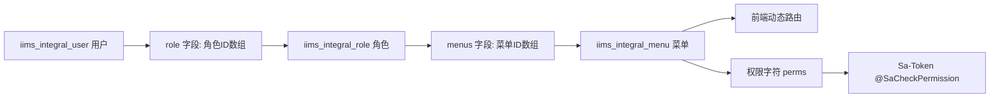

# 第 11 课：RBAC 用户、角色、菜单

> 课程定位：这一课解决“后台系统为什么不同用户看到不同菜单、按钮权限怎么控制、数据库里的角色菜单怎么影响前端动态路由”。RBAC 是后台管理系统最核心的能力之一。

## 1. 本课目标

学完本课后，学生应该能做到：

1. 理解 RBAC 的用户、角色、权限关系。
2. 找到用户、角色、菜单相关 Controller、Service、Mapper。
3. 读懂用户表、角色表、菜单表的核心字段。
4. 理解前端动态路由和后端菜单数据的关系。
5. 理解按钮权限字符和 `@SaCheckPermission` 的关系。
6. 能新增一个角色并分配菜单。
7. 能排查登录后菜单不显示、接口无权限问题。

## 2. 源码定位

后端：

```text
iims-module-integral/src/main/java/cn/aitenry/iims/integral/controller/UserController.java
iims-module-integral/src/main/java/cn/aitenry/iims/integral/controller/RoleController.java
iims-module-integral/src/main/java/cn/aitenry/iims/integral/controller/MenuController.java
iims-module-integral/src/main/java/cn/aitenry/iims/integral/service/impl/UserServiceImpl.java
iims-module-integral/src/main/java/cn/aitenry/iims/integral/service/impl/RoleServiceImpl.java
iims-module-integral/src/main/java/cn/aitenry/iims/integral/service/impl/MenuServiceImpl.java
iims-module-integral/src/main/resources/mapper/UserMapper.xml
iims-module-integral/src/main/resources/mapper/RoleMapper.xml
iims-module-integral/src/main/resources/mapper/MenuMapper.xml
```

前端：

```text
iims-client/src/router-guard.ts
iims-client/src/store/modules/permission.ts
iims-client/src/api/user.ts
iims-client/src/api/role.ts
iims-client/src/api/menu.ts
```

数据库：

```text
iims_integral_user
iims_integral_role
iims_integral_menu
iims_integral_permission
```

## 3. RBAC 是什么

RBAC：

```text
Role-Based Access Control
基于角色的访问控制
```

关系：

```text
用户 -> 拥有角色
角色 -> 拥有菜单和权限
菜单 -> 对应页面/按钮/权限字符
```

## 4. 本项目 RBAC 数据链路



## 5. 用户表

核心表：

```text
iims_integral_user
```

重点字段：

| 字段 | 含义 |
|---|---|
| `id` | 用户 ID |
| `name` | 姓名 |
| `username` | 登录名 |
| `password` | 密码摘要 |
| `role` | 角色 ID 数组，JSON 字符串 |
| `is_disable` | 是否禁用 |
| `is_deleted` | 是否删除 |
| `avatar` | 头像文件 ID |

初始用户示例：

```text
Aitenry
G-001
Q-001
```

## 6. 角色表

核心表：

```text
iims_integral_role
```

重点字段：

| 字段 | 含义 |
|---|---|
| `id` | 角色 ID |
| `role_name` | 角色名称 |
| `role_en` | 英文标识 |
| `menus` | 菜单 ID 数组 |
| `systemic` | 是否系统内置 |

角色示例：

```text
超级管理员
档案管理员
教务管理员
```

## 7. 菜单表

核心表：

```text
iims_integral_menu
```

重点字段：

| 字段 | 含义 |
|---|---|
| `id` | 菜单 ID |
| `menu_name` | 菜单名 |
| `parent_id` | 父级菜单 |
| `path` | 前端路由 path |
| `name` | 路由 name |
| `component` | 前端组件路径 |
| `icon` | 菜单图标 |
| `type` | 菜单类型 |
| `perms` | 权限字符 |
| `is_show` | 是否显示 |

菜单类型通常可理解为：

```text
M：目录
C：菜单页面
F：按钮权限
```

## 8. 动态路由

前端路由守卫：

```ts
const accessRoutes = await store.dispatch('permission/generateRoutes')
accessRoutes.forEach(route => router.addRoute(route))
```

含义：

```text
登录后前端根据后端返回的菜单生成路由，而不是写死所有路由。
```

如果菜单表里的 component 写错，可能页面打不开。

## 9. 权限字符

例如用户分页接口：

```java
@SaCheckPermission("permission:admin:query")
```

对应菜单或按钮权限字段：

```text
permission:admin:query
```

如果用户角色没有这个权限，接口会抛无权限异常。

## 10. 常见错误

### 10.1 登录成功但没有菜单

排查：

- 用户 `role` 字段是否为空。
- 角色 `menus` 字段是否为空。
- 菜单 `is_show` 是否正确。
- 前端动态路由是否生成。
- 菜单 component 是否存在。

### 10.2 页面有菜单但点开白屏

排查：

- 菜单 component 路径是否对应 `src/views`。
- 前端是否能动态 import。
- Console 是否报模块找不到。

### 10.3 按钮点了无权限

排查：

- 接口 `@SaCheckPermission` 需要什么权限。
- 菜单表 perms 是否有该权限。
- 角色 menus 是否包含对应按钮权限菜单 ID。

## 11. 实操任务

1. 查询当前用户：

```sql
SELECT id, username, role FROM iims_integral_user;
```

2. 查询角色：

```sql
SELECT id, role_name, menus FROM iims_integral_role;
```

3. 查询菜单：

```sql
SELECT id, menu_name, parent_id, path, component, type, perms FROM iims_integral_menu;
```

4. 找到一个接口的 `@SaCheckPermission`。
5. 在菜单表中找到对应 perms。

## 12. 验收标准

学生必须能回答：

1. 用户和角色怎么关联？
2. 角色和菜单怎么关联？
3. 菜单如何变成前端路由？
4. 按钮权限和接口权限如何对应？
5. 登录后没菜单怎么查？
6. 接口无权限怎么查？

## 13. 面试表达

> IIMS 使用 RBAC 权限模型，用户表的 `role` 字段保存角色 ID 数组，角色表的 `menus` 字段保存菜单 ID 数组，菜单表中定义路由 path、组件路径、图标、菜单类型和权限字符。登录后前端根据后端返回的菜单动态生成路由，接口层通过 Sa-Token 的 `@SaCheckPermission` 校验权限字符。排查权限问题时，我会从用户角色、角色菜单、菜单 perms、前端动态路由和接口注解五层检查。

