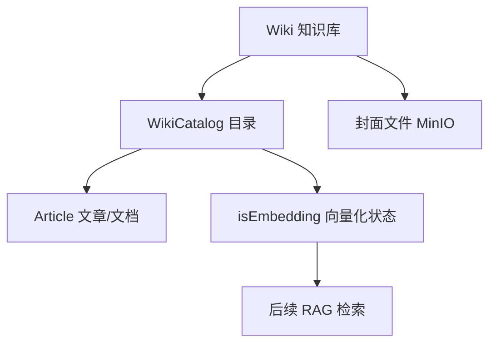

# 第 18 课：知识库业务模块

> 课程定位：这一课解决“知识库业务和 RAG 向量检索是什么关系”。IIMS 的知识库模块先是一个内容管理系统：知识库、目录、文章、封面、发布状态；后续才通过事件触发文档向量化，进入 RAG。

## 1. 本课目标

学完本课后，学生应该能做到：

1. 找到知识库 Controller、Service、Mapper、前端页面。
2. 理解知识库、目录、文章之间的关系。
3. 理解新增知识库时默认目录如何创建。
4. 理解发布、置顶、删除、分页查询。
5. 理解 DocumentEmbeddingEvent 如何连接到 RAG。
6. 能排查知识库列表、目录、封面、向量化状态问题。

## 2. 源码定位

```text
iims-module-integral/src/main/java/cn/aitenry/iims/integral/controller/WikiController.java
iims-module-integral/src/main/java/cn/aitenry/iims/integral/service/impl/WikiServiceImpl.java
iims-module-integral/src/main/java/cn/aitenry/iims/integral/mapper/WikiMapper.java
iims-module-integral/src/main/java/cn/aitenry/iims/integral/mapper/WikiCatalogMapper.java
iims-module-integral/src/main/resources/mapper/WikiMapper.xml
iims-module-integral/src/main/resources/mapper/WikiCatalogMapper.xml
iims-module-integral/src/main/java/cn/aitenry/iims/integral/event/DocumentEmbeddingEvent.java
iims-module-integral/src/main/java/cn/aitenry/iims/integral/event/subscriber/DocumentEmbeddingSubscriber.java
iims-client/src/views/knowledge
iims-client/src/api/wiki.ts
```

数据库：

```text
iims_integral_wiki
iims_integral_wiki_catalog
```

## 3. 知识库业务模型



## 4. 新增知识库

`addWiki`：

```java
Wiki wiki = Wiki.builder()
    .cover(addWikiDto.getCover())
    .title(addWikiDto.getTitle())
    .summary(addWikiDto.getSummary())
    .type(addWikiDto.getType())
    .weight(0)
    .isPublish(false)
    .isDeleted(false)
    .build();
wikiMapper.insert(wiki);
```

新增后创建默认目录：

```java
wikiCatalogMapper.insert(WikiCatalog.builder()
    .wikiId(wikiId)
    .title("概述")
    .level(1)
    .sort(1)
    .build());

wikiCatalogMapper.insert(WikiCatalog.builder()
    .wikiId(wikiId)
    .title("基础")
    .level(1)
    .sort(2)
    .build());
```

## 5. 分页查询

```java
PageHelper.startPage(page, pageSize);
Page<Wiki> wikiPage = wikiMapper.pageQuery(dto, openPublish);
```

返回 VO 时会补充：

- 封面短链。
- 第一篇文章 ID。
- 向量化任务状态。

封面：

```java
vo.setImgUrl(minioService.generateShortLink(vo.getCover()));
```

## 6. 发布和置顶

发布：

```java
updateWikiIsPublish
```

置顶：

```java
updateWikiIsTop
```

置顶逻辑：

```text
查询最大 weight，再加 1。
```

## 7. 删除知识库

删除知识库时：

- 逻辑删除 wiki。
- 查询目录。
- 找到二级目录关联文章。
- 把文章类型改回普通。
- 逻辑删除目录。

这说明知识库删除不是单表操作。

## 8. 向量化事件

`DocumentEmbeddingSubscriber`：

```java
@Async("threadPoolTaskExecutor")
public void onApplicationEvent(DocumentEmbeddingEvent event) {
    Long wikiId = event.getWikiId();
    Long currentId = event.getCurrentId();
    BaseContext.setCurrentId(currentId);
    Boolean result = milvusStoreService.addDocumentByWiki(wikiId);
    notificationService.sendToClient(currentId, message);
}
```

含义：

```text
知识库触发向量化事件后，异步调用 MilvusStoreService，把文档写入向量库，并通过 SSE 通知用户。
```

注意：

```text
这里手动设置 BaseContext，因为异步线程不会自动继承当前用户上下文。
```

## 9. 知识库和 RAG 的边界

知识库业务模块负责：

- 知识库管理。
- 目录管理。
- 文章关联。
- 发布状态。
- 任务状态。

RAG 模块负责：

- 文档读取。
- 文档切分。
- Embedding。
- Milvus 存储。
- 相似度检索。
- Prompt 组装。

不要把两者混成一团。

## 10. 常见错误

### 10.1 知识库封面不显示

排查：

- cover 文件 ID 是否存在。
- MinIO 文件是否存在。
- `iims.short-link` 是否正确。

### 10.2 目录为空

排查：

- 新增知识库时默认目录是否插入。
- `wiki_id` 是否正确。
- 目录是否逻辑删除。

### 10.3 向量化失败

排查：

- Embedding 模型是否配置。
- Milvus 是否启动。
- 当前用户上下文是否传入事件。
- 后端日志。

### 10.4 前端任务状态不对

排查：

- `isEmbedding` 字段。
- `countEmbedding` 查询。
- SSE 通知是否发送。

## 11. 实操任务

1. 新增知识库。
2. 查看默认目录。
3. 上传封面。
4. 发布知识库。
5. 触发向量化。
6. 查看后端日志和 SSE 通知。

## 12. 验收标准

学生必须能回答：

1. 新增知识库会自动创建哪些目录？
2. 知识库封面如何显示？
3. 删除知识库会影响文章吗？
4. 向量化事件做了什么？
5. 知识库模块和 RAG 模块的边界是什么？

## 13. 面试表达

> IIMS 知识库模块先是内容管理业务，核心表是 `iims_integral_wiki` 和 `iims_integral_wiki_catalog`。新增知识库后会自动创建默认目录，列表查询会补充封面短链、第一篇文章 ID 和向量化状态。知识库删除会联动目录和文章类型。RAG 不是直接写在普通 CRUD 里，而是通过 `DocumentEmbeddingEvent` 发布事件，异步订阅者调用 `MilvusStoreService` 完成文档向量化，并通过 SSE 通知用户。这种设计把业务管理和向量处理解耦。

