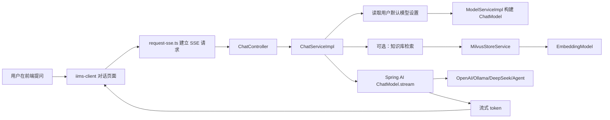

# 第 19 课：Spring AI 总览与 IIMS 接入方式
> 课程定位：这一课不急着填模型 Key，而是先把 IIMS 的 AI 模块全链路看明白。学生要知道一次“发送问题”到底经过了哪些类、哪些表、哪些模型配置，最后怎样从大模型返回流式答案。

## 1. 本课目标

学完本课后，学生应该能做到：

1. 说清楚 Spring AI 在 IIMS 中承担什么角色。
2. 找到 AI 对话、模型管理、向量检索、用户模型设置相关源码。
3. 画出“前端提问 -> 后端 SSE -> Spring AI ChatModel -> 大模型接口 -> 前端增量显示”的链路。
4. 区分 ChatModel、EmbeddingModel、VectorStore 三个概念。
5. 理解 IIMS 为什么需要同时配置语言模型和向量模型。
6. 能判断一个 AI 功能无法使用时，是模型配置问题、接口问题、SSE 问题，还是向量库问题。

## 2. 就业目标

面试时不能只说“我用过 Spring AI”。更好的表达是：

> 我在项目中接入过 Spring AI，后端根据数据库中的模型配置动态构建 ChatModel，支持 Ollama、OpenAI 兼容接口和 DeepSeek。对话接口使用 SSE 推送增量结果，同时结合知识库、EmbeddingModel 和 Milvus 实现 RAG 检索增强。

这句话里有几个加分点：

- 不是写死一个模型，而是动态读取模型配置。
- 不只是普通 HTTP 返回，而是 SSE 流式响应。
- 不只是调用大模型，而是有知识库和向量检索。
- 能讲出 ChatModel、EmbeddingModel、Milvus 的分工。

## 3. 源码定位

后端核心文件：

```text
iims-module-ai/src/main/java/cn/aitenry/iims/ai/chat/controller/ChatController.java
iims-module-ai/src/main/java/cn/aitenry/iims/ai/chat/service/impl/ChatServiceImpl.java
iims-module-ai/src/main/java/cn/aitenry/iims/ai/service/impl/ModelServiceImpl.java
iims-module-ai/src/main/java/cn/aitenry/iims/ai/service/impl/AiChatModelsServiceImpl.java
iims-module-ai/src/main/java/cn/aitenry/iims/ai/service/impl/AiChatSettingServiceImpl.java
iims-module-ai/src/main/java/cn/aitenry/iims/ai/store/CustomizeVectorStoreServiceImpl.java
iims-module-ai/src/main/java/cn/aitenry/iims/ai/store/MilvusStoreServiceImpl.java
iims-module-ai/src/main/java/cn/aitenry/iims/ai/config/ModelsConfig.java
```

前端核心文件：

```text
iims-client/src/api/ai/chat.ts
iims-client/src/api/settings/model.ts
iims-client/src/views/settings/model/Index.vue
iims-client/src/utils/request-sse.ts
```

数据库核心表：

```text
iims_ai_chat_models
iims_ai_chat_settings
iims_ai_dialogue
iims_ai_topic
```

## 4. AI 模块整体地图



这张图是课程后半段的总线。后面的第 20 到第 30 课都会围绕它展开。

## 5. Spring AI 在项目中的角色

Spring AI 不是一个大模型。它更像一个统一适配层。

项目里可能有不同模型提供方：

- Ollama：本地模型服务。
- OpenAI：OpenAI 官方接口，或者兼容 OpenAI 协议的第三方接口。
- DeepSeek：DeepSeek 模型接口。
- Agent：项目预留的智能体类型。

如果不用 Spring AI，代码可能到处都是：

```java
if (type == OLLAMA) {
    // 调 Ollama SDK
} else if (type == OPENAI) {
    // 调 OpenAI SDK
} else if (type == DEEPSEEK) {
    // 调 DeepSeek SDK
}
```

使用 Spring AI 后，项目尽量把这些差异收敛成：

```java
ChatModel chatModel = modelService.getChatModel(modelId);
chatModel.stream(new Prompt(messages));
```

也就是说，业务层关心的是：

- 给模型什么消息。
- 使用哪个模型配置。
- 是否流式返回。
- 返回内容怎样入库、怎样推给前端。

至于底层调用哪个厂商，由模型服务层处理。

## 6. ChatModel、EmbeddingModel、VectorStore

AI 项目里最容易混淆的是这三个对象。

### 6.1 ChatModel

ChatModel 用来聊天、问答、生成内容。

在 IIMS 中，它负责：

- 根据用户输入生成回答。
- 根据历史对话保持上下文。
- 根据知识库检索内容生成更准确答案。
- 通过 `stream` 方法返回流式结果。

典型用途：

```text
用户：帮我总结这篇文章
模型：这篇文章主要讲了……
```

### 6.2 EmbeddingModel

EmbeddingModel 用来把文本转成向量。

它不是用来聊天的。它的作用是把一段文字变成一组数字，例如：

```text
"Spring AI 是什么" -> [0.12, -0.08, 0.33, ...]
```

向量的意义是让机器可以计算文本之间的相似度。

IIMS 中，知识库文章要进入 RAG，需要先经过 EmbeddingModel 向量化。

### 6.3 VectorStore

VectorStore 是向量数据库访问层。

IIMS 中使用的是 Milvus。它负责：

- 保存文档向量。
- 根据用户问题向量检索相似文档。
- 返回最相关的知识片段。

一句话区分：

```text
ChatModel 负责回答。
EmbeddingModel 负责把文本变成向量。
VectorStore 负责存储和检索向量。
```

## 7. IIMS 模型类型

项目中模型类型大致分两层。

第一层是接口类型：

```text
AiApiType:
AGENT
OPENAI
OLLAMA
DEEPSEEK
```

第二层是模型用途：

```text
AiModelType:
EMBEDDING
LANGUAGE
VISION
MULTIMODAL
```

这两个概念不能混在一起。

例如：

```text
接口类型：OPENAI
模型用途：LANGUAGE
模型名称：gpt-4o-mini
```

又例如：

```text
接口类型：OLLAMA
模型用途：EMBEDDING
模型名称：nomic-embed-text
```

一个是“怎么调用”，一个是“这个模型用来干什么”。

## 8. 枚举入库注意点

项目使用 MyBatis Plus 枚举处理时，要特别注意枚举值入库方式。如果使用 ordinal，则数据库里保存的是枚举顺序数字。

当前顺序可以理解为：

```text
AiApiType:
AGENT   -> 0
OPENAI  -> 1
OLLAMA  -> 2
DEEPSEEK-> 3

AiModelType:
EMBEDDING  -> 0
LANGUAGE   -> 1
VISION     -> 2
MULTIMODAL -> 3
```

教学时一定要强调：

```text
不要随便调整枚举顺序。
```

如果改了顺序，老数据里的数字含义会变，可能导致：

- 原本的 OpenAI 模型被当成 Ollama。
- 原本的语言模型被当成向量模型。
- 页面显示和后端构建模型全部错乱。

## 9. 对话入口

后端入口在：

```text
ChatController.java
```

核心接口包括：

```text
/iims/ai/chat/receive/answer/{uuid}
/iims/ai/chat/endpoint/list
/iims/ai/chat/stop/answer/{uuid}
```

其中最重要的是：

```text
/iims/ai/chat/receive/answer/{uuid}
```

它用于建立 SSE 流式对话。

前端不是普通 `axios.post` 等一个完整 JSON，而是打开一个持续连接，让服务端一点一点推送答案。

## 10. 一次提问的后端流程

在 `ChatServiceImpl` 中，一次提问大致包括：

1. 创建 `SseEmitter`。
2. 从请求中拿到用户问题、话题、模型、知识库等信息。
3. 设置当前用户上下文。
4. 查询历史对话。
5. 插入用户消息。
6. 如果带知识库，检索相关文档。
7. 组装 Prompt。
8. 调用 `modelService.getChatModel(modelId)`。
9. 执行 `chatModel.stream(new Prompt(messages))`。
10. 把模型返回内容通过 SSE 推给前端。
11. 把最终 assistant 消息保存到数据库。

这条链路就是后面排查 AI 问题的主线。

## 11. 模型构建入口

模型不是在 Controller 中直接创建的，而是在：

```text
ModelServiceImpl.java
```

核心思路是：

```java
ChatApi chatApi = aiChatModelsService.selectModelById(modelId);
```

然后根据 `chatApi` 的接口类型构建不同 ChatModel：

```text
OLLAMA
OPENAI
DEEPSEEK
AGENT
```

这样做的好处是：

- Controller 不知道具体模型厂商。
- Service 不需要硬编码某个 API Key。
- 页面新增模型配置后，后端可以动态读取。

## 12. 为什么还需要用户默认模型

一个系统可以配置很多模型：

- 一个语言模型。
- 一个向量模型。
- 一个视觉模型。
- 多个备用模型。

但用户提问时，系统必须知道默认用哪个。

所以 IIMS 有用户模型设置：

```text
iims_ai_chat_settings
```

它通常用于记录：

- 当前用户默认聊天模型。
- 当前用户默认向量模型。

如果这张表没有数据，或者默认模型 id 指向不存在的模型，就可能出现：

```text
模型为空
无法构建 ChatModel
知识库检索失败
```

## 13. RAG 为什么需要两种模型

RAG 的全称是 Retrieval-Augmented Generation，中文通常叫检索增强生成。

IIMS 的 RAG 需要两个阶段：

### 13.1 入库阶段

文章内容进入知识库后：

```text
文章内容 -> EmbeddingModel -> 文本向量 -> Milvus
```

### 13.2 提问阶段

用户提问时：

```text
用户问题 -> EmbeddingModel -> 问题向量 -> Milvus 相似度检索 -> 相关文档 -> ChatModel 回答
```

所以：

- 没有 ChatModel，系统不能生成回答。
- 没有 EmbeddingModel，系统不能进行知识库检索。
- 没有 Milvus，向量没有地方存，也没法相似度搜索。

## 14. 前端如何进入 AI 模块

前端 API 主要在：

```text
iims-client/src/api/ai/chat.ts
```

普通接口使用 Axios。

流式接口使用：

```text
iims-client/src/utils/request-sse.ts
```

这个文件会给 SSE 请求加上：

```text
Content-Type
Cache-Control
Connection
token
```

其中 `token` 很关键。后端开启 Sa-Token 鉴权后，SSE 请求也必须携带 token，否则会登录失效。

## 15. 教学演示脚本

教师演示时按这个顺序：

1. 打开前端模型管理页面，让学生看到模型配置不是写死在代码里。
2. 打开 `iims_ai_chat_models` 表，说明一条模型配置包含名称、地址、Key、类型。
3. 打开 `ModelServiceImpl`，说明后端根据数据库配置动态构建模型。
4. 打开 `ChatController`，找到 SSE 对话入口。
5. 打开 `ChatServiceImpl`，跟踪一次对话流程。
6. 打开 `MilvusStoreServiceImpl`，说明知识库检索从这里进入向量库。
7. 回到前端，发送一次问题，观察浏览器 Network 中的 SSE 请求。

## 16. 学生实操

本课不要求马上配置成功模型，但要求完成源码定位。

任务：

1. 在 IDE 中搜索 `ChatController`，找到对话入口。
2. 搜索 `getChatModel`，找到模型构建入口。
3. 搜索 `EmbeddingModel`，找到向量模型相关代码。
4. 搜索 `MilvusVectorStore`，找到向量库配置。
5. 搜索 `fetchEventSource`，找到前端 SSE 请求。
6. 在笔记里画出一次 AI 对话链路。

## 17. 常见错误

### 17.1 只配置语言模型，不配置向量模型

表现：

```text
普通聊天可能能用，知识库问答不能用。
```

原因：

```text
知识库检索需要 EmbeddingModel。
```

### 17.2 模型类型选错

表现：

```text
把 embedding 模型当语言模型调用。
把语言模型当 embedding 模型调用。
```

排查：

```text
检查 iims_ai_chat_models 的 type 和 model_type。
```

### 17.3 SSE 没带 token

表现：

```text
普通接口能访问，对话流接口失败。
```

排查：

```text
检查 request-sse.ts 是否带 token。
检查浏览器 Network 的请求头。
```

### 17.4 服务器不能访问模型地址

表现：

```text
本地能调模型，部署到阿里云后不行。
```

排查：

```text
在服务器上 curl 模型接口地址。
检查安全组、防火墙、代理、DNS。
```

## 18. 验收标准

学生完成本课后，必须能回答：

1. IIMS 的 AI 对话入口在哪里？
2. 模型配置存在哪张表？
3. ChatModel 和 EmbeddingModel 有什么区别？
4. RAG 为什么需要 Milvus？
5. 前端 SSE 请求和普通 Axios 请求有什么不同？
6. 为什么用户默认模型配置会影响聊天和知识库问答？

## 19. 作业

写一份 500 字技术笔记，标题为：

```text
IIMS 中一次 AI 对话请求的完整链路
```

必须包含：

- 前端文件。
- 后端 Controller。
- 后端 Service。
- 模型配置表。
- Spring AI ChatModel。
- SSE 返回。
- 如果带知识库，额外经过哪些组件。

## 20. 面试表达

可以这样说：

> IIMS 的 AI 模块不是简单调用一个固定大模型，而是把模型信息持久化到数据库，通过模型服务动态构建 Spring AI 的 ChatModel。用户发起对话后，后端使用 SSE 推送流式响应；如果选择知识库，会先通过 EmbeddingModel 和 Milvus 检索相关文档，再把检索结果和历史消息一起组装成 Prompt 交给 ChatModel。

## 21. 最终交付物

本课结束时，学生应提交：

```text
AI 模块源码定位清单
一次 AI 对话链路图
ChatModel/EmbeddingModel/VectorStore 区分笔记
常见错误排查表
```

