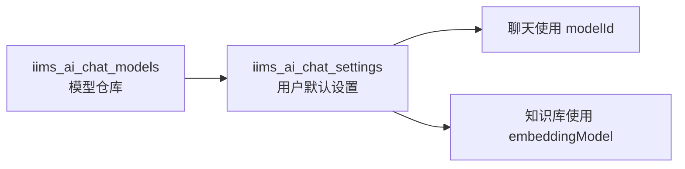

# 第 24 课：用户默认模型与模型设置
> 课程定位：这一课解决“我明明新增了模型，为什么聊天还不用它”的问题。模型配置只是把模型放进系统，用户默认模型设置才决定当前用户实际使用哪一个语言模型和哪一个向量模型。

## 1. 本课目标

学完本课后，学生应该能做到：

1. 理解模型配置和用户模型设置的区别。
2. 找到 `iims_ai_chat_settings` 表和相关服务代码。
3. 理解默认聊天模型和默认 embedding 模型分别影响什么功能。
4. 能排查默认模型为空、模型 id 失效、模型用途不匹配等问题。
5. 能设计一个清晰的“模型配置完成检查清单”。

## 2. 源码定位

用户模型设置服务：

```text
iims-module-ai/src/main/java/cn/aitenry/iims/ai/service/impl/AiChatSettingServiceImpl.java
```

模型服务：

```text
iims-module-ai/src/main/java/cn/aitenry/iims/ai/service/impl/ModelServiceImpl.java
```

聊天服务：

```text
iims-module-ai/src/main/java/cn/aitenry/iims/ai/chat/service/impl/ChatServiceImpl.java
```

向量服务：

```text
iims-module-ai/src/main/java/cn/aitenry/iims/ai/store/CustomizeVectorStoreServiceImpl.java
iims-module-ai/src/main/java/cn/aitenry/iims/ai/store/MilvusStoreServiceImpl.java
```

数据库：

```text
iims_ai_chat_settings
iims_ai_chat_models
```

## 3. 两张表的职责

### 3.1 iims_ai_chat_models

这张表表示：

```text
系统里有哪些模型。
```

比如：

```text
DeepSeek Chat
OpenAI gpt-4o-mini
Ollama qwen2.5
Ollama nomic-embed-text
```

### 3.2 iims_ai_chat_settings

这张表表示：

```text
某个用户默认使用哪些模型。
```

例如：

```text
用户 1 默认聊天模型：DeepSeek Chat
用户 1 默认向量模型：Ollama nomic-embed-text
```

这两张表的关系可以理解为：



## 4. 为什么新增模型后还要设置默认模型

新增模型只是完成：

```text
系统知道有这个模型。
```

但聊天时还需要知道：

```text
当前用户要用哪个模型。
```

否则会出现：

```text
modelId 为空
查不到模型
默认配置不存在
```

所以模型配置流程应该是：

```text
新增模型 -> 验证模型可用 -> 设置为默认模型 -> 发起对话
```

而不是：

```text
新增模型 -> 直接对话
```

## 5. 默认聊天模型

默认聊天模型通常影响：

- 普通 AI 对话。
- 知识库问答中的最终生成。
- 对话标题生成。
- 总结、改写等语言生成能力。

它必须指向一个：

```text
modelType = LANGUAGE
```

的模型。

如果指向 embedding 模型，会出现：

```text
模型无法生成正常回答。
```

## 6. 默认向量模型

默认向量模型通常影响：

- 知识库文档向量化。
- 用户问题向量化。
- Milvus 相似度检索。

它必须指向一个：

```text
modelType = EMBEDDING
```

的模型。

如果没有默认向量模型，知识库相关功能容易失败。

## 7. 代码链路

用户发起 AI 对话时：

```text
ChatServiceImpl
  -> 获取用户设置
  -> 读取默认聊天模型
  -> ModelServiceImpl.getChatModel
  -> ChatModel.stream
```

知识库检索时：

```text
MilvusStoreServiceImpl
  -> CustomizeVectorStoreServiceImpl
  -> 获取用户默认 embedding 模型
  -> 构建 EmbeddingModel
  -> 查询 Milvus
```

这说明：

```text
聊天模型错了，回答失败。
向量模型错了，知识库失败。
```

## 8. 初始化环境的检查清单

项目要“完整跑起来”，模型部分至少检查：

```text
1. iims_ai_chat_models 有语言模型
2. iims_ai_chat_models 有 embedding 模型
3. 语言模型 type 正确
4. 语言模型 modelType 正确
5. embedding 模型 type 正确
6. embedding 模型 modelType 正确
7. iims_ai_chat_settings 有当前用户记录
8. 默认聊天模型 id 存在
9. 默认 embedding 模型 id 存在
10. 后端服务器能访问两个模型的 url
```

## 9. 数据库排查 SQL

查看模型：

```sql
select id, name, rename, type, model_type, url, is_deleted
from iims_ai_chat_models
order by id;
```

查看用户模型设置：

```sql
select *
from iims_ai_chat_settings
order by id;
```

检查默认模型是否存在：

```sql
select s.*, m1.name as chat_model_name, m2.name as embedding_model_name
from iims_ai_chat_settings s
left join iims_ai_chat_models m1 on s.model_id = m1.id
left join iims_ai_chat_models m2 on s.embedding_model = m2.id;
```

字段名如果和实际表结构不同，以本项目 SQL 为准调整。

## 10. 页面操作流程

1. 进入模型管理。
2. 新增语言模型。
3. 新增向量模型。
4. 进入模型设置或个人 AI 设置页面。
5. 选择默认聊天模型。
6. 选择默认向量模型。
7. 保存。
8. 刷新页面。
9. 重新进入确认设置没有丢失。
10. 发起聊天和知识库测试。

## 11. 常见错误

### 11.1 设置表为空

表现：

```text
模型管理里有模型，但聊天失败。
```

原因：

```text
当前用户没有默认模型设置。
```

修复：

```text
通过页面保存默认设置。
或写初始化 SQL。
```

### 11.2 默认模型 id 指向已删除模型

表现：

```text
查不到模型配置。
```

原因：

```text
模型被逻辑删除，但设置表仍然引用旧 id。
```

修复：

```text
重新选择默认模型。
```

### 11.3 聊天模型和向量模型选反

表现：

```text
普通聊天失败。
知识库向量化失败。
```

修复：

```text
LANGUAGE 用作聊天模型。
EMBEDDING 用作向量模型。
```

### 11.4 多用户设置混淆

表现：

```text
A 用户配置好了，B 用户还是不能用。
```

原因：

```text
设置是按用户保存的。
```

修复：

```text
给当前登录用户保存设置。
```

## 12. 初始化 SQL 的策略

为了演示环境稳定，可以准备初始化 SQL：

```text
插入一条语言模型
插入一条向量模型
给管理员用户插入默认设置
```

但注意：

```text
不要把真实 API Key 写进 SQL。
```

可以写：

```text
sk-your-api-key
```

部署后由页面修改。

## 13. 教学演示脚本

1. 打开模型表，展示已有模型。
2. 打开设置表，展示当前用户默认模型。
3. 故意把默认模型设置为空，演示聊天失败。
4. 恢复默认聊天模型，演示普通聊天成功。
5. 故意把默认向量模型设置为空，演示知识库失败。
6. 恢复默认向量模型，演示知识库向量化或检索。
7. 总结模型配置和模型设置的区别。

## 14. 学生实操

任务：

1. 查询模型表。
2. 查询设置表。
3. 找到当前登录用户的默认模型。
4. 判断默认聊天模型是否为 LANGUAGE。
5. 判断默认向量模型是否为 EMBEDDING。
6. 进行一次普通聊天测试。
7. 进行一次知识库问答测试。

## 15. 验收标准

学生必须能回答：

1. 为什么新增模型后还不能直接聊天？
2. 默认聊天模型影响哪些功能？
3. 默认向量模型影响哪些功能？
4. 设置表为空时怎么处理？
5. 默认模型 id 指向删除模型时怎么排查？
6. 多用户环境为什么会出现“别人能用我不能用”？

## 16. 作业

写一份“模型配置完成检查清单”，要求覆盖：

```text
模型表
设置表
语言模型
向量模型
当前登录用户
服务端可达性
前端 SSE 验证
知识库向量化验证
```

## 17. 面试表达

可以这样说：

> 项目把模型配置和用户默认设置拆开设计。模型配置表负责维护系统支持哪些模型，用户设置表负责记录当前用户默认使用的聊天模型和向量模型。这样既支持多模型管理，也支持不同用户使用不同模型。排查 AI 功能时，我会先检查模型表，再检查用户设置表，最后验证后端是否能访问模型服务。

## 18. 最终交付物

```text
当前用户默认模型查询结果
默认聊天模型检查结果
默认向量模型检查结果
模型配置完成检查清单
一份模型设置故障排查记录
```

