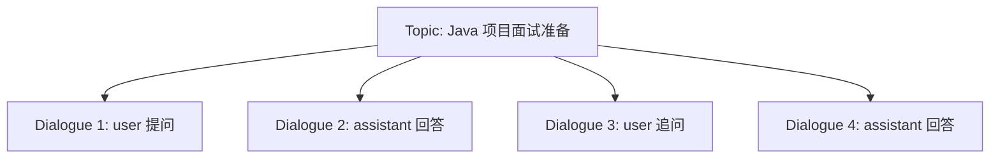

# 第 26 课：对话历史、话题与消息存储
> 课程定位：这一课讲 AI 对话为什么能“记住上下文”。模型本身不会自动知道你之前说过什么，项目需要把历史消息查出来，重新组装进 Prompt，再交给模型。

## 1. 本课目标

学完本课后，学生应该能做到：

1. 理解话题、对话消息、历史上下文之间的关系。
2. 找到对话相关实体、Mapper、Service。
3. 理解用户消息和 assistant 消息如何入库。
4. 理解历史消息如何参与 Prompt 组装。
5. 能排查“模型不记得上下文”的问题。

## 2. 源码定位

```text
iims-module-ai/src/main/java/cn/aitenry/iims/ai/chat/service/impl/ChatServiceImpl.java
iims-module-ai/src/main/java/cn/aitenry/iims/ai/chat/controller/ChatController.java
iims-module-ai/src/main/java/cn/aitenry/iims/ai/chat/entity
iims-module-ai/src/main/java/cn/aitenry/iims/ai/chat/mapper
iims-module-ai/src/main/resources/mapper
```

数据库常见表：

```text
iims_ai_topic
iims_ai_dialogue
```

## 3. 模型为什么需要历史消息

大模型接口通常是无状态的。

第一次请求：

```text
用户：我叫小林。
模型：你好，小林。
```

第二次请求如果只发送：

```text
用户：我叫什么？
```

模型可能不知道。

正确做法是把历史一起发过去：

```text
用户：我叫小林。
助手：你好，小林。
用户：我叫什么？
```

这就是对话历史的意义。

## 4. Topic 和 Dialogue

可以这样理解：

```text
Topic：一次会话主题。
Dialogue：主题下面的一条条消息。
```

一个 Topic 下有多条 Dialogue：



## 5. 一次消息入库流程

用户发送问题后：

1. 后端接收用户问题。
2. 判断 topic 是否存在。
3. 保存用户消息。
4. 查询历史消息。
5. 组装 Prompt。
6. 调用模型。
7. 流式返回 assistant 内容。
8. 最终保存 assistant 消息。

如果第 3 步或第 8 步失败，就会导致历史不完整。

## 6. Prompt 组装顺序

理想顺序：

```text
系统提示词
知识库上下文
历史 user/assistant 消息
当前用户问题
```

顺序很重要。

如果当前问题不在最后，模型可能关注错重点。

如果知识库内容太长，历史消息可能被截断。

如果历史消息太多，超过模型上下文窗口，也会失败或效果变差。

## 7. 历史消息数量控制

不能无限把所有历史都发给模型。

原因：

- token 成本高。
- 上下文窗口有限。
- 老消息可能干扰当前问题。
- 响应速度会变慢。

常见策略：

```text
只取最近 N 条。
对旧消息做摘要。
按 topic 隔离。
用户手动清空上下文。
```

IIMS 中要根据当前代码判断采用了哪种策略。

## 8. 话题标题

AI 对话系统通常会给 topic 生成标题。

标题作用：

- 左侧会话列表展示。
- 用户快速找回历史。
- 后续继续对话。

标题可以：

- 使用用户第一句话。
- 调用模型生成短标题。
- 用户手动编辑。

如果标题生成失败，不影响核心聊天，但影响体验。

## 9. 多用户隔离

对话历史必须按用户隔离。

关键字段通常包括：

```text
userId
topicId
createTime
```

如果查询历史时没有带用户条件，可能出现严重问题：

```text
A 用户看到 B 用户对话。
模型把别人的上下文带入回答。
```

排查对话历史时要重点看 Mapper SQL 是否包含当前用户条件。

## 10. BaseContext 的作用

项目中使用：

```text
BaseContext
```

保存当前登录用户 id。

异步线程中如果需要用户 id，要重新设置：

```text
BaseContext.setCurrentId(userId)
```

否则可能：

- 保存消息没有 userId。
- 查询默认模型失败。
- 查询历史为空。
- 数据串用户。

## 11. 常见错误

### 11.1 模型不记得上下文

原因：

```text
历史消息没有查出来。
历史消息没有加入 Prompt。
topicId 变了。
用户换了。
历史条数限制太小。
```

### 11.2 对话重复保存

原因：

```text
前端重复提交。
SSE 重连重复触发。
后端没有幂等处理。
```

### 11.3 assistant 消息保存不完整

原因：

```text
流式过程中异常中断。
只保存了部分内容。
完成回调没有执行。
```

### 11.4 删除话题后历史仍然可见

原因：

```text
逻辑删除条件没有加。
查询 SQL 没过滤删除状态。
```

## 12. 教学演示脚本

1. 发起新对话：“我叫小林”。
2. 继续问：“我叫什么？”
3. 打开数据库查询 topic 和 dialogue。
4. 展示 user 和 assistant 消息如何成对出现。
5. 打开 `ChatServiceImpl`，找到历史查询逻辑。
6. 修改 topic 或新建对话，再问同样问题。
7. 对比模型是否还知道上下文。

## 13. 学生实操

任务：

1. 创建一个新话题。
2. 连续发送三轮对话。
3. 查询数据库中的消息记录。
4. 标记每条消息的角色。
5. 重新打开话题继续提问。
6. 验证上下文是否保留。
7. 写出如果上下文丢失要检查哪些地方。

## 14. 验收标准

学生必须能说明：

1. Topic 和 Dialogue 的区别。
2. 模型为什么需要历史消息。
3. 用户消息什么时候保存。
4. assistant 消息什么时候保存。
5. 为什么历史消息不能无限发送。
6. 多用户隔离为什么重要。

## 15. 作业

写一份“AI 对话持久化设计说明”，包括：

```text
表设计
消息角色
话题关系
历史消息查询
Prompt 组装
异常中断处理
多用户隔离
```

## 16. 面试表达

可以这样说：

> 大模型接口本身是无状态的，所以项目用 Topic 和 Dialogue 保存会话历史。用户每次提问时，后端会查询当前话题下的历史消息，和当前问题一起组装成 Prompt 发送给模型。流式回答完成后，再把 assistant 回复保存到数据库。为了避免上下文过长，需要控制历史消息数量，并确保历史查询按用户隔离。

## 17. 最终交付物

```text
一次完整对话的数据库记录
Topic/Dialogue 关系图
上下文丢失排查表
AI 对话持久化说明
```

