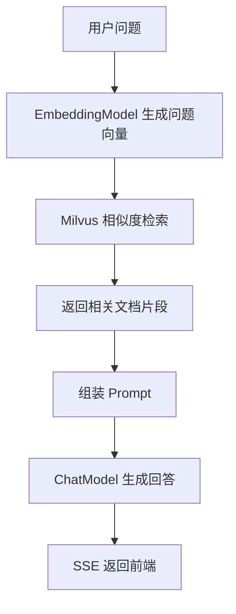

# 第 27 课：RAG 文档检索与 Prompt 组装
> 课程定位：这一课讲知识库问答的核心思想。RAG 不是让模型“凭记忆回答”，而是先从项目知识库中检索相关内容，再把这些内容塞进 Prompt，让模型基于资料回答。

## 1. 本课目标

学完本课后，学生应该能做到：

1. 理解 RAG 的完整流程。
2. 找到 IIMS 中知识库检索入口。
3. 理解 wikiIds、question、topK 的作用。
4. 理解检索结果如何影响 Prompt。
5. 能排查知识库问答“答非所问”或“没有引用知识库”的问题。

## 2. 源码定位

```text
iims-module-ai/src/main/java/cn/aitenry/iims/ai/store/MilvusStoreServiceImpl.java
iims-module-ai/src/main/java/cn/aitenry/iims/ai/store/CustomizeVectorStoreServiceImpl.java
iims-module-ai/src/main/java/cn/aitenry/iims/ai/chat/service/impl/ChatServiceImpl.java
iims-module-integral/src/main/java/cn/aitenry/iims/integral/event/DocumentEmbeddingEvent.java
iims-module-integral/src/main/java/cn/aitenry/iims/integral/event/subscriber/DocumentEmbeddingSubscriber.java
```

知识库业务：

```text
iims-module-integral/src/main/java/cn/aitenry/iims/integral/service/impl/WikiServiceImpl.java
```

## 3. RAG 是什么

RAG 可以拆成两步：

```text
Retrieval：检索
Augmented Generation：增强生成
```

普通问答：

```text
用户问题 -> 大模型 -> 回答
```

RAG 问答：

```text
用户问题 -> 检索知识库 -> 找到相关文档 -> 文档 + 问题 -> 大模型 -> 回答
```

差别在于：

```text
回答不只依赖模型训练时的知识，还依赖项目自己的文档。
```

## 4. IIMS 的 RAG 流程



其中，文档必须提前向量化入库。

## 5. wikiIds 的作用

用户可能选择一个或多个知识库。

`wikiIds` 用来限制检索范围：

```text
只在用户选择的知识库中搜索。
```

否则系统可能在所有知识库中搜索，导致：

- 检索结果不相关。
- 响应变慢。
- 数据权限风险。

在 `MilvusStoreServiceImpl` 中，检索时会用过滤条件限制 wikiId。

## 6. question 的作用

用户问题会先被 embedding 模型转成向量。

例如：

```text
question = "这个项目怎么配置 DeepSeek？"
```

经过 embedding 后，系统会在 Milvus 中搜索语义相近的文档。

这不是关键词匹配，而是语义相似度匹配。

## 7. topK 的作用

`topK` 表示返回最相关的前 K 条文档。

例如：

```text
topK = 5
```

含义：

```text
返回相似度最高的 5 个片段。
```

topK 太小：

```text
可能漏掉关键资料。
```

topK 太大：

```text
Prompt 太长，成本变高，噪声变多。
```

教学建议：

```text
先从 3 到 5 开始调试。
```

## 8. Prompt 组装方式

一个 RAG Prompt 通常包括：

```text
系统角色说明
知识库检索内容
历史对话
用户当前问题
回答要求
```

示例：

```text
你是 IIMS 项目助手。请优先根据以下知识库内容回答。

知识库内容：
1. ...
2. ...
3. ...

历史对话：
...

用户问题：
...

如果知识库内容不足，请明确说明。
```

重点：

```text
检索到文档不等于模型一定会正确引用。
Prompt 需要明确要求模型基于资料回答。
```

## 9. 知识库内容从哪里来

IIMS 知识库内容来自：

```text
Wiki
WikiCatalog
Article
Document
```

当知识库内容创建或更新后，需要触发文档向量化。

相关事件：

```text
DocumentEmbeddingEvent
DocumentEmbeddingSubscriber
```

向量化成功后，Milvus 中才有可检索数据。

## 10. 检索不到内容的原因

常见原因：

```text
知识库没有向量化。
embedding 模型没有配置。
Milvus 没启动。
wikiId 过滤条件不匹配。
topK 设置太小。
文章内容为空。
向量集合或数据库配置错误。
```

排查时按顺序：

1. 知识库文章是否存在。
2. 是否触发向量化。
3. embedding 模型是否可用。
4. Milvus 是否有数据。
5. 检索代码是否带正确 wikiIds。
6. Prompt 是否包含检索结果。

## 11. 答非所问的原因

答非所问不一定是模型差。

可能是：

- 检索片段不相关。
- 文档切分太粗或太细。
- topK 不合理。
- Prompt 没要求基于文档。
- 选择了错误知识库。
- embedding 模型质量差。
- 用户问题太模糊。

RAG 排查要先看：

```text
检索结果到底是什么。
```

如果检索结果本身不相关，后面 ChatModel 再强也很难答对。

## 12. 教学演示脚本

1. 新建一个知识库。
2. 写入一篇带明显答案的文章。
3. 触发向量化。
4. 发起知识库问答。
5. 在后端日志中打印或观察检索结果。
6. 修改问题，让检索更模糊。
7. 调整 topK。
8. 对比回答质量。

## 13. 学生实操

任务：

1. 创建一个“项目部署 FAQ”知识库。
2. 写入至少三篇文章。
3. 完成向量化。
4. 选择该知识库提问。
5. 记录检索是否命中正确文章。
6. 修改 topK 或问题表达，观察回答变化。

## 14. 验收标准

学生必须能说明：

1. RAG 和普通聊天的区别。
2. wikiIds 为什么重要。
3. topK 太大或太小分别有什么问题。
4. Prompt 中为什么要放检索内容。
5. 检索不到内容时先查什么。
6. 答非所问时为什么先看检索结果。

## 15. 作业

写一份 RAG 调试报告：

```text
知识库名称
文章内容摘要
embedding 模型
topK
用户问题
检索结果
最终回答
问题分析
优化方案
```

## 16. 面试表达

可以这样说：

> 项目中的知识库问答使用 RAG 思路实现。用户选择知识库后，后端会把问题转成向量，在 Milvus 中按 wikiId 过滤并检索 topK 相关文档，再把文档内容、历史消息和当前问题一起组装成 Prompt，交给 ChatModel 生成答案。排查回答质量时，我会先检查检索结果是否相关，再看 Prompt 组织和模型生成效果。

## 17. 最终交付物

```text
一个可检索知识库
一次 RAG 问答记录
检索结果分析
Prompt 组装说明
RAG 排查清单
```

