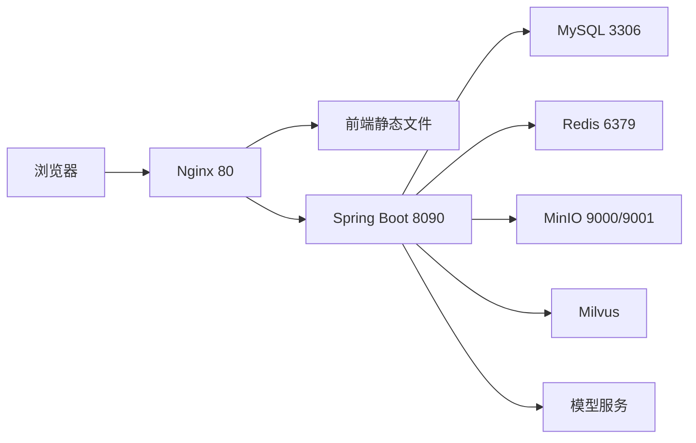

# 第 29 课：生产部署、日志与故障排查
> 课程定位：这一课把“能跑起来”升级成“出了问题能定位”。求职项目不只看功能演示，更看你能不能解释部署结构、日志位置、端口、配置、数据库和第三方服务问题。

## 1. 本课目标

学完本课后，学生应该能做到：

1. 画出 IIMS 的生产部署结构。
2. 理解前端、后端、数据库、中间件、AI 服务之间的关系。
3. 掌握常用日志查看命令。
4. 能按层排查 404、500、跨域、数据库、Redis、MinIO、AI 模型问题。
5. 能准备一个稳定的求职演示环境。

## 2. 部署结构

典型部署：



其中：

- Nginx 负责公网入口。
- 前端是打包后的静态文件。
- 后端是 Spring Boot 服务。
- MySQL 保存业务数据。
- Redis 保存缓存或会话相关数据。
- MinIO 保存文件。
- Milvus 保存知识库向量。
- AI 服务可以是云端 API、Ollama 或兼容网关。

## 3. 端口清单

建议维护一张端口表：

| 服务 | 常见端口 | 用途 |
| --- | --- | --- |
| Nginx | 80 | 前端入口 |
| Spring Boot | 8090 | 后端接口 |
| MySQL | 3306 | 数据库 |
| Redis | 6379 | 缓存 |
| MinIO API | 9000 | 文件对象存储 |
| MinIO Console | 9001 | 管理页面 |
| Ollama | 11434 | 本地模型 |
| Milvus | 19530 | 向量库 |

阿里云安全组至少要开放：

```text
80
```

开发调试时才考虑临时开放：

```text
8090
9001
```

不要长期把数据库端口暴露到公网。

## 4. 前端部署排查

前端访问失败常见原因：

```text
Nginx 没启动
静态文件目录错误
dist 没上传
root 配错
try_files 配错
安全组没开放 80
```

检查命令：

```bash
systemctl status nginx
nginx -t
curl -I http://服务器IP
```

如果页面能打开但刷新 404，需要检查：

```nginx
try_files $uri $uri/ /index.html;
```

Vue 单页应用必须让未知路由回到 `index.html`。

## 5. 后端排查

后端启动失败先看日志。

常见命令：

```bash
ps -ef | grep java
netstat -tunlp | grep 8090
curl http://127.0.0.1:8090/iims/
```

如果用 jar 启动：

```bash
nohup java -jar app.jar --spring.profiles.active=prod > app.log 2>&1 &
tail -f app.log
```

如果用 systemd：

```bash
systemctl status iims
journalctl -u iims -f
```

## 6. 数据库排查

常见错误：

```text
Table doesn't exist
Access denied
Communications link failure
Unknown database
```

排查：

```bash
mysql -h127.0.0.1 -uroot -p
show databases;
use iims;
show tables;
```

如果报表不存在：

```text
检查初始化 SQL 是否导入。
检查连接的是不是正确数据库。
检查表名前缀是否一致。
```

本项目曾出现过类似：

```text
Table 'iims.iims_integral_user' doesn't exist
```

这种错误通常说明 SQL、Mapper 或初始化脚本中的表名不一致。

## 7. Redis 排查

检查 Redis：

```bash
redis-cli ping
```

正常：

```text
PONG
```

常见问题：

- Redis 没启动。
- 密码配置不一致。
- 后端连接地址错误。
- Docker 容器端口没映射。

## 8. MinIO 排查

文件上传失败时检查：

```text
endpoint
accessKey
secretKey
bucket
short-link
```

命令：

```bash
docker ps
docker logs minio
curl -I http://127.0.0.1:9000
```

常见问题：

- bucket 不存在。
- 密钥错误。
- MinIO 地址写成 localhost，但后端在容器或服务器另一处。
- 文件短链地址配置不对。

## 9. AI 模型排查

AI 失败按顺序查：

```text
模型表是否有记录
用户默认模型是否设置
服务器是否能访问模型 url
API Key 是否正确
模型名是否正确
modelType 是否正确
SSE 是否正常
```

不要一上来就改前端。

前端只是显示结果。真正的问题通常在：

- 模型配置。
- 后端日志。
- 第三方模型接口。
- 网络访问。

## 10. 日志排查方法

推荐“三层日志法”：

```text
浏览器 Network
后端应用日志
中间件日志
```

浏览器看：

- URL。
- Status Code。
- Request Payload。
- Response。
- EventStream。

后端看：

- Controller 是否收到请求。
- Service 是否报错。
- SQL 是否执行。
- 第三方接口是否失败。

中间件看：

- MySQL 表是否存在。
- Redis 是否连通。
- MinIO 是否有对象。
- Milvus 是否运行。

## 11. 常见故障模板

### 11.1 页面打不开

检查：

```text
安全组 80
Nginx 状态
Nginx root
前端 dist
```

### 11.2 登录失败

检查：

```text
后端是否启动
接口地址是否正确
数据库用户表
密码加密逻辑
Sa-Token 配置
```

### 11.3 功能按钮报 500

检查：

```text
后端日志完整堆栈
数据库表
Mapper SQL
请求参数
权限注解
```

### 11.4 上传失败

检查：

```text
MinIO 是否启动
bucket
密钥
文件大小
后端配置
```

### 11.5 AI 不回复

检查：

```text
模型配置
默认模型
SSE 请求
模型服务 curl
后端异常
```

## 12. 求职演示环境建议

演示环境要稳定，不要太花。

建议：

```text
前端：Nginx 静态部署
后端：jar + nohup 或 systemd
数据库：Docker MySQL
Redis：Docker Redis
MinIO：Docker MinIO
AI：云端 API 或本地开发演示
```

2 核 2G 服务器不建议强行跑大模型。

演示时准备：

- 一个可登录账号。
- 几条稳定业务数据。
- 一个可用知识库。
- 一个能成功回答的模型配置。
- 一份排障截图或日志说明。

## 13. 教学演示脚本

1. 画部署结构图。
2. 查看 Nginx 状态。
3. 查看 Java 进程。
4. curl 后端接口。
5. 登录 MySQL 查看表。
6. ping Redis。
7. 打开 MinIO 控制台。
8. 发起一次 AI 对话。
9. 模拟数据库表缺失错误。
10. 按日志定位问题。

## 14. 学生实操

任务：

1. 写一张端口清单。
2. 写一张服务状态检查表。
3. 完成一次从浏览器到后端日志的排查。
4. 故意关闭 Redis 或改错数据库名，观察错误。
5. 恢复配置。
6. 写出完整故障报告。

## 15. 验收标准

学生必须能做到：

1. 独立判断页面打不开属于哪一层问题。
2. 独立查看后端日志。
3. 独立确认数据库表是否存在。
4. 独立确认 Redis、MinIO 是否正常。
5. 独立解释 AI 不回复的排查顺序。
6. 准备一个可演示的公网地址。

## 16. 作业

写一份《IIMS 生产环境排障手册》，包含：

```text
部署结构图
端口清单
启动命令
日志命令
常见错误
恢复步骤
演示前检查清单
```

## 17. 面试表达

可以这样说：

> 我把项目部署到云服务器时，前端通过 Nginx 提供静态访问，后端以 Spring Boot jar 运行，MySQL、Redis、MinIO 和 Milvus 作为基础服务。排查问题时我会按浏览器 Network、后端日志、中间件状态三层定位。例如接口 500 先看后端堆栈，表不存在就检查初始化 SQL 和连接库，AI 不回复则检查默认模型、模型服务可达性和 SSE 连接。

## 18. 最终交付物

```text
部署结构图
端口清单
服务状态检查表
生产排障手册
演示前检查清单
```

